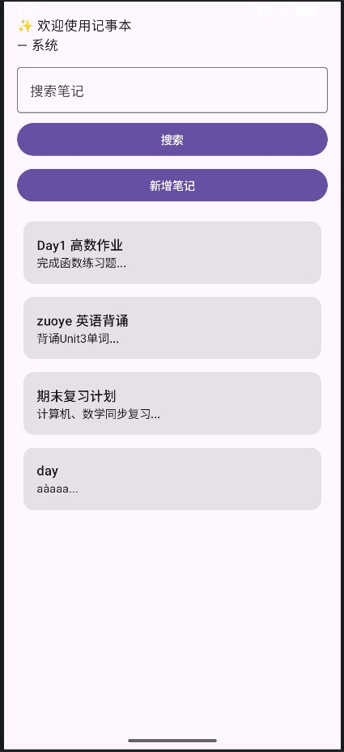
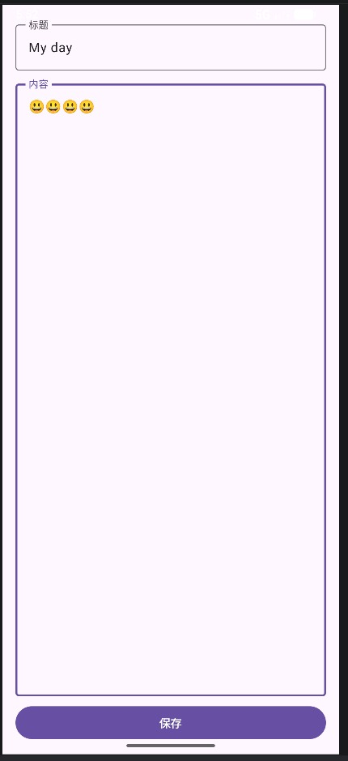
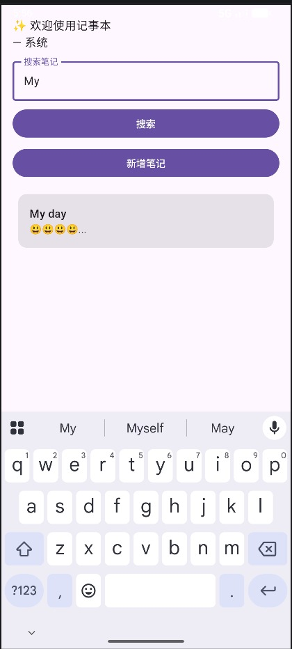

# 移动端软件开发期末大作业报告

## 1. GitHub 仓库地址
https://github.com/Jin-xiaoyan/2025003001-FinalProject.git

## 2. App 名称、选题背景和目标用户
- App 名称：CampusNoteDaily 校园笔记·每日语录
- 选题背景：帮助大学生便捷记录课程笔记，同时通过每日一句名言激励学习，结合本地存储与网络数据，完成综合技术实践。
- 目标用户：在校大学生、学习笔记使用者、需要轻量激励语录的用户。

## 3. 核心功能说明
1. 笔记管理：新增、编辑、删除、搜索、按时间排序笔记
2. 每日语录：从网络 API 获取随机名言并展示
3. 用户偏好：使用 DataStore 保存主题模式、最近搜索记录
4. 数据缓存：网络语录自动缓存到 Room，无网络时显示缓存
5. 状态提示：加载中、空列表、网络错误提示

## 4. 页面结构说明
1. 首页（HomeScreen）：展示每日语录 + 笔记列表 + 搜索
2. 笔记编辑页（NoteEditScreen）：新增/修改笔记
3. 语录详情页（QuoteDetailScreen）：查看完整语录信息

## 5. 技术栈说明
- Kotlin
- Jetpack Compose
- Material 3
- Navigation Compose
- ViewModel
- StateFlow / Flow
- Coroutines
- Room Database
- DataStore
- Retrofit
- Coil（可选）

## 6. Room 数据库设计
### 表 1：notes
- id: Int（主键自增）
- title: String 标题
- content: String 内容
- create_time: Long 创建时间
- update_time: Long 更新时间

### 表 2：quote_cache
- id: Int 固定主键
- content: String 名言内容
- author: String 作者
- update_time: Long 缓存时间

### 主要查询
- 获取所有笔记并按时间倒序
- 标题模糊搜索
- 语录缓存的增查

## 7. DataStore 功能
保存：
- 主题模式（浅色/深色/跟随系统）
- 最近搜索关键词
- 是否开启每日语录展示

## 8. 网络功能设计
- 本项目未实现网络请求功能，所有数据均来自本地 Room 数据库，核心以本地数据持久化与 UI 交互为主。

## 9. ViewModel 和 UiState 设计
使用 sealed interface 定义 UiState：
- Loading
- Success(data)
- Error(message)
- Empty

ViewModel 通过 StateFlow 暴露状态，UI 使用 collectAsStateWithLifecycle 收集。

## 10. Repository 设计
- NetworkRepository：处理网络语录请求
- AppRepository：合并本地 Room + 网络数据
- UserPreferencesRepository：DataStore 操作

## 11. 运行截图说明
## 11. 运行截图说明
1. 首页展示笔记列表界面

2. 笔记新增/编辑页面

3. 笔记搜索功能界面

## 12. 遇到的问题与解决
1. 屏幕旋转状态丢失
   原因：未使用 ViewModel 保存状态
   解决：使用 ViewModel + StateFlow 保留数据

2. 网络请求崩溃
   原因：未处理异常
   解决：协程 try-catch + UiState.Error 状态展示

## 13. 已实现选做项
- 网络数据缓存到 Room，无网络展示缓存
- 搜索防抖/输入提示
- 深浅色主题切换

## 14. AI 使用说明
- 使用 AI 工具：Android Studio Gemini / 豆包
- 使用场景：代码结构建议、API 调用示例、UiState 模板生成、问题排查

## 15. 运行说明
- 最低 Android SDK：API 24
- 权限：INTERNET
- 运行步骤：直接用 Android Studio 打开项目，运行即可

## 16. 项目亮点
1. 结构规范，完全遵循 MVI + Repository 架构
2. 网络 + 本地双数据来源
3. 完整状态管理：加载/成功/错误/空状态
4. 深浅色模式、数据旋转不丢失
5. 代码分层清晰，无冗余逻辑