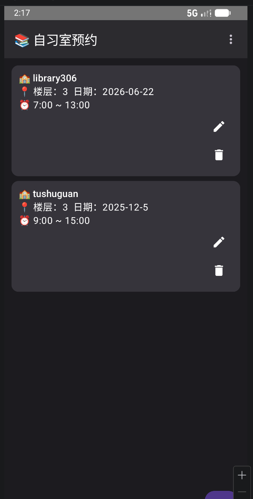
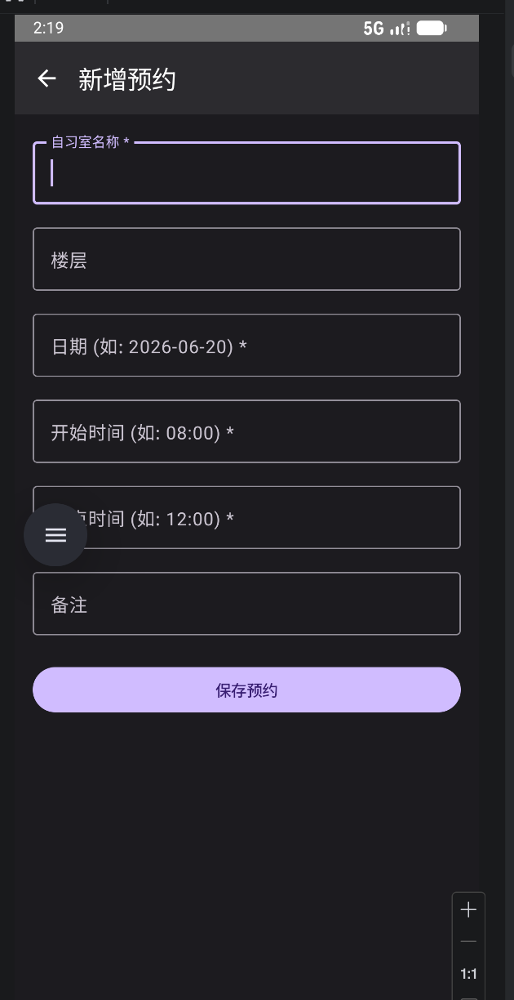
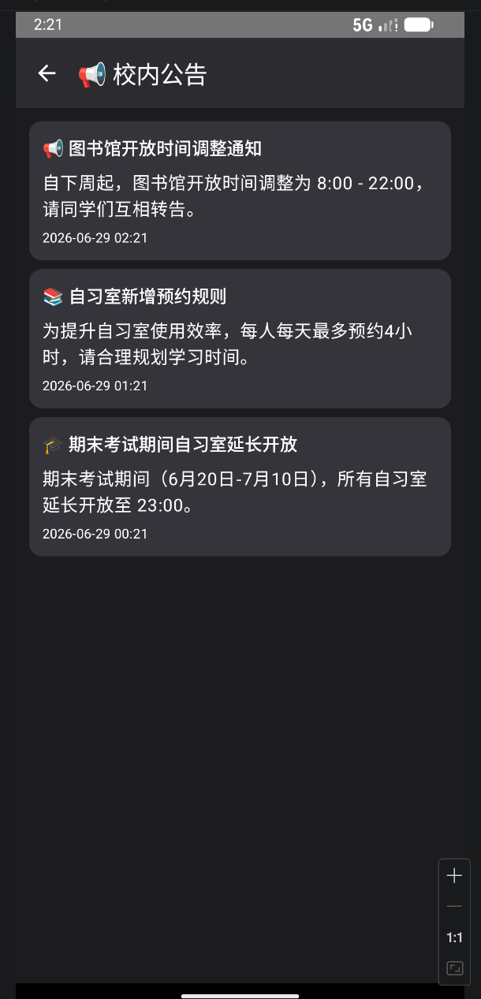
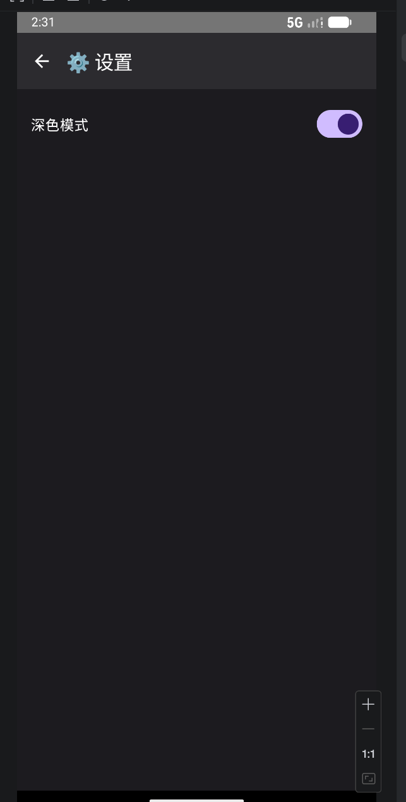

# 自习室预约助手

**GitHub 仓库地址：** https://github.com/Lang22026/2025003006-FinalProject


## 1. 项目简介

- **应用名称：** 自习室预约助手 (StudyRoomReserve)
- **目标用户：** 在校大学生、考研群体、需要自习空间的用户
- **核心功能：**
  - **预约管理：** 用户可以新增、查看、编辑和删除自习室预约记录
  - **本地数据持久化：** 所有预约记录通过 Room 数据库存储在本地
  - **校内公告浏览：** 通过网络请求获取校内通知或公告并展示
  - **主题切换：** 支持深色/浅色模式，通过 DataStore 持久化保存用户偏好


## 2. 技术栈

- **UI：** Jetpack Compose + Material 3
- **数据库：** Room（2张表：Reserve, Notice）
- **网络：** Retrofit + OkHttp + Gson（接口来源：Mock API）
- **状态管理：** ViewModel + StateFlow
- **持久化偏好：** DataStore（保存主题偏好）
- **导航：** Navigation Compose
- **异步处理：** Kotlin Coroutines
- **其他依赖：** Coil（图片加载）


## 3. 功能清单

### 必做项完成情况

**UI 层**
- [x] Jetpack Compose 构建全部 UI
- [x] 至少 2 个主要页面（首页预约列表、公告页、设置页、新增/编辑页）
- [x] Compose Navigation 导航
- [x] LazyColumn 列表展示预约记录
- [x] Material 3 组件（Card、FAB、TopAppBar、IconButton、OutlinedTextField、DropdownMenu）
- [x] 浅色/深色模式支持（跟随系统 + 手动切换）

**数据层**
- [x] Room 数据库，2 张表（Reserve, Notice）
- [x] 完整 CRUD 操作（新增、编辑、删除）
- [x] DAO 查询方法返回 Flow 类型
- [x] 查询功能（获取所有预约、按ID查询）
- [x] DataStore 保存用户偏好（深色模式）

**网络层**
- [x] 声明并使用 Internet 权限
- [x] 使用 Retrofit 发起网络请求（Mock API）
- [x] 网络数据在公告页面展示
- [x] 处理 Loading / Success / Error 网络状态
- [x] Composable 不直接发起网络请求

**架构层**
- [x] ViewModel 状态管理（ReserveViewModel, NoticeViewModel, SettingsViewModel）
- [x] Repository 模式（ReserveRepository, NoticeRepository）
- [x] StateFlow/Flow 数据流
- [x] Kotlin 协程异步处理
- [x] UiState 描述界面状态（Loading、Success、Error、Empty）
- [x] Composable 不直接访问数据库或网络

**功能完整性**
- [x] 新增/编辑/删除（已实现 3 项）
- [x] 输入验证（必填项检查）
- [x] 状态展示（列表空状态）
- [x] 屏幕旋转后状态保持

### 选做项完成情况

- [x] **深色模式：** 通过 DataStore 持久化保存用户主题偏好，支持手动切换
- [x] **网络图片加载：** 使用 Coil 加载公告网络图片（代码已预留）
- [ ] 其他选做项未完成


## 4. 数据库设计

### 表 1：`reserves`（预约记录表）

| 字段名 | 类型 | 说明 |
|---|---|---|
| `id` | Long | 主键，自增 |
| `roomName` | String | 自习室名称 |
| `floor` | String | 所在楼层 |
| `reserveDate` | String | 预约日期 |
| `startTime` | String | 开始时间 |
| `endTime` | String | 结束时间 |
| `remark` | String | 备注信息 |

**表结构定义：**
```kotlin
@Entity(tableName = "reserves")
data class Reserve(
    @PrimaryKey(autoGenerate = true)
    val id: Long = 0,
    @ColumnInfo(name = "room_name")
    val roomName: String = "",
    @ColumnInfo(name = "floor")
    val floor: String = "",
    @ColumnInfo(name = "reserve_date")
    val reserveDate: String = "",
    @ColumnInfo(name = "start_time")
    val startTime: String = "",
    @ColumnInfo(name = "end_time")
    val endTime: String = "",
    @ColumnInfo(name = "remark")
    val remark: String = ""
)
```

### 表 2：`notices`（公告表 - 缓存网络数据）

| 字段名 | 类型 | 说明 |
|---|---|---|
| `id` | Long | 主键 |
| `title` | String | 公告标题 |
| `content` | String | 公告内容 |
| `imageUrl` | String | 配图链接 |
| `timestamp` | Long | 发布时间戳 |

**表关系：** 两张表相互独立，通过各自的 Repository 统一管理。

**主要 DAO 查询方法：**
```kotlin
// ReserveDao
@Query("SELECT * FROM reserves ORDER BY id DESC")
fun getAllReserves(): Flow<List<Reserve>>

@Query("SELECT * FROM reserves WHERE id = :id")
suspend fun getReserveById(id: Long): Reserve?

@Insert(onConflict = OnConflictStrategy.REPLACE)
suspend fun insertReserve(reserve: Reserve): Long

@Update
suspend fun updateReserve(reserve: Reserve)

@Delete
suspend fun deleteReserve(reserve: Reserve)
```


## 5. 网络功能设计

- **API 来源：** 使用 Mock API，通过 `https://jsonplaceholder.typicode.com/` 占位接口模拟，同时内置本地 Mock 数据作为备选
- **接口地址：** `GET /notices`
- **请求方式：** GET
- **主要返回字段：**
  ```json
  {
    "id": 1,
    "title": "图书馆开放时间调整通知",
    "content": "自下周起，图书馆开放时间调整为 8:00 - 22:00",
    "imageUrl": "",
    "timestamp": 1700000000000
  }
  ```
- **App 中使用这些网络数据的页面或功能：** 在 `NoticeScreen`（公告页面）中获取并展示公告列表
- **网络失败时的处理方式：** `NoticeViewModel` 更新 `UiState` 为 `Error` 状态，UI 展示错误提示并提供"重试"按钮；同时返回本地 Mock 数据作为备选，确保应用在网络不可用时仍能展示内容


## 6. 架构设计

本项目采用 MVVM (Model-View-ViewModel) 架构，结合 Repository 模式，严格遵循单向数据流原则：

**Data Layer（数据层）：**
- 本地数据源：Room 数据库（`ReserveDao`、`NoticeDao`）
- 远程数据源：Retrofit 网络服务（`ApiService`）
- Repository：`ReserveRepository` 和 `NoticeRepository` 作为单一数据源入口，隔离数据来源

**ViewModel 层（状态管理层）：**
- 持有 Repository 引用
- 使用 `StateFlow` 暴露 `UiState`（Loading、Success、Error、Empty）
- 接收 UI 层事件，调用 Repository 执行操作，使用协程处理异步任务

**UI 层（Composables）：**
- 负责纯界面渲染
- 通过 `collectAsState()` 收集 ViewModel 的 StateFlow
- 不包含业务逻辑，通过回调将用户交互事件传递给 ViewModel

**数据流向：**
```
UI → 用户事件 → ViewModel → Repository → Room/Network → StateFlow → UI 重组
```


## 7. 核心功能截图

### 首页 - 预约列表

*说明：展示所有自习室预约记录，右上角菜单可跳转至公告和设置，右下角 FAB 用于新增预约。*

### 新增预约页面

*说明：用户可填写自习室名称、楼层、日期、时间段和备注，保存到本地数据库。*

### 公告页面（网络数据）

*说明：从网络 API 获取并展示校内公告列表，包含标题和内容。*

### 设置页面（DataStore）

*说明：用户可以切换应用主题（深色/浅色模式），并通过 DataStore 持久化保存用户偏好。*


## 8. 技术难点与解决方案

### 难点 1：Gradle 构建失败 - SSL 证书问题

- **问题描述：** 项目同步时反复出现 `SSLHandshakeException` 和 `Could not resolve gradle:8.7` 错误，导致无法下载 Gradle 和项目依赖。
- **原因分析：** 网络环境对 `services.gradle.org` 存在证书验证问题，且 `gradle-wrapper.properties` 中配置的校验和不匹配。
- **解决方案：**
  1. 手动从 Gradle 官网下载 `gradle-8.7-bin.zip`，放置到 Gradle Wrapper 本地缓存目录 `C:\Users\用户名\.gradle\wrapper\dists\`，绕过网络下载
  2. 修正 `gradle-wrapper.properties` 中 `distributionSha256Sum` 为 Gradle 8.7 的正确校验和
  3. 在 `gradle.properties` 中添加 `android.useAndroidX=true` 和 `android.enableJetifier=true`
- **参考资料：** Gradle 官方文档、Gradle 发行版校验和页面

### 难点 2：数据保存后首页不刷新

- **问题描述：** 新增预约保存后返回首页，列表不显示新数据。
- **原因分析：** `insertReserve`、`updateReserve`、`deleteReserve` 操作后未调用 `loadReserves()` 重新加载数据，导致 `uiState` 未更新。
- **解决方案：** 在每个数据操作方法中，操作完成后都调用 `loadReserves()` 刷新状态，确保 UI 与数据同步。

### 难点 3：OutlinedTextField 无法输入

- **问题描述：** 新增预约页面中，`OutlinedTextField` 输入框无法获得焦点，键盘不弹出。
- **原因分析：** 输入框未获得焦点，且页面被键盘遮挡导致焦点被抢占。
- **解决方案：**
  1. 使用 `FocusRequester` 在 `LaunchedEffect` 中请求焦点，延迟 300ms 确保界面加载完成
  2. 页面添加 `.verticalScroll(rememberScrollState())` 避免被键盘遮挡
  3. 通过 `LocalSoftwareKeyboardController` 手动弹出键盘
  4. 在模拟器中安装 Gboard 输入法，添加中文拼音输入


## 9. AI 使用说明

请在以下选项中勾选，可多选：

- [ ] 未使用 AI
- [x] 网页版 AI（如 ChatGPT、Claude、Kimi、豆包等）
- [ ] AI Agent / 编程代理（如 Claude Code、Codex、OpenCode、Cursor Agent 等）
- [x] 国产大模型服务（如 DeepSeek、GLM、通义千问、文心一言等）
- [ ] IDE 插件或代码补全工具（如 GitHub Copilot、Cursor、CodeGeeX 等）
- [ ] 其他：

**具体工具名称：** DeepSeek、通义千问

**AI 主要用于哪些环节：**
1. **代码生成：** 生成 Compose UI 组件、Room Entity 和 DAO 接口的初始代码框架
2. **调试分析：** 协助分析 Gradle 构建错误和 Compose 编译错误，提供解决方案
3. **概念解释：** 解释 StateFlow、collectAsState、Repository 模式等概念
4. **报告整理：** 辅助梳理技术栈和项目结构，生成报告大纲

**说明：** AI 工具提高了开发效率和问题排查速度，特别是在处理构建错误和架构设计时。所有生成的代码均经过理解、审查和调整，符合项目需求和编码规范。


## 10. 运行说明

- **最低 Android 版本：** API 24（Android 7.0 Nougat）
- **推荐 Android 版本：** API 34（Android 14）
- **特殊权限：** `android.permission.INTERNET`（网络权限）

**运行步骤：**
1. 克隆仓库：`git clone https://github.com/Lang22026/2025003006-FinalProject`
2. 使用 Android Studio 打开项目
3. 等待 Gradle 同步完成（建议使用本地 Gradle 分发，避免网络问题）
4. 连接 Android 模拟器或真机
5. 点击 Run 按钮（绿色三角形 ▶️）运行应用


## 11. 项目亮点

1. **架构清晰：** 严格遵循 MVVM 和 Repository 模式，代码分层明确，职责分离，具有良好的可维护性和扩展性
2. **功能完整：** 涵盖 Room 本地持久化、Retrofit 网络请求、DataStore 偏好设置的完整数据流
3. **用户体验友好：** 提供列表空状态、网络加载/错误状态等完备的 UI 反馈，支持深色/浅色主题切换
4. **技术栈全面：** 综合运用了 Compose、Room、ViewModel、Navigation、Coroutines、DataStore 等全部核心技术


## 12. 未来改进方向

1. **时间冲突检测：** 增加预约时间冲突检测功能，当用户预约的时间段与已有记录重叠时给出提示
2. **数据统计图表：** 利用图表库展示用户的预约频率、热门自习室等统计数据
3. **接入真实 API：** 将 Mock API 替换为真实后端服务，实现多用户数据共享
4. **本地通知提醒：** 使用 WorkManager 实现预约提醒通知
5. **数据导入导出：** 支持将预约数据导出为 JSON 或 CSV 格式