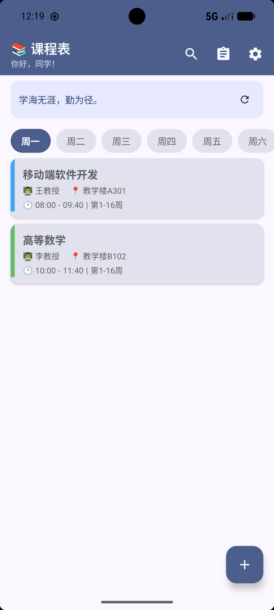
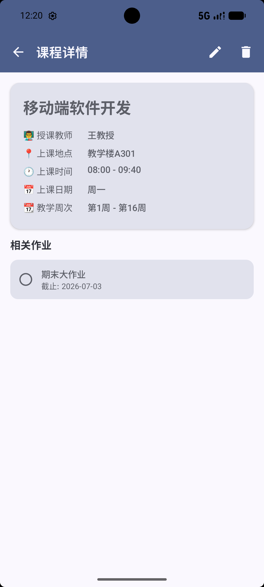
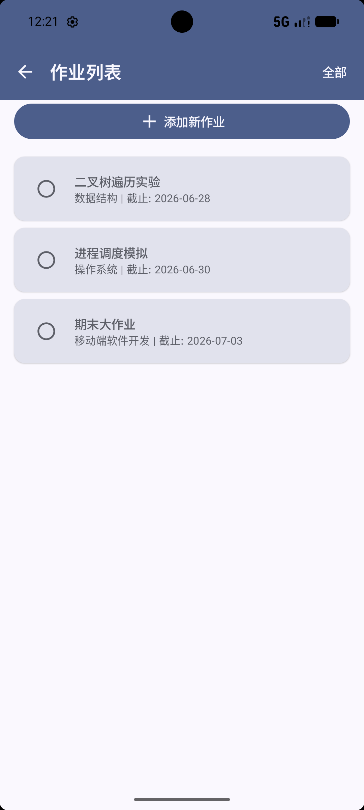
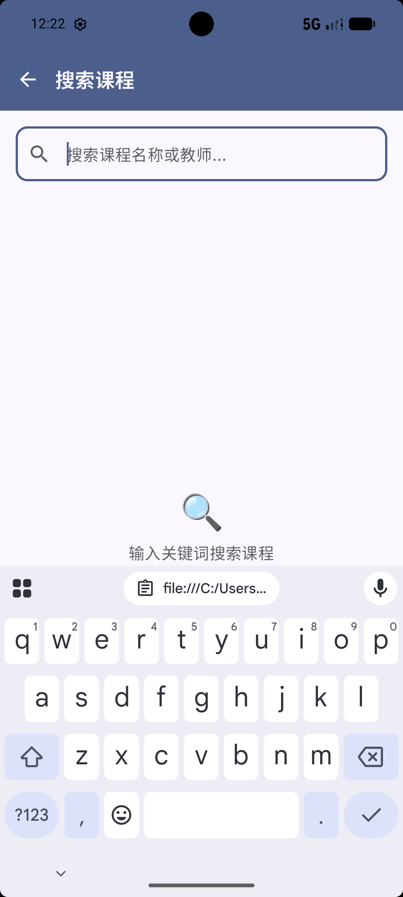
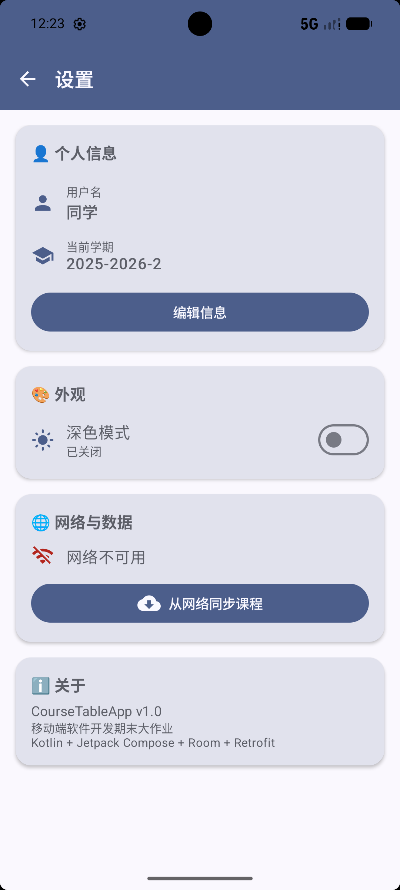

# 智能课程表 CourseTableApp

GitHub 仓库地址：https://github.com/oujiachun/2025003007-FinalProject.git

## 1. 项目简介

- **应用名称**：智能课程表 — CourseTableApp
- **选题背景**：作为大学生，日常需要管理多门课程的上课时间、地点以及对应的作业任务。市面上虽然有多种课程表应用，但多数功能繁杂或需要登录。本应用旨在提供一个轻量、本地优先的课程管理工具，帮助同学快速查看每日课表、管理作业任务，并获取每日励志语录作为学习动力。
- **目标用户**：在校大学生，特别是需要管理多门课程及作业的学生群体。
- **核心功能**：
  - 按周查看每日课程表，支持新增、编辑、删除课程
  - 管理作业列表，支持添加、标记完成/未完成、删除作业
  - 按课程名称或教师名称搜索课程
  - 从网络获取每日励志语录（真实 API）
  - 支持深色/浅色模式切换、个性化用户名和学期设置

## 2. 技术栈

- **UI**：Jetpack Compose + Material 3
- **数据库**：Room（2 张表：courses、assignments）
- **网络**：Retrofit + OkHttp + Gson（真实 API：zenquotes.io）
- **状态管理**：ViewModel + StateFlow + UiState
- **持久化偏好**：DataStore（Preferences）
- **导航**：Navigation Compose
- **异步处理**：Kotlin Coroutines（Flow、suspend）
- **其他依赖**：
  - `androidx.lifecycle.viewmodel-compose` — ViewModel Compose 集成
  - `androidx.navigation:navigation-compose` — 导航
  - `com.squareup.retrofit2:retrofit` — 网络请求
  - `com.squareup.okhttp3:logging-interceptor` — 网络日志
  - `com.google.code.gson:gson` — JSON 解析

## 3. 功能清单

### 必做项完成情况

**UI 层**
- [x] Jetpack Compose 构建全部 UI（无 XML 布局）
- [x] 至少 2 个主要页面（共 7 个页面：首页、课程详情、添加/编辑课程、搜索、作业列表、作业详情、设置）
- [x] Compose Navigation 导航
- [x] LazyColumn 列表（课程列表、作业列表、搜索结果列表）
- [x] Material 3 组件和主题（Card、Button、TopAppBar、FloatingActionButton、Snackbar、AlertDialog、OutlinedTextField、Switch 等）
- [x] 浅色 / 深色模式支持（可跟随设置切换，通过 DataStore 持久化）

**数据层**
- [x] Room 数据库，2 张表：`courses` 和 `assignments`
- [x] 完整 CRUD 操作（CourseDao 和 AssignmentDao 均实现了 insert、update、delete、query）
- [x] DAO 查询方法返回 Flow 类型（`getAllCourses()`、`getCoursesByDay()`、`getAllAssignments()` 等）
- [x] 至少一种查询功能（按星期筛选课程、按名称/教师模糊搜索课程、按完成状态筛选作业）
- [x] DataStore 保存用户偏好（深色模式、用户名、学期、默认星期、最近搜索词）

**网络层**
- [x] 声明并使用 Internet 权限（`AndroidManifest.xml` 中声明 `INTERNET` 和 `ACCESS_NETWORK_STATE`）
- [x] 使用 Retrofit 发起网络请求（从 zenquotes.io 获取每日励志语录）
- [x] 网络数据在核心页面中展示（首页 QuoteBanner 展示每日一语）
- [x] 处理 Loading / Success / Error 等网络状态（`isQuoteLoading`、`quote`、`quoteError` 状态管理）
- [x] Composable 不直接发起网络请求（通过 ViewModel → Repository → NetworkDataSource 调用）

**架构层**
- [x] ViewModel 状态管理（`CourseTableViewModel` 管理全局 UiState）
- [x] Repository 模式（`CourseRepository` 隔离本地数据和网络数据）
- [x] StateFlow / Flow 数据流（`MutableStateFlow<CourseTableUiState>` 暴露给 UI）
- [x] Kotlin 协程异步处理（ViewModel 中使用 `viewModelScope.launch` 处理所有异步操作）
- [x] UiState 描述界面状态（`CourseTableUiState` data class 包含 Loading/Success/Error/Empty 状态）
- [x] Composable 不直接访问数据库或网络

**功能完整性**
- [x] 新增 / 编辑 / 删除 / 搜索等核心操作（新增编辑课程、删除课程、搜索课程、新增/删除作业、标记作业完成）
- [x] 输入验证和错误提示（课程名称为必填项、作业标题和截止日期必填、Snackbar 提示操作结果）
- [x] 状态展示（空课程提示"这一天没有课程"、空作业提示"没有待完成的作业"、加载语录 Loading 动画）
- [x] 屏幕旋转后状态保持（ViewModel 在旋转后不重建，所有状态通过 StateFlow 保持）

### 选做项完成情况

- [x] **复杂数据库查询**：模糊搜索（LIKE）— `CourseDao.searchCourses()` 使用 `LIKE` 实现按课程名和教师名搜索
- [x] **Coil 图片加载**：未使用 AsyncImage（本应用无图片需求），但网络数据（语录）真实从 API 加载
- [ ] 其他选做项未实现

## 4. 数据库设计

### 表 1：courses（课程表）

| 字段名 | 类型 | 说明 |
|---|---|---|
| id | Long | 主键，自增 |
| name | String | 课程名称 |
| teacher | String | 授课教师 |
| classroom | String | 上课地点 |
| day_of_week | Int | 上课日期（1=周一 ... 7=周日） |
| start_time | String | 开始时间（格式："08:00"） |
| end_time | String | 结束时间（格式："09:40"） |
| start_week | Int | 起始周 |
| end_week | Int | 结束周 |
| color_index | Int | 课程卡片颜色索引 |
| notes | String | 备注 |
| is_synced | Boolean | 是否从网络同步 |

### 表 2：assignments（作业表）

| 字段名 | 类型 | 说明 |
|---|---|---|
| id | Long | 主键，自增 |
| course_id | Long | 外键，关联 courses 表 |
| title | String | 作业标题 |
| description | String | 作业描述 |
| due_date | String | 截止日期（格式："2026-07-03"） |
| is_completed | Boolean | 是否已完成 |
| type | String | 类型（作业/考试/其他） |

### 表关系

assignments 通过 `course_id` 与 courses 表建立外键关联，一个课程对应多个作业（一对多关系）。

### 主要 DAO 查询方法

**CourseDao：**
- `getAllCourses()` — 查询所有课程，按星期和时间排序，返回 `Flow<List<CourseEntity>>`
- `getCoursesByDay(day)` — 按星期筛选课程
- `searchCourses(query)` — 模糊搜索（`LIKE '%query%'`），搜索课程名和教师名
- `insertCourse()`、`updateCourse()`、`deleteCourse()` — 完整 CRUD
- `getDistinctDays()` — 获取所有有课程的星期（用于统计）

**AssignmentDao：**
- `getAllAssignments()` — 查询所有作业，按截止日期排序
- `getAssignmentsByCourse(courseId)` — 按课程 ID 查询作业
- `getPendingAssignments()` — 查询未完成的作业
- `toggleCompleted(id, completed)` — 切换完成状态
- `getPendingCount()` — 统计未完成作业数量

## 5. 网络功能设计

- **API 来源**：[zenquotes.io](https://zenquotes.io/) — 免费励志语录 API
- **接口地址**：`https://zenquotes.io/api/today`
- **请求方式**：GET
- **主要返回字段**：
  - `q`（String）：每日励志语录正文
  - `a`（String）：作者
  - `h`（String）：HTML 格式
- **App 中使用这些网络数据的页面或功能**：
  - 首页顶部的 **QuoteBanner**（每日语录横幅）展示从网络获取的励志语录
  - 用户可点击刷新按钮重新获取新的语录
  - 网络请求失败时会显示默认语录"学海无涯，勤为径。"并标记网络不可用
- **网络失败时的处理方式**：
  - 语录加载失败时显示默认文案，不阻塞应用正常使用
  - 在设置页面显示网络连接状态（Wifi/WifiOff 图标）
  - 提供"从网络同步课程"按钮（当前为 Mock 接口预留，可扩展为真实课程数据同步）
  - 使用 `Result<T>` 封装网络返回，在 Repository 层统一处理异常

## 6. 架构设计

```
┌─────────────────────────────────────────────────────┐
│                  UI Layer (Composable)               │
│  HomeScreen / CourseDetailScreen / AddEditCourse     │
│  SearchScreen / AssignmentListScreen / ...           │
│  ← collectAsState() 收集 ViewModel 的 StateFlow      │
└──────────────────────────┬──────────────────────────┘
                           │
┌──────────────────────────▼──────────────────────────┐
│              ViewModel Layer                         │
│        CourseTableViewModel                          │
│  - 持有 MutableStateFlow<CourseTableUiState>         │
│  - 调用 Repository 获取数据，更新 UiState             │
│  - 调用 UserPreferencesRepository 读写偏好           │
└──────────────────────────┬──────────────────────────┘
                           │
┌──────────────────────────▼──────────────────────────┐
│              Repository Layer                        │
│        CourseRepository                              │
│  - 封装 CourseDao / AssignmentDao (本地数据)          │
│  - 封装 NetworkDataSource (网络数据)                  │
│  - 对外暴露统一的数据访问接口                          │
└───────┬──────────────────────────┬──────────────────┘
        │                          │
┌───────▼──────────┐    ┌─────────▼────────────┐
│   Room Database   │    │   Network Layer       │
│  - CourseDao      │    │  - RetrofitClient     │
│  - AssignmentDao  │    │  - ApiService         │
│  - CourseEntity   │    │  - NetworkDataSource  │
│  - AssignmentEntity│   │  - CourseDto / QuoteDto│
└───────┬──────────┘    └─────────┬────────────┘
        │                         │
┌───────▼──────────┐              │
│   DataStore       │              │
│  UserPreferences │              │
└──────────────────┘              │
                                  │
                     ┌────────────▼──────────────┐
                     │  External API              │
                     │  zenquotes.io / Mock API   │
                     └───────────────────────────┘
```

### UiState 设计

`CourseTableUiState` 是一个 data class，统一管理所有页面的状态：

```kotlin
data class CourseTableUiState(
    // 课程相关
    val courses: List<Course>,
    val filteredCourses: List<Course>,  // 按星期筛选后的课程
    val selectedDay: Int,
    val isLoadingCourses: Boolean,
    val courseError: String?,
    
    // 作业相关
    val assignments: List<Assignment>,
    val pendingAssignments: List<Assignment>,
    val isLoadingAssignments: Boolean,
    
    // 搜索相关
    val searchQuery: String,
    val isSearching: Boolean,
    val searchResults: List<Course>,
    
    // 网络相关
    val quote: String,
    val isQuoteLoading: Boolean,
    val quoteError: String?,
    val isSyncing: Boolean,
    val isNetworkAvailable: Boolean,
    
    // 用户偏好
    val userName: String,
    val isDarkMode: Boolean,
    val semester: String,
    
    // 编辑相关
    val editingCourse: Course?,
    val isSaving: Boolean,
    val saveSuccess: Boolean,
    val saveError: String?,
    
    // 通用
    val snackbarMessage: String?
)
```

### Repository 如何隔离本地数据和网络数据

`CourseRepository` 同时持有 `CourseDao`、`AssignmentDao`（本地数据源）和 `NetworkDataSource`（网络数据源）：

- **本地数据**：课程和作业的 CRUD 操作直接通过 DAO 完成，返回 `Flow` 实现响应式更新
- **网络数据**：`fetchDailyQuote()` 通过 `NetworkDataSource` 调用 Retrofit API，使用 `Result<T>` 封装成功/失败
- **数据同步**：`fetchAndSyncCourses()` 方法将网络获取的课程 DTO 转为 Entity 后写入 Room 数据库并标记 `isSynced = true`
- **ViewModel 视角**：ViewModel 不感知数据来源，只调用 Repository 的方法，Repository 内部决定数据从哪里获取

## 7. 核心功能截图

（请在项目同级目录下创建 `screenshots/` 文件夹并放入截图）

### 首页 — 课程列表

说明：展示某一天的课程列表，顶部显示每日励志语录，下方为星期选择器，点击可切换查看不同日期的课程。右下角 FAB 可添加新课程。

### 课程详情页

说明：展示课程详细信息（教师、地点、时间、周次等），以及该课程关联的作业列表。顶部工具栏可编辑或删除课程。

### 作业列表页

说明：展示所有未完成的作业列表（可切换到全部视图），每个作业可标记完成/未完成，点击查看详情，底部可添加新作业。

### 搜索页

说明：输入课程名称或教师姓名进行模糊搜索，实时显示搜索结果，点击结果可跳转到课程详情。

### 设置页

说明：可编辑用户名和学期、切换深色模式、查看网络状态及从网络同步课程数据。

## 8. 技术难点与解决方案

### 难点 1：ViewModel 中多个数据流的状态合并

- **问题描述**：应用需要同时观察课程列表（`Flow<List<CourseEntity>>`）、作业列表（`Flow<List<AssignmentEntity>>`）、未完成作业列表、用户偏好等多个数据流，且这些数据流之间存在依赖关系（作业需要关联课程名称）。如何避免状态不一致和竞态条件？
- **原因分析**：Room 的 Flow 查询是异步且响应式的，多个 Flow 的 collect 顺序不确定。如果简单地将多个 Flow 依次 collect，可能出现 UiState 部分更新导致的闪烁或一致性问题。
- **解决方案**：
  - 采用主 UiState + 多个 `viewModelScope.launch` 的架构模式，每个数据流独立收集并更新 UiState 中的对应字段
  - 作业关联课程名称时，从当时 UiState 中的 courses 列表中查找，而非单独查询
  - 使用 `_uiState.update { it.copy(...) }` 进行原子状态更新，避免并发问题
  - 在 `init` 块中一次性启动所有数据流观察，确保数据加载顺序在逻辑上是安全的

### 难点 2：DataStore 与 Room 的数据持久化策略选择

- **问题描述**：应用需要在本地持久化两种不同类型的数据：结构化数据（课程、作业）和简单的用户偏好（深色模式、用户名等）。如何选择合适的技术方案？
- **原因分析**：Room 适合存储结构化、需要复杂查询的关系型数据；DataStore 适合存储轻量级的键值对偏好设置。如果统一使用 Room 存储偏好设置，会导致表结构复杂化；如果统一使用 DataStore 存储课程数据，则无法支持复杂查询和关联查询。
- **解决方案**：
  - 采用分层策略：**Room** 存储课程和作业数据（需要 CRUD、关联查询、模糊搜索），**DataStore** 存储用户偏好（深色模式、用户名、学期、默认星期、最近搜索词）
  - 数据读取方式也做了区分：Room 数据通过 `Flow` 响应式观察，DataStore 数据通过 `Flow.map{}` 读取
  - 在 ViewModel 的 `init` 中分别初始化两种数据源的观察，各司其职

## 9. AI 使用说明

请在以下选项中勾选，可多选：

- [ ] 未使用 AI
- [ ] 网页版 AI（如 ChatGPT、Claude、Kimi、豆包等）
- [x] AI Agent / 编程代理（如 Claude Code、Codex、OpenCode、Cursor Agent 等）
- [x] 国产大模型服务（如 DeepSeek、GLM、通义千问、文心一言等）
- [x] IDE 插件或代码补全工具（如 GitHub Copilot、Cursor、CodeGeeX 等）
- [ ] 其他：

**具体工具名称**：DeepSeek（CodeBuddy IDE 集成）、GitHub Copilot

**AI 主要用于哪些环节**：
- **代码生成与调试**：Composable UI 组件的编写、ViewModel 状态管理逻辑、Room DAO 和 Entity 的生成
- **架构设计辅助**：Repository 模式的设计思路、UiState 的结构规划
- **报告整理**：本实验报告的框架生成和内容整理

**说明**：AI 主要用于提供代码参考、调试辅助和效率提升，所有核心业务逻辑和设计决策均由本人独立完成。是否使用 AI 不影响分值，请如实填写。

## 10. 运行说明

- **最低 Android 版本**：API 26（Android 8.0）
- **推荐 Android 版本**：API 34（Android 14）
- **特殊权限**：网络权限（`android.permission.INTERNET`）、网络状态权限（`android.permission.ACCESS_NETWORK_STATE`）
- **运行步骤**：
  1. 克隆仓库：`git clone https://github.com/你的用户名/NewCourseTableApp`
  2. 使用 Android Studio（建议 Koala 或更新版本）打开项目
  3. 等待 Gradle 同步完成
  4. 连接模拟器（建议 API 34）或真机（开启 USB 调试）
  5. 点击 Run 运行应用
  6. 首次启动会自动填充示例课程和作业数据，可直接体验全部功能

## 11. 项目亮点（可选）

- **完整的 MVVM 架构**：项目严格遵循 Clean Architecture 分层，UiState、ViewModel、Repository、DAO 各层职责清晰，Composable 中无直接数据访问逻辑
- **响应式数据流**：Room + Flow + StateFlow 实现数据变更自动推送到 UI，增删改操作无需手动刷新列表
- **丰富的 UI 交互**：首页星期选择器带平滑动画切换、课程卡片带颜色标识、Snackbar 操作反馈、空状态/加载状态/错误状态的完整覆盖
- **网络与本地数据结合**：网络语录 API 真实可访问，失败时有优雅降级方案（显示默认语录），不阻塞应用使用
- **代码结构清晰**：严格按照建议的项目结构组织代码，28 个 Kotlin 源文件分布在 data、ui、viewmodel、navigation、model、datastore 六个包中

## 12. 未来改进方向（可选）

- **网络同步增强**：接入真实的教务系统 API，实现课程数据的自动同步和导入
- **通知提醒**：使用 WorkManager 实现作业截止日期提醒和课程上课前通知
- **图表统计**：添加课程分布饼图、每周课程时间统计等可视化功能
- **周视图/月视图**：除日视图外，增加整周或整月的课程总览视图
- **课程冲突检测**：自动检测并提示课程时间冲突
- **数据导出**：支持将课程表导出为图片或 CSV 格式分享给同学
- **单元测试**：为 ViewModel 和 Repository 编写单元测试，覆盖核心业务逻辑
