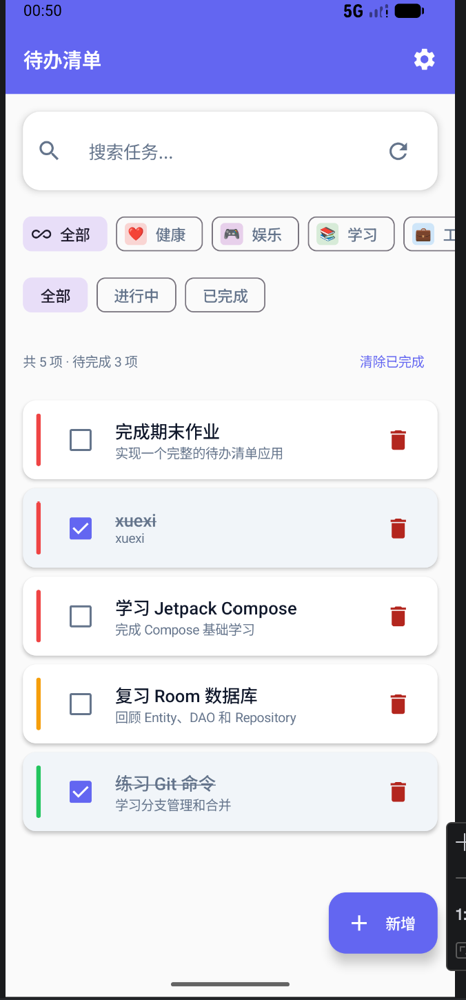
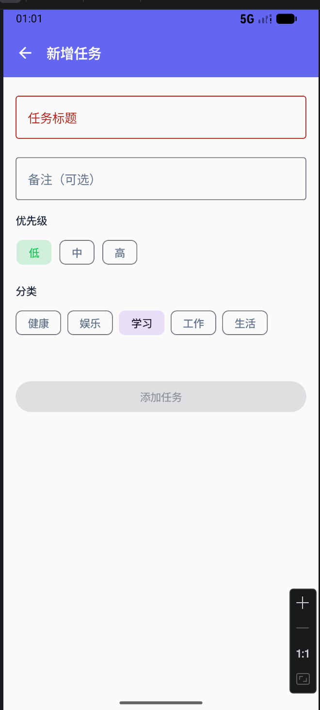
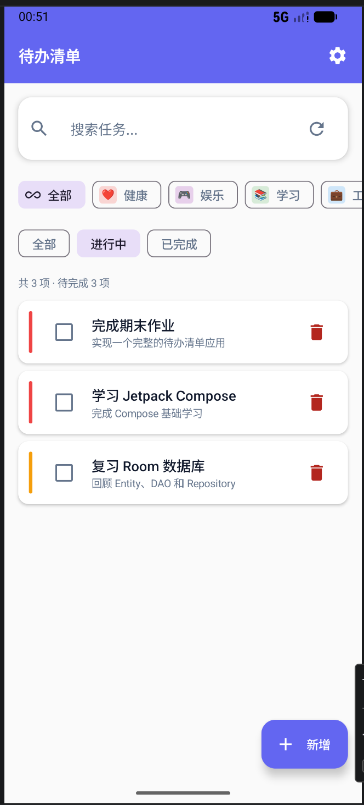
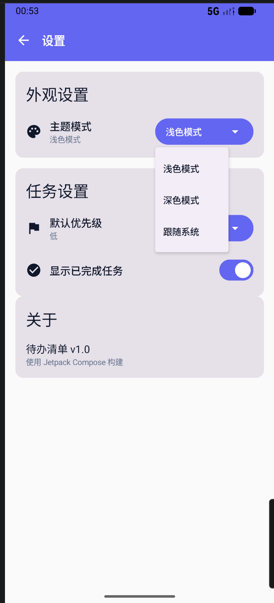

# 待办清单 (TodoList)

GitHub 仓库地址：https://github.com/Velprowq/2025003008-FinalProject.git

## 1. 项目简介

- 应用名称：待办清单 (TodoList)
- 目标用户：需要管理日常任务的用户
- 核心功能：
  - 任务信息的添加、编辑、删除和搜索
  - 任务状态管理（待完成→已完成）、优先级设置（低/中/高）
  - 任务分类管理（学习、工作、生活、健康、娱乐）
  - 基于 Mock API 的网络数据同步和初始数据加载
  - 用户偏好设置持久化（主题模式、默认优先级、显示已完成任务）
  - 深浅色主题自动切换

## 2. 技术栈

- UI：Jetpack Compose + Material 3
- 数据库：Room
- 网络：Retrofit + OkHttp（Mock 数据来源于 NetworkDataSource）
- 状态管理：ViewModel + StateFlow
- 持久化偏好：DataStore Preferences
- 导航：Navigation Compose
- 异步处理：Kotlin Coroutines
- 图片加载：Coil
- 其他依赖：Gson（JSON 解析）、KSP（Room 编译期注解处理）

## 3. 功能清单

### 必做项完成情况

**UI 层**
- [x] Jetpack Compose 构建全部 UI
- [x] 至少 2 个主要页面（首页、任务详情、新增任务、编辑任务、设置共 5 页）
- [x] Compose Navigation 导航
- [x] LazyColumn 列表（任务列表使用 LazyColumn，分类列表使用 LazyRow）
- [x] Material 3 组件和主题（Card、FAB、TopAppBar、FilterChip、AlertDialog、Checkbox、Snackbar 等）
- [x] 浅色 / 深色模式支持（自动跟随系统，通过 `isSystemInDarkTheme()` 切换）

**数据层**
- [x] Room 数据库，至少 2 张表（todos + categories）
- [x] 完整 CRUD 操作（两表均支持 Insert / Update / Delete / Query）
- [x] DAO 查询方法返回 Flow 类型（getAllTodos、getAllCategories 等返回 Flow）
- [x] 至少一种查询功能（任务标题/描述模糊搜索、按状态筛选、按分类筛选）
- [x] DataStore 保存用户偏好（主题模式、默认优先级、显示已完成任务）

**网络层**
- [x] 声明并使用 Internet 权限
- [x] 使用网络请求获取 Mock API 数据（NetworkDataSource 返回预设 Mock 数据）
- [x] 网络数据在核心页面中展示（首页展示从网络同步的任务数据）
- [x] 处理 Loading / Success / Error 等网络状态（isLoading、errorMessage）
- [x] Composable 不直接发起网络请求（通过 Repository → ViewModel 单向数据流）

**架构层**
- [x] ViewModel 状态管理（TodoViewModel + CategoryViewModel）
- [x] Repository 模式（TodoRepository 封装 TodoDao + NetworkDataSource）
- [x] StateFlow / Flow 数据流（ViewModel 持有 MutableStateFlow，暴露 StateFlow）
- [x] Kotlin 协程异步处理（viewModelScope.launch 调用 suspend 函数）
- [x] UiState 描述界面状态（TodoUiState、CategoryUiState）
- [x] Composable 不直接访问数据库或网络

**功能完整性**
- [x] 新增 / 编辑 / 删除 / 搜索等核心操作
- [x] 输入验证和错误提示（任务标题非空校验，红色错误提示）
- [x] 状态展示（空列表占位提示、加载中动画、错误 Snackbar 提示）
- [x] 屏幕旋转后状态保持（ViewModel 存活于 Activity 重建期间）

### 选做项完成情况

- [x] 复杂数据库查询：按状态筛选（全部/进行中/已完成）、按分类筛选、模糊搜索
- [x] 数据库迁移：支持从版本 1 到版本 2 的迁移（新增 categories 表和 categoryId 字段）
- [x] 优先级颜色标识：高/中/低优先级使用不同颜色标识（红色/橙色/绿色）
- [x] 任务统计：显示任务总数、待完成数量、清除已完成任务功能
- [x] 任务详情页：展示任务完整信息，支持编辑和删除操作

## 4. 数据库设计

### 表 1：todos（任务表）

| 字段名      | 类型    | 说明                              |
|-------------|---------|-----------------------------------|
| id          | Long    | 主键，自增                        |
| title       | String  | 任务标题                          |
| description | String  | 任务描述                          |
| isCompleted | Boolean | 是否已完成                        |
| priority    | Int     | 优先级：0 = 低，1 = 中，2 = 高    |
| categoryId  | Long    | 外键，关联 categories.id          |
| createdAt   | Long    | 创建时间（epoch 毫秒时间戳）       |
| dueDate     | Long    | 截止日期（epoch 毫秒时间戳，可选） |

### 表 2：categories（分类表）

| 字段名    | 类型    | 说明                              |
|-----------|---------|-----------------------------------|
| id        | Long    | 主键，自增                        |
| name      | String  | 分类名称                          |
| icon      | String  | 分类图标标识（book/briefcase/home/heart/gamepad） |
| color     | String  | 分类颜色（十六进制颜色值）        |
| isDefault | Boolean | 是否为默认分类                    |

**表关系**：todos 表通过 `categoryId` 外键关联 categories 表。数据库迁移时预置了 5 个分类（学习、工作、生活、健康、娱乐），默认分类为"学习"。

**主要 DAO 查询方法**：
- `getAllTodos(): Flow<List<TodoEntity>>` — 获取全部任务，按优先级降序、创建时间降序排列
- `getActiveTodos(): Flow<List<TodoEntity>>` — 获取未完成任务
- `getCompletedTodos(): Flow<List<TodoEntity>>` — 获取已完成任务
- `searchTodos(query): Flow<List<TodoEntity>>` — 按标题或描述模糊搜索
- `getTodosByCategory(categoryId): Flow<List<TodoEntity>>` — 按分类筛选任务
- `getAllCategories(): Flow<List<CategoryEntity>>` — 获取所有分类

## 5. 网络功能设计

- API 来源：自定义 Mock API（通过 NetworkDataSource 返回本地构造的数据）
- 接口地址：
  - `GET /todos` — 获取任务列表
  - `GET /categories` — 获取分类列表
- 请求方式：GET
- 主要返回字段：
  - 任务：id, title, description, isCompleted, priority, createdAt, dueDate
  - 分类：id, name, icon, color
- App 中使用这些网络数据的页面或功能：
  - 应用启动时自动同步网络数据到本地数据库
  - 首页刷新按钮手动触发网络同步
- 网络失败时的处理方式：`Result` 包装网络调用，通过 `isSuccess` 判断结果，错误信息通过 Snackbar 展示给用户

## 6. 架构设计

```
┌─────────────────────────────────────────────────┐
│                    UI Layer                       │
│  HomeScreen / AddTodoScreen /                     │
│  DetailScreen / EditTodoScreen /                 │
│  SettingsScreen                                  │
│  (Composable 函数，仅消费 StateFlow)              │
└──────────────────┬──────────────────────────────┘
                   │ 持有 StateFlow<UiState>
                   │
┌──────────────────▼──────────────────────────────┐
│                 ViewModel                         │
│  TodoViewModel / CategoryViewModel                │
│  (持有 MutableStateFlow，暴露 StateFlow)          │
│  (通过 viewModelScope.launch 调用 Repository)     │
└──────────────────┬──────────────────────────────┘
                   │
┌──────────────────▼──────────────────────────────┐
│              Repository                           │
│  TodoRepository / CategoryRepository              │
│  (整合 DAO + NetworkDataSource)                  │
└────┬──────────┬───────────┬─────────────────────┘
     │          │           │
┌────▼──┐ ┌────▼──┐  ┌─────▼──────┐
│ Room   │ │DataSt.│  │  Network    │
│ DAO    │ │       │  │  (Mock)     │
└────────┘ └───────┘  └────────────┘
```

数据流向：**UI Layer** 通过 `collectAsState()` 订阅 ViewModel 的 `StateFlow`。ViewModel 通过 `viewModelScope.launch` 调用 Repository 的 suspend 函数。Repository 作为唯一数据源，整合 Room DAO（本地持久化）、DataStore（用户偏好）和 NetworkDataSource（远程/Mock 数据）。Composable 不直接调用数据库或网络 API，所有数据操作都经过 ViewModel 和 Repository。

## 7. 核心功能截图

### 首页

说明：展示任务列表，支持搜索框输入搜索，支持分类筛选（学习/工作/生活/健康/娱乐）和状态筛选（全部/进行中/已完成）。任务卡片显示优先级色标、标题、描述和截止日期。已完成任务灰色显示并带删除线。右下角 FAB 按钮添加新任务。

### 新增任务

说明：填写任务标题、描述（可选），选择优先级（低/中/高）和分类。任务标题非空校验，为空时按钮禁用。

### 任务详情

说明：展示任务完整信息，包括标题、完成状态、描述、优先级、创建时间、截止日期。支持切换完成状态、编辑任务和删除任务。

### 设置

说明：主题模式切换（浅色/深色/跟随系统），默认优先级设置（低/中/高)，显示已完成任务开关，关于信息。

## 8. 技术难点与解决方案

### 难点 1：多条件组合筛选

- 问题描述：任务列表需要同时支持按状态筛选、按分类筛选和搜索，需要动态组合这些条件。
- 原因分析：多个筛选条件需要协同工作，搜索条件优先级最高，其次是状态和分类。
- 解决方案：在 `TodoRepository.getTodos()` 方法中使用 `filterMode` 和 `categoryId` 参数动态选择不同的 DAO 查询。在 ViewModel 中使用 `combine` 和 `flatMapLatest` 组合多个 StateFlow，当任一条件变化时自动重新查询。

### 难点 2：Mock 数据的网络层设计

- 问题描述：项目需要网络功能但无真实后端 API，需要模拟网络请求流程。
- 原因分析：直接在代码中硬编码假数据无法满足"使用网络请求"的要求，需要模拟真实的 HTTP 请求-响应流程。
- 解决方案：使用 NetworkDataSource 封装 Mock 数据，在 `fetchTodos()` 和 `fetchCategories()` 方法中模拟网络延迟（delay），返回 `Result` 类型。Retrofit 和 OkHttp 正常配置，便于后续切换到真实 API。

### 难点 3：数据库迁移

- 问题描述：项目迭代过程中需要新增分类功能，需要在已有数据库上新增表和字段。
- 原因分析：直接修改数据库 schema 会导致旧版本应用崩溃，需要编写迁移脚本。
- 解决方案：使用 Room 的 Migration API，编写 `MIGRATION_1_2` 迁移脚本，创建 categories 表、为 todos 表添加 categoryId 字段、插入预置分类数据。

## 9. AI 使用说明

请在以下选项中勾选，可多选：

- [ ] 未使用 AI
- [√] 网页版 AI（如 ChatGPT、Claude、Kimi、豆包等）
- [ ] AI Agent / 编程代理（如 Claude Code、Codex、OpenCode、Cursor Agent 等）
- [√] 国产大模型服务（如 DeepSeek、GLM、通义千问、文心一言等）
- [√] IDE 插件或代码补全工具（如 GitHub Copilot、Cursor、CodeGeeX 等）
- [ ] 其他：

具体工具名称：
豆包、通义千问、Codebuddy
AI 主要用于哪些环节：（如选题分析、代码生成、调试、报告整理等）
代码逻辑梳理、代码报错调试、实验报告文字润色、知识点概念解释、代码示例参考编写
说明：是否使用 AI 以及使用了什么 AI 工具不会影响分值，请如实填写。

## 10. 运行说明

- 最低 Android 版本：API 26（Android 8.0）
- 推荐 Android 版本：API 34（Android 14）/ 目标 SDK 34
- 特殊权限：`android.permission.INTERNET`（网络权限）、`android.permission.ACCESS_NETWORK_STATE`（网络状态权限）
- 运行步骤：
  1. 克隆仓库：`git clone https://github.com/Jack-gmdz/2025003025-FinalProject`
  2. 使用 Android Studio（Hedgehog 或更新版本）打开项目
  3. 等待 Gradle 同步完成（需 KSP 插件编译 Room）
  4. 连接 Android 模拟器（API 26+）或真机，点击 Run

## 11. 项目亮点（可选）

1. **多维度任务管理**：支持优先级、分类、状态三种维度的任务管理，满足用户对任务的精细化管理需求。
2. **响应式数据流**：使用 StateFlow + Flow 实现响应式数据更新，任务状态变化实时反映到 UI。
3. **Mock 网络层透明设计**：通过 NetworkDataSource 封装 Mock 数据，切换到真实 API 只需修改 NetworkDataSource 实现。
4. **完整的任务生命周期**：从新增、编辑、完成到删除，提供完整的任务管理流程，支持任务详情查看。

## 12. 未来改进方向（可选）

1. **通知提醒**：基于截止日期设置，通过 WorkManager 定时检查即将到期的任务并发送系统通知。
2. **数据统计分析**：增加任务完成率、各分类任务数量、优先级分布等统计图表。
3. **数据导入导出**：支持任务数据的 JSON 导入导出，便于备份或迁移。
4. **真实后端对接**：将 Mock API 替换为 Firebase Realtime Database 或自建 Spring Boot 后端。
5. **任务排序**：支持按创建时间、截止日期、优先级等多种方式排序。
