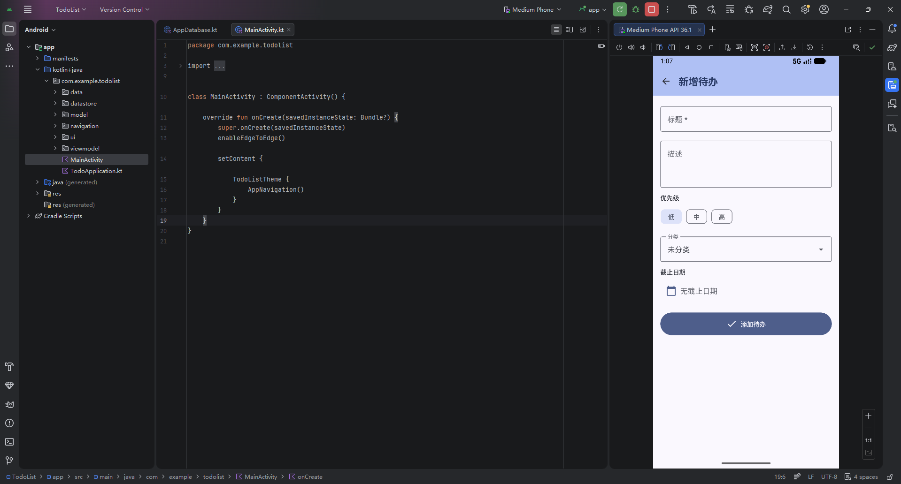
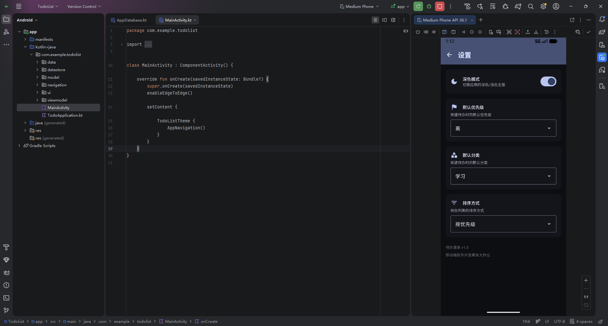
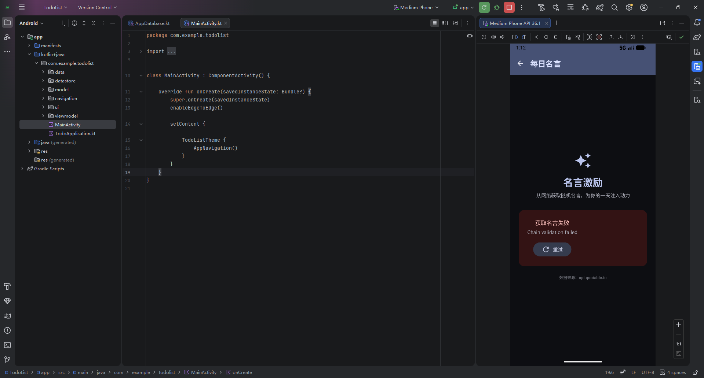

# 待办清单 (TodoList)

GitHub 仓库地址：https://github.com/Clj2636/2025003009FinalProject.git

## 1. 项目简介

- 应用名称：待办清单 (TodoList)
- 目标用户：需要管理日常任务和待办事项的用户，学生和职场人士
- 核心功能：
  - 待办事项的增删改查（新建、编辑、删除、查看）
  - 待办事项分类管理（工作、学习、生活、健康、购物、其他）
  - 优先级设置（高、中、低三档）
  - 截止日期提醒
  - 搜索功能（按标题和描述模糊搜索）
  - 筛选功能（全部、进行中、已完成）
  - 完成进度可视化展示
  - 每日名言激励（从网络获取随机名言）
  - 支持浅色/深色模式
  - 支持屏幕旋转后状态保持

## 2. 技术栈

- UI：Jetpack Compose + Material 3
- 数据库：Room（本地 SQLite 持久化）
- 网络：Retrofit / OkHttp（接口来源：api.quotable.io 免费名言 API）
- 状态管理：ViewModel + StateFlow
- 持久化偏好：DataStore Preferences
- 导航：Navigation Compose
- 异步处理：Kotlin Coroutines + Flow
- 其他依赖：Material Icons Extended

## 3. 功能清单

### 必做项完成情况

**UI 层**
- [x] Jetpack Compose 构建全部 UI
- [x] 至少 2 个主要页面（首页、编辑页、设置页、名言页 — 共 4 个）
- [x] Compose Navigation 导航
- [x] LazyColumn 列表（首页待办列表）
- [x] Material 3 组件和主题（Card、Button、TextField、TopAppBar、FAB、Snackbar、Dialog、FilterChip、DropdownMenu 等）
- [x] 浅色 / 深色模式支持（自定义 TodoListTheme，支持跟随系统或手动切换）
- [x] DockedSearchBar 搜索栏

**数据层**
- [x] Room 数据库（2 张表：todos、categories）
- [x] 完整 CRUD 操作（新增、查看、编辑、删除待办事项）
- [x] DataStore 保存用户偏好（深色模式、默认优先级、默认分类、排序方式）
- [x] 搜索功能（按标题和描述模糊搜索）
- [x] 数据库预填充默认分类（工作、学习、生活、健康、购物、其他）

**网络层**
- [x] 声明并使用 Internet 权限
- [x] 使用 Retrofit + OkHttp 获取 api.quotable.io 随机名言
- [x] 网络数据在每日名言页面中展示
- [x] 处理 Loading / Success / Error 等网络状态
- [x] Composable 不直接发起网络请求（通过 QuoteRepository 封装）

**架构层**
- [x] ViewModel 状态管理（HomeViewModel、EditViewModel、SettingsViewModel、QuoteViewModel）
- [x] Repository 模式（TodoRepository、CategoryRepository、QuoteRepository、UserPreferencesRepository）
- [x] StateFlow 数据流（所有 UiState 通过 StateFlow 暴露）
- [x] Kotlin 协程异步处理（viewModelScope.launch）
- [x] sealed interface 描述 UiState（HomeUiState、EditUiState、QuoteUiState、SettingsUiState）
- [x] Composable 不直接访问数据库或网络

**功能完整性**
- [x] 新增 / 编辑 / 删除 / 搜索等核心操作
- [x] 输入验证和错误提示（标题不能为空）
- [x] 状态展示（Loading / Success / Error / Empty）
- [x] 屏幕旋转后状态保持（ViewModel 管理，配置变更不丢失数据）
- [x] 完成进度百分比展示

### 选做项完成情况

- [x] 分类管理（6 个默认分类）
- [x] 优先级管理（高/中/低三档）
- [x] 截止日期选择（DatePickerDialog）
- [x] 清除已完成待办（一键删除）
- [x] 每日名言激励页面
- [ ] 待办事项重复提醒功能未实现
- [ ] 待办分类统计功能未实现

## 4. 数据存储设计

### TodoEntity（待办事项）

| 字段名 | 类型 | 说明 |
|---|---|---|
| id | Long | 主键，自增 |
| title | String | 待办标题（必填） |
| description | String | 待办描述（可选） |
| isCompleted | Boolean | 是否已完成 |
| priority | Int | 优先级（0=低, 1=中, 2=高） |
| categoryId | Long | 分类 ID（0 表示未分类） |
| dueDate | Long | 截止日期时间戳 |
| createdAt | Long | 创建时间 |
| updatedAt | Long | 更新时间 |

### CategoryEntity（分类）

| 字段名 | 类型 | 说明 |
|---|---|---|
| id | Long | 主键，自增 |
| name | String | 分类名称 |
| color | Long | 分类颜色（ARGB） |
| icon | String | 分类图标名称 |

默认分类：工作（蓝色）、学习（绿色）、生活（橙色）、健康（粉色）、购物（紫色）、其他（灰色）

### 主要数据操作方法

- `TodoRepository.getAllTodos()` — 获取所有待办
- `TodoRepository.getTodoById(id)` — 根据 ID 获取单个待办
- `TodoRepository.getTodosByCategory(categoryId)` — 根据分类获取待办
- `TodoRepository.getTodosByCompletion(completed)` — 根据完成状态获取待办
- `TodoRepository.searchTodos(query)` — 模糊搜索待办
- `TodoRepository.getActiveCount()` — 获取进行中数量
- `TodoRepository.getCompletedCount()` — 获取已完成数量
- `TodoRepository.insertTodo(todo)` — 新增待办
- `TodoRepository.updateTodo(todo)` — 更新待办
- `TodoRepository.deleteTodo(todo)` — 删除待办
- `TodoRepository.deleteCompletedTodos()` — 删除所有已完成的待办

### DataStore Preferences

通过 `UserPreferencesRepository` 管理：

| 键 | 类型 | 说明 |
|---|---|---|
| dark_mode | Boolean | 深色模式开关 |
| default_category_id | Long | 新建待办时的默认分类 |
| default_priority | Int | 新建待办时的默认优先级 |
| sort_order | String | 排序方式（priority/date/category） |
| last_search_query | String | 最近搜索词 |

## 5. 网络功能设计

- API 来源：Quotable 免费名言 API（无需 API Key）
- 接口地址：`https://api.quotable.io/random`
- 请求方式：`GET`
- 主要返回字段：
  - `_id` — 名言 ID
  - `content` — 名言内容
  - `author` — 作者
  - `tags` — 标签数组
- App 中使用这些网络数据的页面：**每日名言页** — 展示随机获取的名言、作者和标签
- 网络失败时的处理方式：显示错误状态和重试按钮，不影响本地待办功能

## 6. 架构设计

项目采用 **MVVM + Repository** 架构，清晰分层：

```
UI Layer (Composable Screens)
    ↕ collectAsState() / 事件回调
ViewModel Layer (HomeViewModel, EditViewModel, SettingsViewModel, QuoteViewModel)
    ↕ StateFlow<UiState>
Repository Layer (TodoRepository, CategoryRepository, QuoteRepository, UserPreferencesRepository)
    ↕ 同步/异步调用
Data Layer (Room Database, Retrofit ApiService, DataStore)
```

- **Data Layer**：`AppDatabase`（Room 数据库）、`QuoteApiService`（Retrofit 定义）、`DataStore`（用户偏好）
- **Repository**：`TodoRepository` 封装待办 CRUD 操作、`CategoryRepository` 封装分类操作、`QuoteRepository` 封装网络请求、`UserPreferencesRepository` 封装 DataStore 操作
- **ViewModel**：每个页面一个 ViewModel，持有 `MutableStateFlow<UiState>`，通过 `viewModelScope.launch` 处理异步操作
- **UiState**：使用 `sealed interface` 定义（`Loading` / `Success` / `Error` / `Empty`），`Success` 中包含页面所需全部数据
- **UI Layer**：Composable 通过 `collectAsState()` 收集状态，根据 UiState 类型渲染对应 UI

## 7. 核心功能截图

### 首页
- 说明：展示待办列表、筛选栏（全部/进行中/已完成）、搜索栏、完成进度提示、FAB 添加按钮。用户可点击待办编辑、勾选完成、删除待办。

### 新增/编辑页

- 说明：可输入标题（必填）和描述（可选），选择优先级（高/中/低），选择分类（工作/学习/生活/健康/购物/其他），设置截止日期，支持新增和编辑。

### 设置页

- 说明：深色模式开关、默认优先级设置、默认分类设置、排序方式设置。

### 每日名言页

- 说明：从网络获取随机名言，展示名言内容、作者、标签，可刷新获取新的名言。

## 8. 技术难点与解决方案

### 难点 1：Room 数据库预填充分类数据的异步问题

- 问题描述：原来使用 `CoroutineScope(Dispatchers.IO).launch` 在 `onCreate` 回调中异步插入分类数据，但由于 `INSTANCE` 尚未赋值完成，导致 `INSTANCE?.let { database -> ... }` 中的 `INSTANCE` 为 null，分类数据插入失败
- 原因分析：`Room.databaseBuilder().build()` 是同步方法，但在返回前会触发 `onCreate` 回调，而此时 `INSTANCE` 尚未被赋值
- 解决方案：改用同步 SQL 插入方式，直接在 `onCreate` 回调中使用 `SupportSQLiteDatabase.insert()` 方法插入默认分类数据，避免异步竞态条件

### 难点 2：EditViewModel 中 Flow.collect 导致状态被覆盖

- 问题描述：在 `EditViewModel` 中使用 `categoryRepository.getAllCategories().collect { categories -> ... }` 会持续监听分类数据更新，可能导致用户在编辑表单时状态被新数据覆盖
- 原因分析：`collect` 是热流，会持续发射数据，每当数据库中的分类发生变化就会触发更新，覆盖当前编辑状态
- 解决方案：改用 `first()` 方法只获取一次数据，避免持续监听导致的状态覆盖问题

### 难点 3：HomeUiState.Empty 状态下分类信息丢失

- 问题描述：当待办列表为空时，`HomeUiState.Empty` 状态不包含分类数据，导致用户点击添加待办时无法选择分类
- 原因分析：原设计将空状态设计为单独的 sealed class，不包含分类列表
- 解决方案：移除 `HomeUiState.Empty` 判断，始终返回 `HomeUiState.Success` 状态，在 UI 层判断列表是否为空来决定显示空状态还是列表内容

## 9. AI 使用说明

请在以下选项中勾选，可多选：

- [ ] 未使用 AI
- [ ] 网页版 AI（如 ChatGPT、Claude、Kimi、豆包等）
- [x] AI Agent / 编程代理（如 Claude Code、Codex、OpenCode、Cursor Agent 等）
- [ ] 国产大模型服务（如 DeepSeek、GLM、通义千问、文心一言等）
- [x] IDE 插件或代码补全工具（如 GitHub Copilot、Cursor、CodeGeeX 等）
- [ ] 其他：

具体工具名称：CodeBuddy (AI Agent)

AI 主要用于哪些环节：
1. **项目功能完善**：修复待办列表和分类存储问题
2. **Room 数据库优化**：修复分类数据预填充的异步问题
3. **ViewModel 状态管理**：修复 Flow.collect 导致的状态覆盖问题
4. **代码调试与错误修复**：解决编译错误和运行时问题
5. **文档生成**：基于项目代码整理 README.md

说明：是否使用 AI 以及使用了什么 AI 工具不会影响分值，请如实填写。

## 10. 运行说明

- 最低 Android 版本：API 24（Android 7.0）
- 推荐 Android 版本：API 34（Android 14）
- 编译要求：JDK 17+
- 特殊权限：`android.permission.INTERNET`（用于名言 API 请求）
- 运行步骤：
  1. 克隆仓库：https://github.com/Clj2636/2025003009FinalProject.git
  2. 使用 Android Studio（推荐 2024.3+）打开项目
  3. 等待 Gradle 同步完成
  4. 连接模拟器或真机（Android 7.0+），点击 Run
  5. 首次运行会自动创建数据库并预填充 6 个默认分类

## 11. 项目亮点

1. **完善的 MVVM 架构**：清晰的分层设计，UI / ViewModel / Repository / Data 层各司其职
2. **Room 数据库完整实现**：包含 2 张表、多个查询方法、Room Callbacks 预填充数据
3. **多维度筛选和搜索**：支持按分类、优先级、完成状态筛选，支持标题和描述模糊搜索
4. **Material 3 设计规范**：使用最新的 Material 3 组件库，包括 FilterChip、ExposedDropdownMenuBox、DockedSearchBar 等
5. **深色模式完整支持**：通过 DataStore 持久化用户偏好，支持跟随系统或手动切换
6. **网络名言激励功能**：集成 Quotable API，展示随机名言为用户注入动力
7. **状态管理健壮**：使用 sealed interface 定义 UiState，完整处理 Loading/Success/Error/Empty 状态
8. **配置变更恢复**：ViewModel 保存 UI 状态，屏幕旋转后数据不丢失

## 12. 未来改进方向

1. **分类管理页面**：允许用户添加、编辑、删除自定义分类
2. **待办提醒通知**：使用 WorkManager 或 AlarmManager 实现定时提醒推送
3. **数据备份与恢复**：支持将数据导出为 JSON 或云端同步
4. **批量操作**：支持批量标记完成、批量移动分类
5. **Widget 小部件**：支持桌面小组件快速查看和添加待办
