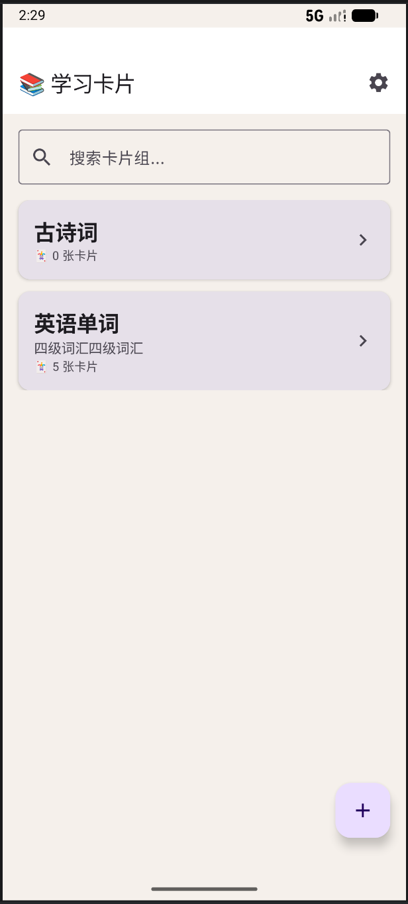
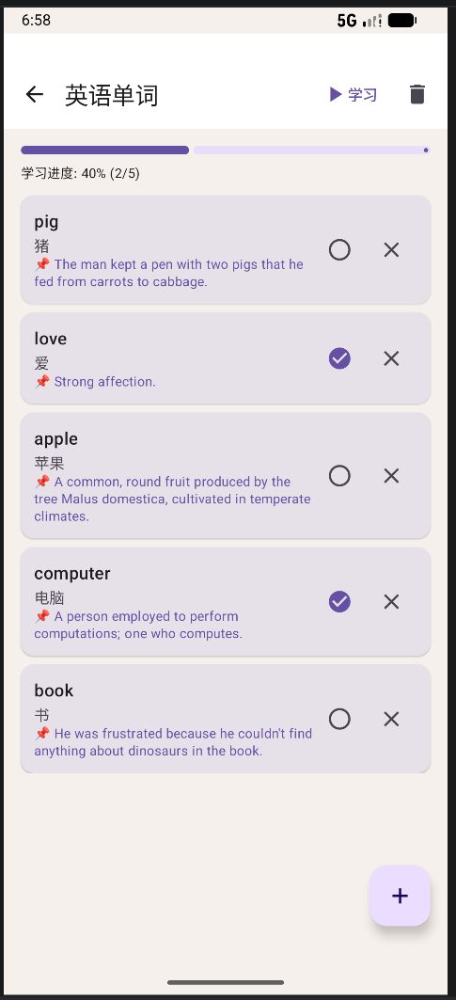
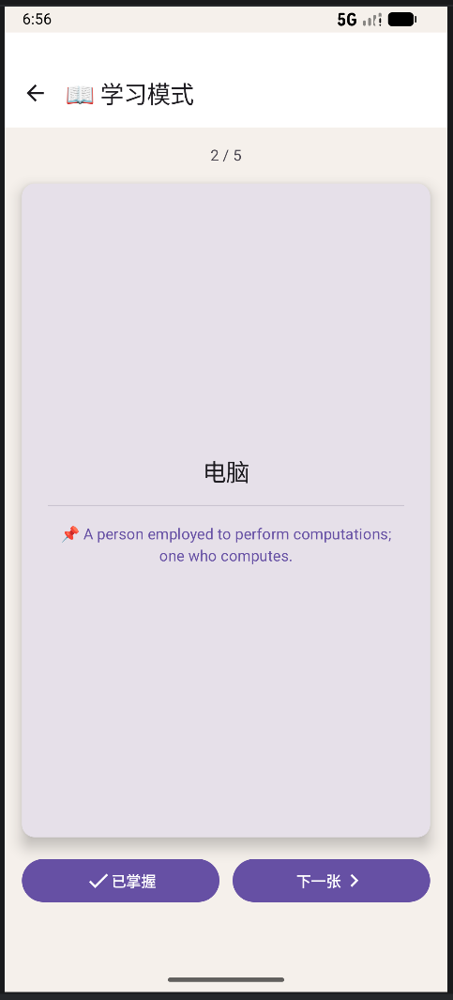
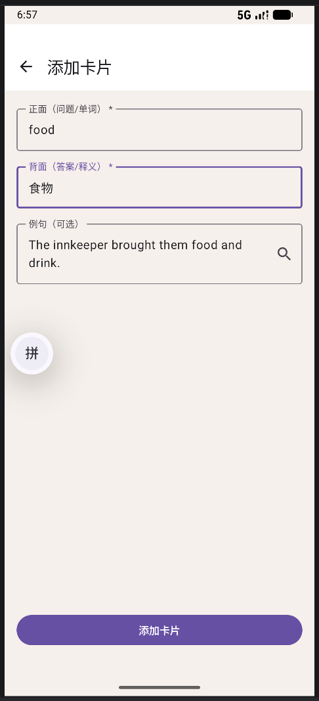
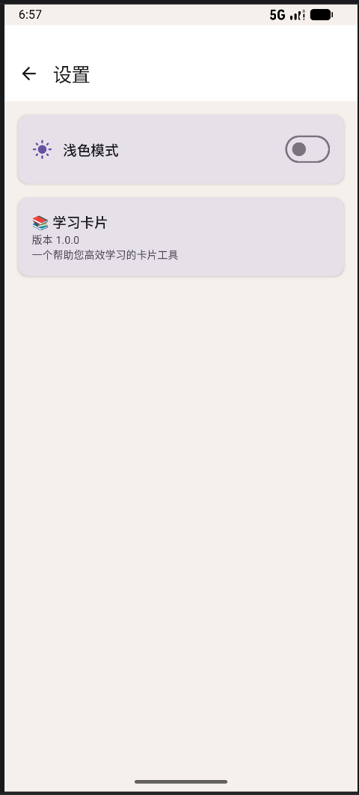
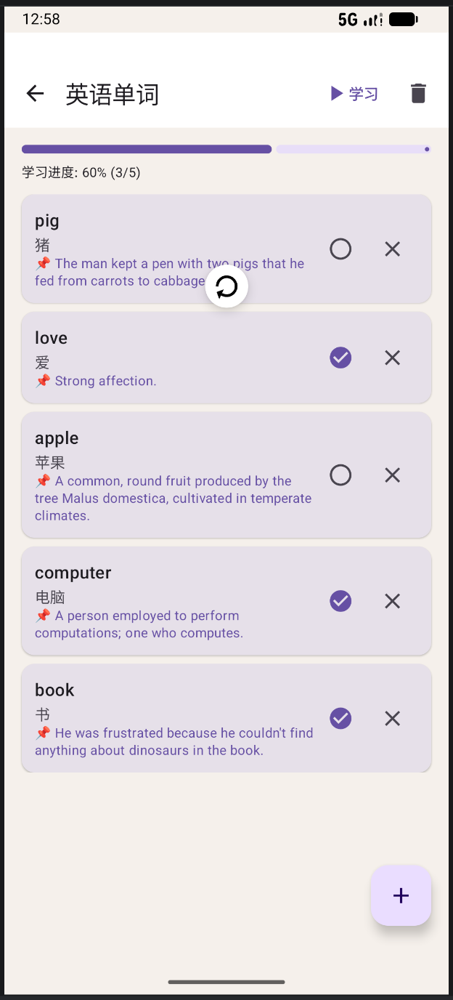

# 项目名称

GitHub 仓库地址：https://github.com/yf-13/2025003013-FinalProject.git

## 1. 项目简介

应用名称：学习卡片（StudyFlash）
选题方向：内容管理类应用 — 学习卡片管理工具
目标用户：学生、语言学习者、备考人员、知识管理爱好者
核心功能：
创建/删除卡片组
添加/删除学习卡片（正面问题 + 背面答案）
学习模式（卡片翻转、标记掌握状态）
搜索卡片组
深色/浅色模式切换
网络获取例句（词典API）


## 2. 技术栈

- UI：Jetpack Compose + Material 3
- 数据库：Room（2张表）
- 网络：Retrofit + Moshi
- 状态管理：ViewModel + StateFlow
- 持久化偏好：DataStore
- 导航：Navigation Compose
- 异步处理：Kotlin Coroutines
- 编程语言	Kotlin
- 最低 SDK	API 24（Android 7.0）

## 3. 功能清单

### 必做项完成情况

**UI 层**
- Jetpack Compose 构建全部 UI
- 6个主要页面（首页/卡片组详情/学习模式/添加卡片组/添加卡片/设置）
- Compose Navigation 页面导航
- LazyColumn 列表展示
- Material 3 组件（Card、Button、TextField、TopAppBar、FAB、Switch、Dialog）
- 自定义主题 + 深色/浅色模式切换

**数据层**
- Room 数据库，2张表（CardGroupEntity + CardEntity）
- 完整 CRUD 操作（增/删/改/查）
- DAO 查询返回 Flow 类型
- 搜索功能（模糊查询 LIKE）
- DataStore 保存主题偏好 + 最近访问卡片组

**网络层**
- 声明并使用 Internet 权限
- 使用 Retrofit 从 Free Dictionary API 获取例句
- 网络数据在添加卡片时使用（获取例句）
- 处理 Loading / Success / Error 状态
- Repository 封装网络请求

**架构层**
- ViewModel 管理 UI 状态
- Repository 模式隔离数据来源
- StateFlow 数据流
- Kotlin 协程异步处理
- UiState 使用 sealed interface
- Composable 不直接访问数据库或网络

**功能完整性**
- 新增卡片组 / 新增卡片
- 删除卡片组 / 删除卡片
- 搜索卡片组
- 标记掌握/未掌握
- 学习模式（卡片翻转）
- 输入验证（名称不能为空）
- 空状态 / 加载状态 / 错误状态
- 屏幕旋转后状态保持

### 选做项完成情况

- 网络获取例句（Free Dictionary API）
- 搜索功能
- 深色/浅色模式切换
- 学习进度追踪
- 下拉刷新（首页和详情页）
- 
## 4. 数据库设计

### 表1：card_groups（卡片组）

| 字段名 | 类型 | 说明 |
|---|---|---|
| id | Long | 主键，自增 |
| name | String | 卡片组名称 |
| description | String | 描述（可空） |
| color | String | 主题色（预留） |
| createdAt | Long | 创建时间戳 |

### 表2：cards（卡片）

| 字段名 | 类型 | 说明 |
|---|---|---|
| id | Long | 主键，自增 |
| groupId | Long | 外键，关联卡片组 |
| front | String | 正面内容（问题/单词） |
| back | String | 背面内容（答案/释义） |
| example | String | 例句（可空，来自网络） |
| mastered | Boolean | 是否已掌握 |
| createdAt | Long | 创建时间戳 |

**表关系**：一对多（一个卡片组包含多张卡片，删除卡片组时级联删除所有卡片）

## 5. 网络功能设计

- API 来源：Free Dictionary API（免费词典 API）
- 接口地址：https://api.dictionaryapi.dev/api/v1/entries/en/{word}
- 请求方式：GET
- 主要返回字段：word、meaning.definition、meaning.example
- 使用场景：在添加卡片时，用户点击"获取例句"按钮，根据正面（单词）自动获取例句
- 网络失败处理：
	如果单词不存在或网络异常，静默失败，不弹出错误提示
   	用户可手动输入例句，不影响核心功能
  	部分单词只有定义（definition）没有例句（example），会自动显示定义作为备选
API 调用流程：
1、用户在添加卡片页面输入正面内容（单词）
2、点击"获取例句"按钮
3、通过 Retrofit 调用 Free Dictionary API
4、解析返回的 JSON 数据，提取 meaning.example
5、自动填入例句输入框
6、如果 API 调用失败，不显示错误，用户可以手动输入

## 6. 架构设计

┌─────────────────────────────────────────────────────────┐
│                     UI Layer                           │
│  (Composable 函数：HomeScreen, StudyScreen, etc.)      │
│  - 只负责界面展示和事件触发                             │
│  - 通过 collectAsState 收集状态                        │
└─────────────────────────────────────────────────────────┘
                            │
                            ▼
┌─────────────────────────────────────────────────────────┐
│                   ViewModel Layer                      │
│                    StudyViewModel                       │
│  - 持有 UiState (StateFlow)                           │
│  - 处理业务逻辑                                         │
│  - 通过 Repository 访问数据                            │
└─────────────────────────────────────────────────────────┘
                            │
                            ▼
┌─────────────────────────────────────────────────────────┐
│                    Repository                          │
│                    StudyRepository                      │
│  - 隔离数据来源                                         │
│  - 合并本地数据 + 网络数据                             │
└─────────────────────────────────────────────────────────┘
           │                       │
           ▼                       ▼
┌──────────────────┐    ┌──────────────────┐
│    Local Data    │    │    Network Data  │
│     Room         │    │    Retrofit      │
│   DataStore      │    │   Free API       │
└──────────────────┘    └──────────────────┘

数据流向：
1、UI 触发事件（点击、输入）
2、ViewModel 接收事件，调用 Repository
3、Repository 从数据库/网络获取数据
4、数据通过 Flow 返回 ViewModel
5、ViewModel 更新 UiState
6、UI 自动重组显示新状态

## 7. 核心功能截图

### 首页

说明：展示所有卡片组列表，支持搜索

### 卡片组详情

说明：展示组内所有卡片，显示学习进度

### 学习模式

说明：卡片翻转学习，标记掌握状态

### 添加卡片

说明：添加新卡片，支持网络获取例句

### 设置页

说明：切换深色/浅色模式

### 下拉刷新

说明：首页支持下拉刷新，更新卡片组列表，刷新时显示加载指示器

## 8. 技术难点与解决方案

### 难点 1：Gradle 版本不兼容导致项目无法同步

- 问题描述：项目同步时报错 Minimum supported Gradle version is 8.9. Current version is 8.7
- 原因分析：Android Studio 版本（Ladybug）要求较新的 Gradle 版本，而项目默认使用旧版本
- 解决方案：
1、升级 gradle-wrapper.properties 中的 Gradle 版本到 8.13
2、升级 AGP 版本到 8.13.0
3、添加阿里云镜像加速依赖下载
4、多次 Invalidate Caches 清理缓存
最终版本：AGP 8.13.0 + Gradle 8.13 + Kotlin 1.9.24

### 难点 2：Compose Navigation 参数传递语法错误
- 问题描述：页面跳转时传递 groupId 参数报错 No value passed for parameter 'argument'
- 原因分析：navArgument 的写法有语法错误，使用了错误的 API
- 解决方案：
使用 `navArgument("groupId") { defaultValue = 0L }` 替代错误的 `NamedNavArgument`

### 难点 3：搜索后返回不刷新列表
- 问题描述：问题描述：搜索卡片组后进入详情页，返回时仍停留在搜索结果，不显示全部卡片组
- 原因分析：searchQuery 状态在离开页面时没有重置
- 解决方案：在 HomeScreen 中添加 LaunchedEffect(Unit)，每次进入首页时清空搜索框并重新加载

### 难点 4：Room 数据库列名映射错误
- 问题描述：SQL 查询中 `group_id` 报错 `Cannot resolve symbol`
- 解决方案：在 Entity 中使用 `@ColumnInfo(name = "groupId")` 显式指定列名，SQL 中使用驼峰命名

### 难点 5：网络 API 数据结构不匹配导致例句获取失败

- 问题描述：点击"获取例句"按钮后，日志显示 API 返回了数据，但 `meanings=null`，无法提取例句
- 原因分析：
  1. 最初使用的 DTO 字段是 `meanings`（复数），但 API 实际返回的是 `meaning`（单数）
  2. 词性分组是 `noun`/`verb`，而不是 `definitions`
  3. 部分单词没有 `example` 字段，只有 `definition`
- 解决方案：
  1. 修改 DTO，将 `meanings` 改为 `meaning`，添加 `noun`/`verb` 词性分组
  2. 在 Repository 中优先取 `example`，如果没有则取 `definition` 作为备选
  3. 遍历 `noun` 和 `verb` 两个词性分组，提高数据提取成功率

### 难点 6：下拉刷新状态管理

- **问题描述**：实现下拉刷新后，刷新指示器一直旋转，无法停止
- **原因分析**：`onRefresh` 中立即将 `isLoading` 设为 `false`，但数据加载是异步的，实际加载完成后没有重置状态
- **解决方案**：使用 `LaunchedEffect` 监听 `groupState`，当状态不再是 `Loading` 时，自动将 `isLoading` 设为 `false`
  ```kotlin
  LaunchedEffect(groupState) {
      if (groupState !is GroupListUiState.Loading) {
          isLoading = false
      }
  }

## 9. AI 使用说明

请在以下选项中勾选，可多选：

- [ ] 未使用 AI
- [√ ] 网页版 AI（如 ChatGPT、Claude、Kimi、豆包等）
- [√ ] AI Agent / 编程代理（如 Claude Code、Codex、OpenCode、Cursor Agent 等）
- [√ ] 国产大模型服务（如 DeepSeek、GLM、通义千问、文心一言等）
- [√ ] IDE 插件或代码补全工具（如 GitHub Copilot、Cursor、CodeGeeX 等）
- [ ] 其他：

具体工具名称：ChatGPT-4o、GitHub Copilot

AI 主要用于选题分析和功能设计；代码生成和模板搭建；调试和错误排查（Gradle 配置、Navigation 参数、数据库查询等）；报告整理
说明：是否使用 AI 以及使用了什么 AI 工具不会影响分值，请如实填写。

## 10. 运行说明

- 最低 Android 版本：API 24（Android 7.0）
- 推荐 Android 版本：API 34（Android 14）
- 特殊权限：INTERNET 网络权限
- 运行步骤：
  1. 克隆仓库：`git clone https://github.com/yf-13/2025003013-FinalProject.git
  2. 使用 Android Studio 打开项目
  3. 等待 Gradle 同步完成
  4. 连接模拟器或真机，点击 Run

## 11. 项目亮点

1、完整的 MVVM 分层架构，代码结构清晰，便于维护
2、学习模式交互流畅，点击卡片翻转，进度追踪可视化
3、网络功能真实可用，集成 Free Dictionary API 获取例句
4、深色/浅色模式自适应，保存用户偏好
5、数据持久化完整，Room 两张表 + DataStore 双重存储
6、空状态/加载状态/错误状态全覆盖，用户体验良好
7、首页和详情页支持下拉刷新，交互自然流畅，用户体验良好

## 12. 未来改进方向

1、添加图表统计：用图表展示学习进度变化趋势
2、导出功能：支持导出卡片组为 JSON 或 CSV 文件
3、语音朗读：学习模式下朗读卡片内容
4、复习提醒：使用 WorkManager 实现定期学习提醒通知
5、多语言支持：国际化（中/英切换）
6、卡片分组标签：给卡片添加标签，支持多维度筛选
