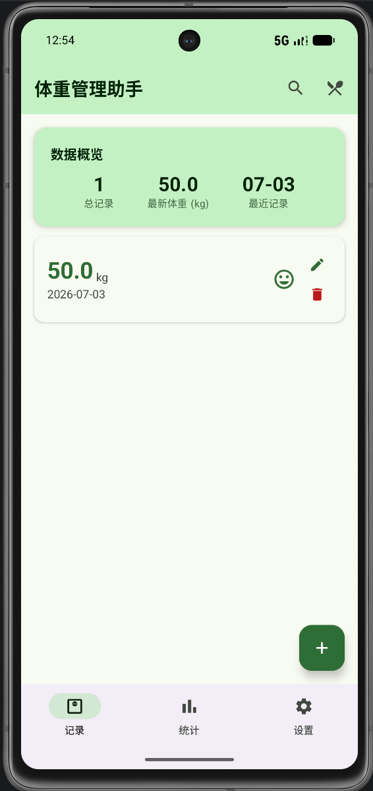

# 体重管理助手 (Weight Manager)

GitHub 仓库地址：https://github.com/chenyunchao803/WeightManager

## 1. 项目简介

- **应用名称**：体重管理助手 (Weight Manager)
- **目标用户**：需要记录和管理自身体重、了解体重变化趋势、查询食品营养信息的用户，特别是有减重、增重或健康管理需求的人群
- **核心功能**：
  - 体重记录的新增、编辑、删除和搜索
  - 体重变化趋势统计（折线图展示）
  - BMI 指数自动计算与分类
  - 食品营养信息查询（通过 OpenFoodFacts 免费 API）
  - 用户偏好设置（主题模式、体重单位、身高、目标体重等）
  - 浅色/深色模式切换

## 2. 技术栈

- **UI**：Jetpack Compose + Material 3
- **数据库**：Room
- **网络**：Retrofit / OkHttp / Gson（接口来源：OpenFoodFacts 开放 API、CalorieNinjas API）
- **状态管理**：ViewModel + StateFlow
- **持久化偏好**：DataStore
- **导航**：Navigation Compose
- **异步处理**：Kotlin Coroutines + Flow
- **其他依赖**：Coil（图片加载）、Material Icons Extended

## 3. 功能清单

### 必做项完成情况

**UI 层**
- [x] Jetpack Compose 构建全部 UI
- [x] 至少 2 个主要页面（首页、添加/编辑页、统计页、食品查询页、设置页，共 5 个页面）
- [x] Compose Navigation 导航
- [x] LazyColumn / LazyVerticalGrid 列表（首页体重记录 LazyColumn、食品搜索结果 LazyColumn）
- [x] Material 3 组件和主题（绿色健康主题配色，自定义 ColorScheme）
- [x] 浅色 / 深色模式支持（通过 DataStore 保存主题偏好，支持跟随系统、浅色、深色三种模式）

**数据层**
- [x] Room 数据库，至少 2 张表（`weight_records` 体重记录表、`targets` 目标设置表）
- [x] 完整 CRUD 操作（DAO 包含 Insert、Update、Delete、Query 全部操作）
- [x] DAO 查询方法返回 Flow 类型（`getAllRecords()`、`getRecentRecords()`、`searchRecords()` 等返回 `Flow<List>`）
- [x] 至少一种查询功能（按日期区间查询、按关键词搜索、按最近记录数查询、统计查询）
- [x] DataStore 保存用户偏好或最近状态（体重单位、身高、主题模式、最近搜索词、通知开关、目标体重）

**网络层**
- [x] 声明并使用 Internet 权限（`AndroidManifest.xml` 中声明 `INTERNET` 和 `ACCESS_NETWORK_STATE`）
- [x] 使用网络请求获取真实 API 数据（OpenFoodFacts 免费 API 和 CalorieNinjas API）
- [x] 网络数据在核心页面中展示或参与主要功能流程（食品营养搜索结果在 NutritionSearchScreen 展示）
- [x] 处理 Loading / Success / Error 等网络状态（`NutritionSearchUiState` 包含 Idle、Loading、Success、Error 四种状态）
- [x] Composable 不直接发起网络请求（网络请求通过 ViewModel → Repository → NetworkDataSource 调用）

**架构层**
- [x] ViewModel 状态管理（WeightViewModel、NutritionViewModel、SettingsViewModel）
- [x] Repository 模式（WeightRepository、TargetRepository、NutritionRepository）
- [x] StateFlow / Flow 数据流（`StateFlow<UiState>` 和 Room 的 `Flow<>` 查询）
- [x] Kotlin 协程异步处理（`viewModelScope.launch` + `suspend` 函数）
- [x] UiState 描述界面状态（WeightListUiState、AddEditWeightUiState、StatsUiState、NutritionSearchUiState、SettingsUiState）
- [x] Composable 不直接访问数据库或网络（全部通过 ViewModel 间接访问）

**功能完整性**
- [x] 新增 / 编辑 / 删除 / 搜索等核心操作（新增和编辑体重记录、删除体重记录、搜索体重记录、搜索食品营养信息）
- [x] 输入验证和错误提示（体重范围验证 0-500、日期必填验证、输入错误时显示错误提示文字）
- [x] 状态展示（空状态 EmptyState、加载状态 LoadingState、错误状态 ErrorState 均实现）
- [x] 屏幕旋转后状态保持（使用 ViewModel，状态不会因旋转丢失；`configChanges` 中配置 `orientation`）

### 选做项完成情况

- [x] 复杂数据库查询：按日期区间查询体重统计信息（平均值、最小值、最大值）
- [x] 搜索防抖：食品搜索使用 500ms 防抖（`delay(500)` 后发起请求）
- [x] 搜索历史：通过 DataStore 保存最近搜索词
- [x] BMI 计算与分类：根据身高和体重自动计算 BMI 并分类（偏瘦/正常/偏胖/肥胖）
- [x] 自定义 Canvas 折线图：使用 Compose Canvas 绘制体重变化趋势图

## 4. 数据库设计

### 表 1：weight_records（体重记录表）

| 字段名 | 类型 | 说明 |
|---|---|---|
| id | Long | 主键，自增 |
| weight | Double | 体重值（kg） |
| record_date | String | 记录日期（yyyy-MM-dd） |
| note | String | 备注（可选） |
| mood | Int | 心情（0: 未记录, 1: 开心, 2: 一般, 3: 不开心） |
| created_at | Long | 创建时间戳 |

### 表 2：targets（目标设置表）

| 字段名 | 类型 | 说明 |
|---|---|---|
| id | Long | 主键，自增 |
| target_weight | Double | 目标体重 |
| start_weight | Double | 起始体重 |
| start_date | String | 起始日期 |
| target_date | String | 目标日期 |
| daily_calorie_goal | Int | 每日热量目标（默认 2000） |
| is_active | Boolean | 是否激活 |
| created_at | Long | 创建时间戳 |

**表关系**：两张表相互独立，`weight_records` 记录每日体重数据，`targets` 记录用户的体重管理目标和进度，通过 `TargetRepository` 支持设置/切换激活目标。

**主要 DAO 查询方法**：
- `WeightRecordDao.getAllRecords()` — 按日期降序获取所有记录（Flow）
- `WeightRecordDao.searchRecords(keyword)` — 按备注关键词搜索记录（Flow）
- `WeightRecordDao.getRecordsBetween(start, end)` — 按日期区间查询（Flow）
- `WeightRecordDao.getAverageWeight / getMinWeight / getMaxWeight` — 统计查询
- `TargetDao.getActiveTarget()` — 获取当前激活的目标（Flow）
- `TargetDao.setActiveTarget(id)` — 切换激活目标（包含批量停用和单条激活）

## 5. 网络功能设计

- **API 来源**：OpenFoodFacts 开放 API（免费，无需 API Key）、CalorieNinjas API（需 API Key，作为备用）
- **接口地址**：
  - OpenFoodFacts: `https://world.openfoodfacts.org/cgi/search.pl`
  - CalorieNinjas: `https://api.calorieninjas.com/v1/nutrition`
- **请求方式**：GET 请求
- **主要返回字段**：
  - OpenFoodFacts: `product_name`, `nutriments`(含 `energy-kcal_100g`, `proteins_100g`, `fat_100g`, `carbohydrates_100g`, `fiber_100g`, `image_url`)
  - CalorieNinjas: `name`, `calories`, `protein_g`, `fat_total_g`, `carbohydrates_total_g`, `fiber_g`, `serving_size_g`
- **App 中使用这些网络数据的页面或功能**：
  - `NutritionSearchScreen`（食品营养查询页）：用户输入食品名称，搜索并展示营养信息（热量、蛋白质、脂肪、碳水、纤维等）
- **网络失败时的处理方式**：
  - 使用 `Result<>` 封装，失败时返回 `Result.failure` 并携带错误信息
  - UI 层通过 `NutritionSearchUiState.Error` 展示错误提示和重试按钮
  - 优先使用 OpenFoodFacts 免费 API，失败时自动降级尝试 CalorieNinjas API

## 6. 架构设计

采用 MVVM + Repository 架构模式，各层职责和关系如下：

```
┌─────────────────────────────────────────────┐
│                  UI Layer                    │
│  Composable (Screens / Components)          │
│  ← 观察 StateFlow / 调用 ViewModel 方法     │
├─────────────────────────────────────────────┤
│              ViewModel Layer                 │
│  WeightViewModel / NutritionViewModel       │
│  SettingsViewModel                          │
│  持有 MutableStateFlow<UiState>             │
│  通过 viewModelScope.launch 执行异步操作    │
├─────────────────────────────────────────────┤
│              Repository Layer                │
│  WeightRepository / TargetRepository        │
│  NutritionRepository                        │
│  封装数据源访问逻辑，返回 Flow 或 suspend   │
├──────────────────┬──────────────────────────┤
│   Data Layer     │    Network Layer          │
│   Room Database  │    Retrofit + OkHttp      │
│   (DAO + Entity) │    (ApiService + DTO)     │
│   DataStore      │    OpenFoodFacts API      │
└──────────────────┴──────────────────────────┘
```

- **Data Layer**：Room 数据库负责本地数据持久化，通过 DAO 提供 Flow 类型的响应式查询；DataStore 存储用户偏好设置
- **Network Layer**：Retrofit + OkHttp 发起网络请求，Gson 解析 JSON 响应，DTO 类映射接口数据，`NetworkDataSource` 封装网络调用
- **Repository Layer**：作为数据源的中介，对 ViewModel 屏蔽数据来源细节（本地/远程），提供统一的 `Flow<>` 或 `suspend` 函数接口
- **ViewModel Layer**：持有 `StateFlow<UiState>` 管理界面状态，在协程中调用 Repository 方法，处理业务逻辑（输入验证、数据转换等）
- **UI Layer**：Composable 通过 `collectAsState()` 观察 ViewModel 的状态变化并渲染 UI，用户操作通过调用 ViewModel 方法触发

## 7. 核心功能截图

### 首页

说明：展示体重记录列表，包含快速统计卡片（总记录数、最新体重、最近记录日期），底部导航栏支持切换到统计页和设置页，顶部可搜索记录和进入食品查询，FAB 按钮添加新记录。

### 添加/编辑体重页面

说明：支持输入体重（含验证）、选择日期（DatePicker）、填写备注、选择心情（开心/一般/不好），保存成功后自动返回首页。

### 统计页面

说明：近一周统计数据概览（记录数、平均体重、最低/最高体重），Canvas 折线图展示体重变化趋势，BMI 指数计算与分类显示（含进度条）。

### 食品营养查询页面

说明：输入食品名称搜索，展示营养信息卡片（热量、蛋白质、脂肪、碳水、纤维），支持防抖搜索，数据来源 OpenFoodFacts 开放 API。

### 设置页面

说明：体重单位切换（kg/lb）、身体信息设置（身高、目标体重）、主题模式切换（跟随系统/浅色/深色）、每日提醒开关。

## 8. 技术难点与解决方案

### 难点 1：使用 Canvas 绘制体重变化折线图

- **问题描述**：需要在不引入第三方图表库的情况下，在 Compose 中绘制体重变化趋势折线图。
- **原因分析**：添加第三方图表库会增加 APK 体积和依赖复杂度，且对于简单的折线图需求来说过于重。
- **解决方案**：使用 Compose 的 `Canvas` API，通过 `drawLine` 绘制网格线和折线路径，`drawCircle` 绘制数据点，手动计算坐标映射关系（数据值 → Canvas 像素坐标），实现了一个轻量级的体重趋势图表组件 `WeightChart`。
- **参考资料**：Android Compose Canvas 官方文档

### 难点 2：食品搜索防抖优化

- **问题描述**：用户在搜索框中每输入一个字符就发起 API 请求，可能导致大量无效网络请求，既浪费流量也容易触发 API 限流。
- **原因分析**：`onSearchQueryChange` 在每次文本变化时都会触发搜索，没有做防抖处理。
- **解决方案**：在 `NutritionViewModel` 中使用 `Job` + `delay(500)` 实现 500ms 搜索防抖。每次输入变化时取消前一个 Job 并重新启动，只有用户停止输入 500ms 后才真正发起网络请求，大幅减少了无效 API 调用。
- **参考资料**：Kotlin Coroutines Job cancel 模式

### 难点 3：双 API 来源的降级策略

- **问题描述**：OpenFoodFacts API 偶尔不稳定或查询不到结果，需要自动降级到备用 API。
- **原因分析**：单一 API 来源存在可用性风险，影响用户体验。
- **解决方案**：在 `NutritionRepository.searchFoodNutrition()` 中实现降级策略：优先请求 OpenFoodFacts（免费，无需 Key），如果返回空结果或请求失败，自动尝试 CalorieNinjas API 作为备用，最大程度保证搜索结果可用。

## 9. AI 使用说明

请在以下选项中勾选，可多选：

- [ ] 未使用 AI
- [x] 网页版 AI（如 ChatGPT、Claude、Kimi、豆包等）
- [x] AI Agent / 编程代理（如 Claude Code、Codex、OpenCode、Cursor Agent 等）
- [x] 国产大模型服务（如 DeepSeek、GLM、通义千问、文心一言等）
- [ ] IDE 插件或代码补全工具（如 GitHub Copilot、Cursor、CodeGeeX 等）
- [ ] 其他：

**具体工具名称**：DeepSeek、CodeBuddy（AI 编程代理）

**AI 主要用于哪些环节**：代码生成（Compose UI 组件、DAO 接口、ViewModel 逻辑）、调试（网络请求错误排查、数据流问题定位）、报告整理（项目报告撰写）、架构设计建议（MVVM 模式落地）、难点分析与解决方案讨论。

**说明**：是否使用 AI 以及使用了什么 AI 工具不会影响分值，请如实填写。

## 10. 运行说明

- **最低 Android 版本**：API 26（Android 8.0）
- **推荐 Android 版本**：API 34（Android 14）
- **特殊权限**：网络权限（`INTERNET`、`ACCESS_NETWORK_STATE`）
- **运行步骤**：
  1. 克隆仓库：`git clone https://github.com/你的用户名/WeightManager`
  2. 使用 Android Studio（Ladybug 或更新版本）打开项目
  3. 等待 Gradle 同步完成（Gradle 8.9+，Kotlin 2.1.0）
  4. 如需使用 CalorieNinjas API，在 `NetworkDataSource.kt` 中替换 `CALORIE_NINJAS_API_KEY`
  5. 连接模拟器或真机，点击 Run

## 11. 项目亮点（可选）

1. **完整的 MVVM 架构实践**：严格遵循 Data Layer → Repository → ViewModel → UI Layer 的单向数据流，代码层次清晰、职责分明。
2. **深色/浅色双主题**：使用绿色健康主题的 Material 3 ColorScheme，支持跟随系统、强制浅色、强制深色三种模式。
3. **自绘 Canvas 折线图**：未使用第三方图表库，通过 Compose Canvas API 自行实现了体重趋势折线图，轻量且灵活。
4. **双 API 降级策略**：优先使用免费 API，失败时自动降级到备用 API，提高了功能可用性。
5. **全面的状态覆盖**：每个页面都实现了 Loading、Success、Empty、Error 四种状态的完整切换，用户体验良好。
6. **输入验证与错误提示**：体重在 0-500 范围内验证、日期必填校验，即时错误提示防止无效数据提交。

## 12. 未来改进方向（可选）

1. **通知提醒功能**：集成 Android 通知渠道，实现每日定时提醒用户记录体重。
2. **数据导出**：支持将体重记录导出为 CSV 或 Excel 文件，方便用户在其他工具中分析。
3. **云端同步**：接入 Firebase 或自建后端，实现多设备数据同步与备份。
4. **健康建议**：根据 BMI 和体重变化趋势，AI 生成个性化的饮食和运动建议。
5. **图表增强**：增加周/月/年不同时间维度的图表切换，以及更多图表类型（柱状图、饼图等）。
6. **Material You 动态颜色**：在 Android 12+ 上支持基于壁纸的动态取色主题。
