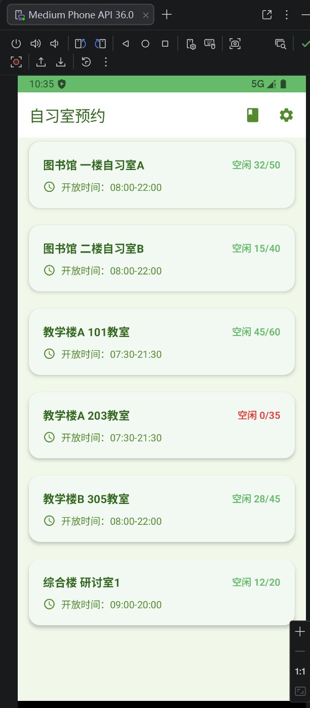

# 自习室预约系统

GitHub 仓库地址：https://github.com/11119yu/2025003017-FinalProject

## 1. 项目简介

- **应用名称**：自习室预约系统（StudyRoomReserve）
- **目标用户**：在校大学生、考研学生等需要使用自习室的人群
- **选题背景**：校园自习室资源紧张，学生经常需要到处找空座位，浪费时间。通过自习室预约系统，学生可以提前查看各自习室的空闲座位情况，在线预约座位，提高自习室的使用效率，也方便学生规划学习时间。
- **核心功能**：
  - 查看所有自习室的空闲座位情况
  - 预约指定自习室的座位
  - 查看我的预约记录
  - 取消已预约的座位
  - 深色/浅色模式切换

## 2. 技术栈

- **UI**：Jetpack Compose + Material 3
- **数据库**：Room
- **网络**：Retrofit + OkHttp + Gson
- **状态管理**：ViewModel + StateFlow / Flow
- **持久化偏好**：DataStore Preferences
- **导航**：Navigation Compose
- **异步处理**：Kotlin Coroutines
- **图片加载**：Coil
- **架构模式**：MVVM（Model-View-ViewModel）
- **构建工具**：Gradle + KSP

## 3. 页面结构

应用共有 4 个主要页面，通过 Navigation Compose 进行页面导航：

### 3.1 首页（HomeScreen）
- **功能**：展示所有自习室列表
- **包含内容**：楼栋名称、教室名称、空闲座位数、开放时间
- **交互**：点击自习室卡片跳转到预约详情页；右上角有"我的预约"和"设置"入口
- **特殊处理**：空闲座位数为 0 时显示红色提醒；列表为空时显示空状态提示

### 3.2 预约详情页（BookScreen）
- **功能**：展示选中自习室的详细信息，提交预约
- **包含内容**：座位数、开放时间、预约日期、预约时段
- **交互**：点击"提交预约"按钮完成预约；点击返回按钮回到首页
- **特殊处理**：重复预约会提示"该时段已被预约，请更换时段"

### 3.3 我的预约页（MyBookingScreen）
- **功能**：展示用户的所有预约记录
- **包含内容**：自习室信息、预约日期、时段、预约状态
- **交互**：点击"取消预约"按钮取消有效预约；点击返回按钮回到首页
- **特殊处理**：有效预约显示绿色状态，已取消的预约显示灰色背景和红色状态

### 3.4 设置页（SettingScreen）
- **功能**：提供应用设置选项
- **包含内容**：深色模式开关、应用版本信息
- **交互**：切换深色模式开关，实时切换主题
- **特殊处理**：设置通过 DataStore 持久化保存，下次启动自动恢复

## 4. 功能清单

### 必做项完成情况

**UI 层**
- Jetpack Compose 构建全部 UI
- 至少 2 个主要页面（首页、预约页、我的预约页、设置页，共 4 个页面）
- Compose Navigation 导航
- LazyColumn 列表展示
- Material 3 组件和主题（Card、Button、TopAppBar、Scaffold、Switch 等）
- 自定义 Material 主题（浅绿色主题）
- 浅色 / 深色模式支持（DataStore 持久化）
- 列表为空时有空状态提示
- 页面布局符合 Material Design 规范（圆角、间距、视觉层级）

**数据层**
- Room 数据库，2 张表（study_room 自习室表、book_record 预约记录表）
- 完整 CRUD 操作（插入、查询、更新、删除）
- DAO 查询方法返回 Flow 类型
- 查询功能（自习室模糊搜索、重复预约校验）
- DataStore 保存用户偏好（深色模式开关）

**网络层**
- 声明并使用 Internet 权限
- 使用 Retrofit 封装网络请求接口
- 预留 Mock API 接口，可从网络获取自习室数据
- 网络请求通过 Repository 封装，UI 不直接发起请求
- 使用 Kotlin 协程处理网络请求
- 网络失败时捕获异常，保留本地缓存数据

**架构层**
- ViewModel 状态管理
- Repository 模式隔离数据来源
- StateFlow / Flow 数据流
- Kotlin 协程异步处理
- UiState 描述界面状态（toastMsg 提示状态）
- Composable 不直接访问数据库或网络

**功能完整性**
- 新增数据（提交预约）
- 删除/取消数据（取消预约）
- 查看详情（预约详情页）
- 保存用户偏好（深色模式）
- 输入验证（重复预约校验）
- 错误提示（Toast 文本提示）
- 空状态展示（暂无预约记录）
- 屏幕旋转后状态保持（ViewModel 保存状态）
- 系统返回键行为正常

### 选做项完成情况
- 复杂数据库查询（自习室模糊搜索 LIKE 查询、重复预约统计查询）
- 网络缓存（网络数据保存到 Room，无网络时展示本地缓存）
- 自定义主题配色（浅绿色主题，动态颜色关闭）
- 卡片美化（圆角、阴影、图标、加粗文字）

## 5. 数据库设计

### 表 1：study_room（自习室表）

| 字段名 | 类型 | 说明 |
|---|---|---|
| roomId | Int | 主键，自习室 ID |
| building | String | 楼栋名称（如图书馆、教学楼 A） |
| roomName | String | 教室名称（如一楼自习室 A） |
| totalSeat | Int | 总座位数 |
| freeSeat | Int | 空闲座位数 |
| openTime | String | 开放时间（如 08:00-22:00） |

### 表 2：book_record（预约记录表）

| 字段名 | 类型 | 说明 |
|---|---|---|
| recordId | Long | 主键，自增，预约记录 ID |
| roomId | Int | 关联的自习室 ID |
| building | String | 楼栋名称（冗余字段，方便展示） |
| roomName | String | 教室名称（冗余字段，方便展示） |
| bookDate | String | 预约日期（格式：yyyy-MM-dd） |
| timeSlot | String | 预约时段（如 08:00-12:00） |
| createTime | Long | 创建时间戳 |
| isCancel | Boolean | 是否已取消（默认 false） |

### 表关系与主要查询
- 两张表通过 `roomId` 关联（逻辑关联，未使用外键）
- **主要 DAO 查询方法**：
  - `getAllRooms()`：查询所有自习室，返回 Flow
  - `searchRooms(keyword)`：按楼栋或教室名模糊搜索
  - `getAllRecords()`：查询所有预约记录，按日期倒序
  - `countSameBooking()`：统计同一自习室、同一日期、同一时段的有效预约数（用于重复预约校验）
  - `addRecord()`：新增预约记录
  - `updateRecord()`：更新预约记录（取消预约）

### DataStore 偏好存储设计

DataStore 用于保存用户的偏好设置，数据量小但需要持久化：

- **保存的数据**：深色模式开关状态（Boolean 类型）
- **写入场景**：用户在设置页点击深色模式开关时，将新的状态写入 DataStore
- **读取场景**：应用启动时，从 DataStore 读取保存的深色模式状态，用于初始化应用主题
- **优势**：基于 Kotlin 协程和 Flow，异步读取不阻塞主线程；支持类型安全；比 SharedPreferences 更现代、更可靠

## 6. 网络功能设计

- **API 来源**：Mock API（预留接口，当前使用本地模拟数据初始化）
- **接口地址**：`http://your-api-base-url.com/studyRooms`
- **请求方式**：GET
- **主要返回字段**：
  - `roomId: Int` - 自习室 ID
  - `building: String` - 楼栋名称
  - `roomName: String` - 教室名称
  - `totalSeat: Int` - 总座位数
  - `freeSeat: Int` - 空闲座位数
  - `openTime: String` - 开放时间
- **App 中使用这些网络数据的页面或功能**：
  - 首页自习室列表展示
  - 下拉刷新时从网络拉取最新数据，更新本地 Room 缓存
- **网络失败时的处理方式**：
  - 捕获异常，打印错误日志
  - 保留本地 Room 数据库中的缓存数据
  - 用户仍可查看本地缓存的自习室信息和预约记录

## 7. 架构设计

采用 **MVVM + Repository** 架构，分层清晰：

```
┌─────────────────────────────────────────┐
│              UI Layer                    │
│  (Composable Screens + Navigation)      │
└──────────────────┬──────────────────────┘
                   │  collectAsState()
┌──────────────────▼──────────────────────┐
│           ViewModel Layer                │
│          (StudyViewModel)                │
│  - StateFlow 暴露 UI 状态                │
│  - 处理业务逻辑和用户操作                │
└──────────────────┬──────────────────────┘
                   │  调用
┌──────────────────▼──────────────────────┐
│          Repository Layer                │
│         (StudyRepository)               │
│  - 隔离本地数据和网络数据                │
│  - 统一数据访问入口                      │
└─────────┬───────────────────┬───────────┘
          │                   │
┌─────────▼───────┐   ┌───────▼───────────┐
│   Local Data     │   │   Remote Data     │
│  (Room Database) │   │  (Retrofit API)  │
│  (DataStore)     │   │                   │
└──────────────────┘   └───────────────────┘
```

### 各层职责说明

- **UI Layer**：只负责界面展示和用户交互，通过 `collectAsState()` 收集 ViewModel 的状态，不直接处理业务逻辑
- **ViewModel Layer**：管理 UI 状态，处理业务逻辑，调用 Repository 获取数据，生命周期独立于 UI
- **Repository Layer**：数据仓库，封装本地数据库和网络请求，对 ViewModel 提供统一的数据访问接口，隔离数据来源
- **Data Layer**：Room 本地数据库 + DataStore 偏好存储 + Retrofit 网络请求

### ViewModel 与 UiState 设计

StudyViewModel 是应用的核心 ViewModel，管理所有页面的状态和业务逻辑：

**主要 StateFlow 状态**：
- `roomList: Flow<List<StudyRoom>>`：自习室列表数据流，从 Room 数据库查询返回
- `recordList: Flow<List<BookRecord>>`：预约记录列表数据流，从 Room 数据库查询返回
- `darkMode: StateFlow<Boolean>`：深色模式状态，从 DataStore 读取并同步更新
- `toastMsg: StateFlow<String>`：提示消息状态，用于显示预约成功、取消成功等提示

**主要业务方法**：
- `addBooking()`：提交预约，带重复校验
- `cancelBooking()`：取消预约
- `toggleDarkMode()`：切换深色模式
- `refreshRooms()`：从网络刷新自习室数据
- `clearToast()`：清空提示消息

**UiState 设计思路**：
- 使用单向数据流（UDF），状态由 ViewModel 管理，UI 只负责展示和发送事件
- 所有状态都是不可变的，通过 StateFlow 暴露给 UI
- UI 通过 collectAsState() 收集状态变化，自动触发界面重组

## 8. 核心功能截图

### 首页（自习室列表）



说明：展示所有自习室列表，包含楼栋名称、教室名称、空闲座位数和开放时间。空闲座位数为 0 时显示红色提醒。点击卡片可进入预约详情页。右上角有"我的预约"和"设置"入口。

### 预约详情页


说明：展示选中自习室的详细信息，包括座位数、开放时间、预约日期和时段。点击"提交预约"按钮可完成预约。重复预约会提示"该时段已被预约"。

### 我的预约页


说明：展示用户的所有预约记录，包含自习室信息、预约日期、时段和状态。有效预约显示绿色状态，已取消的预约显示灰色背景和红色状态。可点击"取消预约"按钮取消有效预约。

### 设置页


说明：提供深色模式开关，用户可切换浅色/深色主题，设置通过 DataStore 持久化保存。

## 9. 技术难点与解决方案

### 难点 1：Kotlin 2.0 + Compose 编译报错

- **问题描述**：升级到 Kotlin 2.0.20 后，Compose 代码编译失败，报编译器相关错误。
- **原因分析**：Kotlin 2.0 版本不再使用旧的 Compose 编译器插件（`kotlin-android-extensions`），需要单独添加 `org.jetbrains.kotlin.plugin.compose` 插件。
- **解决方案**：
  1. 在项目级 `build.gradle.kts` 中添加插件：`id("org.jetbrains.kotlin.plugin.compose") version "2.0.20" apply false`
  2. 在模块级 `build.gradle.kts` 中应用插件：`id("org.jetbrains.kotlin.plugin.compose")`
  3. 统一 JVM 目标版本为 11，避免版本不一致
- **参考资料**：Kotlin 官方文档 - Compose 编译器迁移指南

### 难点 2：自定义主题颜色不生效

- **问题描述**：在 Theme.kt 中自定义了浅绿色主题，但运行后应用还是紫色的默认颜色，自定义颜色不生效。
- **原因分析**：Android 12+ 系统支持动态颜色（Dynamic Color），会根据系统壁纸颜色覆盖应用的自定义主题。代码中 `dynamicColor = true` 导致自定义颜色被覆盖。
- **解决方案**：
  1. 将 `StudyRoomReserveTheme` 函数中的 `dynamicColor` 默认值改为 `false`
  2. 关闭动态颜色后，自定义的浅绿色主题就能正常显示了
- **参考资料**：Material 3 官方文档 - 动态颜色

### 难点 3：应用启动崩溃（ClassNotFoundException）

- **问题描述**：修改主题代码后，应用启动就崩溃，Logcat 报 `ClassNotFoundException: Didn't find class "MainActivity"`。
- **原因分析**：频繁修改代码、反复编译过程中，Build 缓存出现损坏，导致编译出来的 APK 中缺少 MainActivity 类。
- **解决方案**：
  1. 点击菜单 `Build → Clean Project` 清理构建缓存
  2. 然后点击 `Rebuild Project` 重新编译
  3. 卸载模拟器中的旧应用，重新安装运行
- **参考资料**：Android Studio 官方文档 - 清理和重建项目

## 10. AI 使用说明

**使用的 AI 工具**：
- 网页版 AI（如 ChatGPT、Claude、Kimi、豆包等）
- AI Agent / 编程代理（如 Claude Code、Codex、OpenCode、Cursor Agent 等）

**具体工具名称**：豆包 AI Agent

**AI 主要用于哪些环节**：
- 项目架构设计和技术选型建议
- 代码生成（Compose 界面、ViewModel、Repository、Room 数据库等）
- Bug 调试和错误排查（编译错误、运行时崩溃）
- UI 美化建议和代码实现
- 实验报告整理


## 11. 运行说明

- **最低 Android 版本**：API 24（Android 7.0）
- **推荐 Android 版本**：API 34（Android 14）
- **编译 SDK 版本**：API 34
- **Kotlin 版本**：2.0.20
- **特殊权限**：
  - 网络权限（`android.permission.INTERNET`）- 用于获取自习室数据
- **运行步骤**：
  1. 克隆仓库：`git clone https://github.com/11119yu/MobileSoftwareDevelopment`
  2. 使用 Android Studio Hedgehog 及以上版本打开项目
  3. 等待 Gradle 同步完成（首次同步需要下载依赖，可能需要几分钟）
  4. 创建模拟器（推荐 Medium Phone API 34）或连接真机
  5. 点击 Run 按钮运行应用

## 12. 项目亮点

1. **清新的浅绿色主题**：自定义 Material 3 主题，关闭动态颜色，整体风格清新自然，符合学习类应用的氛围
2. **精致的卡片设计**：大圆角、柔和阴影、图标点缀，界面美观有质感
3. **完整的 MVVM 架构**：分层清晰，UI 与业务逻辑分离，代码可维护性好
4. **双重数据持久化**：Room 数据库存储核心业务数据，DataStore 存储用户偏好
5. **网络 + 本地缓存**：预留 Retrofit 网络接口，支持从网络拉取数据并缓存到本地
6. **深色模式支持**：支持浅色/深色模式切换，设置持久化保存
7. **预约防重复**：提交预约时自动校验，同一时段同一自习室不能重复预约
8. **空状态友好提示**：暂无数据时显示友好的空状态提示

## 13. 未来改进方向

1. **接入真实后端 API**：目前使用模拟数据，后续可对接真实的后端服务
2. **日期选择功能**：支持选择预约日期，不局限于当天
3. **多时段选择**：支持上午、下午、晚上等多个时段选择
4. **搜索和筛选**：按楼栋、座位数、开放时间等条件筛选自习室
5. **用户登录系统**：添加用户注册登录功能，支持多用户使用
6. **预约提醒**：通过本地通知在预约时间前提醒用户
7. **座位图展示**：可视化展示自习室座位布局，支持选座
8. **数据统计**：展示自习室使用率统计图表
9. **下拉刷新**：支持下拉刷新自习室列表
10. **页面切换动画**：添加更丰富的页面转场动画
