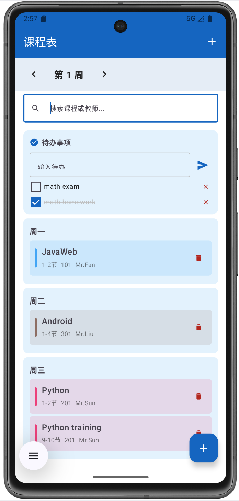
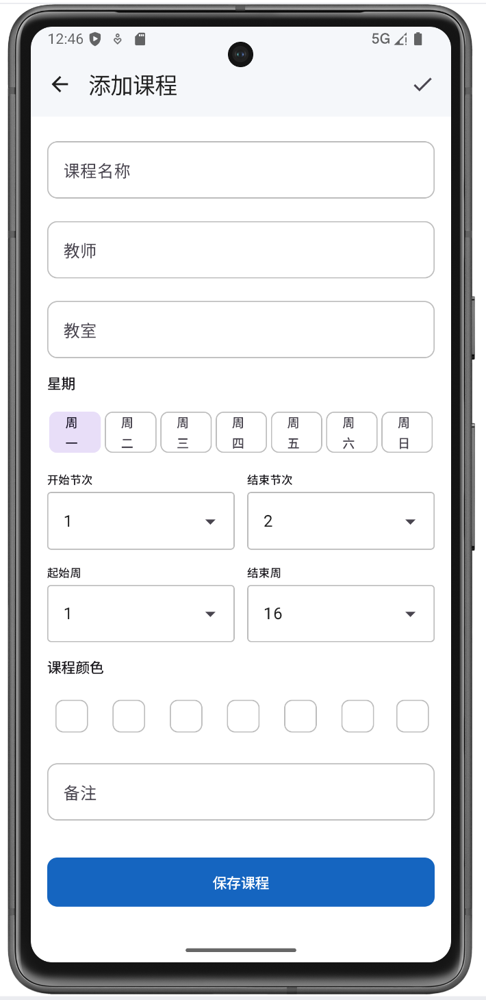
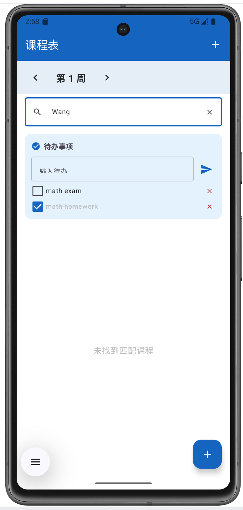

# 课程表

GitHub 仓库地址：https://github.com/wmx191/2025003018-FinalProject

## 1. 项目简介

- 应用名称：课程表
- 目标用户：在校大学生，用于管理和查看每周课程安排
- 核心功能：按周查看课程列表、搜索课程、添加/编辑/删除课程、待办事项管理、自动获取学期信息定位当前周、浅色/深色主题切换

## 2. 技术栈

- UI：Jetpack Compose + Material 3
- 数据库：Room
- 网络：Retrofit / OkHttp（接口来源：自定义 Mock API — /semester/info）
- 状态管理：ViewModel + StateFlow
- 持久化偏好：DataStore
- 导航：Navigation Compose
- 异步处理：Kotlin Coroutines
- 其他依赖：Coil（图片加载）

## 3. 功能清单

### 必做项完成情况

**UI 层**
- [√] Jetpack Compose 构建全部 UI
- [√] 至少 2 个主要页面（首页课程列表页 + 编辑课程页）
- [√] Compose Navigation 导航
- [√] LazyColumn / LazyVerticalGrid 列表（首页使用 LazyColumn 展示课程）
- [√] Material 3 组件和主题（TopAppBar、Card、FloatingActionButton、FilterChip、ExposedDropdownMenu、AlertDialog、TextField 等）
- [√] 浅色 / 深色模式支持（跟随系统自动切换）

**数据层**
- [√] Room 数据库，至少 2 张表（courses 课程表 + todo_tasks 待办表）
- [√] 完整 CRUD 操作（课程新增、编辑、删除、搜索；待办增删改查）
- [√] DAO 查询方法返回 Flow 类型
- [√] 至少一种查询功能（周范围 BETWEEN 筛选 + 按星期查询 + 模糊搜索 LIKE）
- [√] DataStore 保存用户偏好或最近状态（保存当前浏览周次）

**网络层**
- [√] 声明并使用 Internet 权限
- [√] 使用网络请求获取真实 API 或 Mock API 数据（获取学期信息）
- [√] 网络数据在核心页面中展示或参与主要功能流程（学期数据决定默认周次）
- [√] 处理 Loading / Success / Error 等网络状态
- [√] Composable 不直接发起网络请求（通过 Repository 封装）

**架构层**
- [√] ViewModel 状态管理（ScheduleViewModel）
- [√] Repository 模式（ScheduleRepository）
- [√] StateFlow / Flow 数据流
- [√] Kotlin 协程异步处理
- [√] UiState 描述界面状态（CourseListState、SemesterState、CourseFormState）
- [√] Composable 不直接访问数据库或网络

**功能完整性**
- [√] 新增 / 编辑 / 删除 / 搜索等核心操作（至少 2 项）
- [√] 输入验证和错误提示（课程名不能为空）
- [√] 状态展示（空 / 加载 / 错误中的至少一种）
- [√] 屏幕旋转后状态保持

### 选做项完成情况

- [√] 复杂数据库查询：BETWEEN 周范围筛选 + LIKE 模糊搜索 + 按星期和节次排序
- [ ] 搜索防抖或搜索历史（直接搜索，未做防抖）
- [ ] 其他选做项均未实现

## 4. 数据库设计

### 表 1：courses（课程表）

| 字段名 | 类型 | 说明 |
|--------|------|------|
| id | Long | 主键，自增 |
| name | String | 课程名称 |
| teacher | String | 授课教师 |
| classroom | String | 上课教室 |
| day_of_week | Int | 星期几（1=周一 ~ 7=周日） |
| start_slot | Int | 开始节次（1~12） |
| end_slot | Int | 结束节次（1~12） |
| color | String | 课程颜色（Hex） |
| week_start | Int | 起始周 |
| week_end | Int | 结束周 |
| notes | String | 备注 |

### 表 2：todo_tasks（待办事项表）

| 字段名 | 类型 | 说明 |
|--------|------|------|
| id | Long | 主键，自增 |
| content | String | 待办内容 |
| is_done | Boolean | 是否完成 |
| created_at | Long | 创建时间戳 |

**主要 DAO 查询方法**：
- `getCoursesForWeek(currentWeek)` — BETWEEN week_start AND week_end 周范围筛选
- `getCoursesByDay(day)` — 按星期筛选
- `searchCourses(query)` — 按课程名或教师名模糊搜索（LIKE）
- `getAllCourses()` — 按星期、节次排序返回全部课程
- `getAllTasks()` — 按完成状态、创建时间排序返回全部待办

## 5. 网络功能设计

- API 来源：本地 Mock API（启动时模拟数据）
- 接口地址：/semester/info
- 请求方式：GET
- 主要返回字段：semester（学期名）、startDate（开学日期）、totalWeeks（总周数）、currentWeek（当前周次）
- App 中使用这些网络数据的页面或功能：首页 WeekSelector 组件，获取当前周次并自动定位
- 网络失败时的处理方式：降级使用 DataStore 保存的上次周次，静默处理不影响课程数据

## 6. 架构设计

采用 Google 推荐的 Android 分层架构：

- **UI Layer**：HomeScreen、EditCourseScreen — 纯 Compose 函数，只负责渲染和触发事件
- **ViewModel**：ScheduleViewModel — 持有 StateFlow，通过 Repository 获取数据，管理 UiState
- **Repository**：ScheduleRepository — 统一封装 CourseDao + TodoDao 和 Retrofit API，对外暴露 Flow
- **Data Layer**：Room（CourseDao + TodoDao）+ Retrofit（ApiService）+ DataStore（UserPreferences）

数据流向：UI → collectAsState() → ViewModel → StateFlow → Repository → DAO/API/DataStore

## 7. 核心功能截图

### 首页（含搜索栏 + 待办事项）

说明：展示当前周课程列表，按星期分组。顶部有周选择器和搜索栏，输入关键词可模糊搜索课程名或教师名。待办事项卡片支持添加、勾选完成、删除。

### 编辑课程页

说明：编辑课程页面，支持填写课程名、教师、教室，选择星期、节次、周范围、课程颜色。

### 空状态页

说明：当某周无课程时显示空状态提示和"添加课程"按钮。搜索无结果时亦显示提示信息。

## 8. 技术难点与解决方案

### 难点 1：星期选择器布局溢出

- 问题描述：编辑页的 7 个 FilterChip 星期按钮，最后一个"周日"溢出屏幕不可见。
- 原因分析：Arrangement.spacedBy(6.dp) 固定间距导致总宽度超出屏幕。
- 解决方案：改用 Arrangement.SpaceEvenly + Modifier.weight(1f) 等宽分配，缩小字号至 12sp，确保 7 个 chip 均分屏幕宽度。

### 难点 2：跨周课程筛选查询

- 问题描述：课程有起始周和结束周（如 3~16 周），简单筛选无法处理周范围。
- 原因分析：需要 Room 的 BETWEEN 条件来匹配当前周是否在课程周范围内。
- 解决方案：使用 WHERE :currentWeek BETWEEN week_start AND week_end，配合 flatMapLatest 在切换周次时自动刷新列表。

## 9. AI 使用说明

- [ ] 未使用 AI
- [√] 网页版 AI（如 ChatGPT、Claude、Kimi、豆包等）
- [√] AI Agent / 编程代理（如 Claude Code、Codex、OpenCode、Cursor Agent 等）
- [ ] 国产大模型服务（如 DeepSeek、GLM、通义千问、文心一言等）
- [√] IDE 插件或代码补全工具（如 GitHub Copilot、Cursor、CodeGeeX 等）

具体工具名称：CodeBuddy（Claude Code Agent）
AI 主要用于：代码框架生成、Gradle 构建配置修复、编译调试、布局修复、搜索与待办功能实现、报告整理

## 10. 运行说明

- 最低 Android 版本：API 24（Android 7.0）
- 推荐 Android 版本：API 34（Android 14）
- 特殊权限：android.permission.INTERNET
- 运行步骤：
  1. `git clone https://github.com/wmx191/MobileSoftwareDevelopment`
  2. 用 Android Studio 打开项目
  3. 等待 Gradle 同步完成
  4. 连接模拟器或真机，点击 Run

## 11. 项目亮点

- **周范围筛选**：支持跨周课程（如 3~16 周），非简单按星期过滤
- **课程搜索**：按课程名或教师名模糊搜索，实时响应
- **待办事项**：支持添加、勾选完成、删除，与课程表并存
- **8 种课程颜色**：卡片左侧色条快速区分课程
- **Room + DataStore 双存储**：职责清晰

## 12. 未来改进方向

- 搜索防抖优化
- 课程冲突检测
- 周课表表格视图
- 桌面小组件
