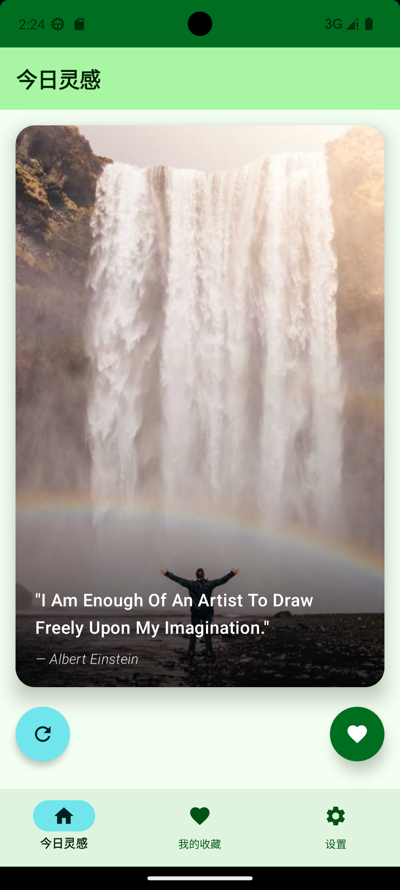
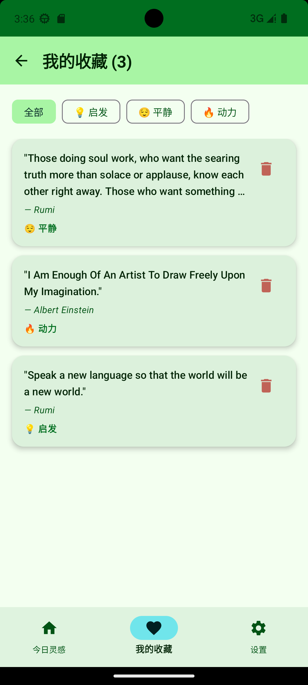
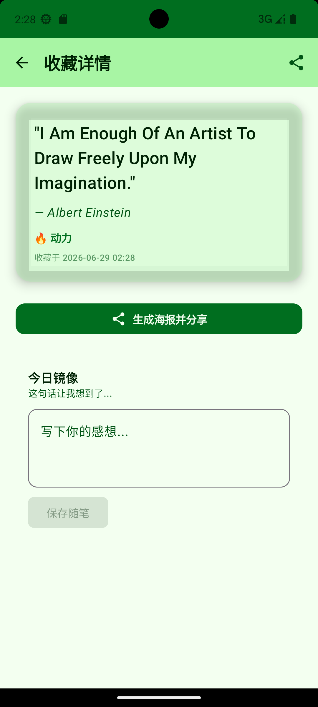
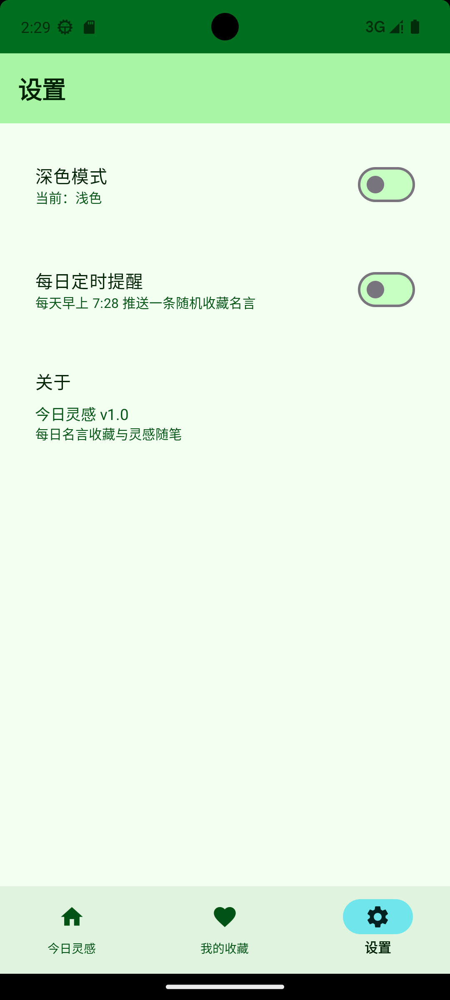

# 今日灵感 - 每日壁纸与名言收藏器

GitHub 仓库地址：https://github.com/zyy-pre/2025003019-FinalProject.git

## 1. 项目简介

- 应用名称：今日灵感（DailyInspiration）
- 目标用户：希望每天获取灵感语录并收藏管理的用户
- 核心功能：每日从网络获取随机名言与壁纸，支持一键收藏（附带情绪标签）、按标签筛选收藏、为收藏名言撰写随笔感想、生成分享海报、每日定时通知推送、深色/浅色模式切换

## 2. 技术栈

- UI：Jetpack Compose + Material 3
- 数据库：Room
- 网络：Retrofit + OkHttp（接口来源：dummyjson.com 名言 API、picsum.photos 壁纸图片）
- 状态管理：ViewModel + StateFlow
- 持久化偏好：DataStore
- 导航：Navigation Compose
- 异步处理：Kotlin Coroutines
- 图片加载：Coil
- 其他依赖：Accompanist SwipeRefresh、AlarmManager + BroadcastReceiver（定时提醒）

## 3. 功能清单

### 必做项完成情况

**UI 层**
- [x] Jetpack Compose 构建全部 UI
- [x] 至少 2 个主要页面（首页、收藏列表页、详情页、设置页共 4 个页面）
- [x] Compose Navigation 导航
- [x] LazyColumn 列表（收藏列表页使用 LazyColumn 展示收藏名言）
- [x] Material 3 组件和主题（自定义 Green/Teal 色彩方案）
- [x] 浅色 / 深色模式支持

**数据层**
- [x] Room 数据库，至少 2 张表（quote 表、journal 表，含外键关联）
- [x] 完整 CRUD 操作（收藏/取消收藏/删除名言、新增/删除随笔）
- [x] DAO 查询方法返回 Flow 类型（getCollectedQuotes、getCollectedQuotesByTag、getJournalsByQuoteId 等）
- [x] 至少一种查询功能（按情绪标签筛选收藏、随机获取已收藏名言）
- [x] DataStore 保存用户偏好（深色模式、每日通知开关、最近名言 ID）

**网络层**
- [x] 声明并使用 Internet 权限
- [x] 使用网络请求获取真实 API 数据（dummyjson.com 名言随机接口）
- [x] 网络数据在核心页面中展示（首页展示随机名言 + 壁纸图片）
- [x] 处理 Loading / Success / Error 等网络状态（HomeUiState 中包含 isLoading、error、inspiration）
- [x] Composable 不直接发起网络请求（通过 ViewModel -> Repository -> ApiService 调用链）

**架构层**
- [x] ViewModel 状态管理（HomeViewModel、CollectionViewModel、DetailViewModel）
- [x] Repository 模式（QuoteRepository、JournalRepository）
- [x] StateFlow / Flow 数据流（UI 通过 collectAsStateWithLifecycle 收集状态）
- [x] Kotlin 协程异步处理（viewModelScope.launch 进行异步操作）
- [x] UiState 描述界面状态（HomeUiState、CollectionUiState、DetailUiState）
- [x] Composable 不直接访问数据库或网络

**功能完整性**
- [x] 新增 / 编辑 / 删除 / 搜索等核心操作（收藏名言、删除收藏、按标签筛选、新增/删除随笔）
- [x] 输入验证和错误提示（随笔输入为空时按钮禁用、网络错误展示错误信息与重试按钮）
- [x] 状态展示（空状态"还没有收藏"、加载状态 CircularProgressIndicator、错误状态"加载失败"）
- [x] 屏幕旋转后状态保持（ViewModel + StateFlow 自动保持状态）

### 选做项完成情况

- [x] 按标签筛选收藏（情绪标签 FilterChip 筛选）
- [x] 生成分享海报功能（Canvas 绘制名言海报并通过 Intent 分享）
- [x] 每日定时通知推送（AlarmManager + BroadcastReceiver，每天 7:28 推送随机收藏名言）
- [x] 开机自动恢复定时通知（BootReceiver 监听 BOOT_COMPLETED）
- [x] 下拉刷新（SwipeRefresh 组件）
- [x] 情绪标签选择对话框（启发/平静/动力三种标签）

## 4. 数据库设计

### 表 1：quote（名言表）

| 字段名 | 类型 | 说明 |
|---|---|---|
| id | Long | 主键，自增 |
| text | String | 名言内容 |
| author | String | 名言作者 |
| emotionTag | String | 情绪标签（如"💡 启发"、"😌 平静"、"🔥 动力"） |
| isCollected | Boolean | 是否已收藏 |
| collectedTime | Long | 收藏时间戳 |

### 表 2：journal（随笔表）

| 字段名 | 类型 | 说明 |
|---|---|---|
| id | Long | 主键，自增 |
| quoteId | Long | 外键，关联 quote 表的 id |
| userThought | String | 用户随笔内容 |
| createdAt | Long | 创建时间戳 |

**表关系**：journal 通过 quoteId 外键关联到 quote 表，设置 `onDelete = CASCADE`，当名言被删除时，其对应的随笔记录会自动级联删除。quote 表上对 quoteId 字段建立了索引以提升查询性能。

**主要 DAO 查询方法**：
- `QuoteDao.getCollectedQuotes()`：查询所有已收藏名言，按收藏时间倒序，返回 `Flow<List<QuoteEntity>>`
- `QuoteDao.getCollectedQuotesByTag(tag)`：按情绪标签筛选已收藏名言
- `QuoteDao.getRandomCollectedQuote()`：随机获取一条已收藏名言（用于每日通知）
- `QuoteDao.findQuoteByContent(text, author)`：按名言内容和作者查找（防重复收藏）
- `JournalDao.getJournalsByQuoteId(quoteId)`：查询指定名言的所有随笔

## 5. 网络功能设计

- API 来源：dummyjson.com（名言 API）、picsum.photos（壁纸图片）
- 接口地址：
  - 名言：`https://dummyjson.com/quotes/random`
  - 图片：从预定义的 20 张 picsum.photos 图片 URL 列表中随机选取
- 请求方式：GET
- 主要返回字段：
  - `id`：名言 ID
  - `quote`：名言文本
  - `author`：作者
  - `tags`：标签列表（可选）
  - `category`：分类（可选）
- App 中使用这些网络数据的页面或功能：首页（HomeScreen）展示随机名言与壁纸，用户可收藏或换一条
- 网络失败时的处理方式：ViewModel 捕获异常，将错误信息写入 UiState.error，UI 展示"加载失败"文案、错误详情和重试按钮（FloatingActionButton）

## 6. 架构设计

```
┌─────────────────────────────────────────────────┐
│                   UI Layer                       │
│  HomeScreen / CollectionListScreen /             │
│  DetailScreen / SettingsScreen                   │
│  (Composable, 通过 collectAsStateWithLifecycle    │
│   观察 UiState)                                   │
└──────────────────────┬──────────────────────────┘
                       │ 观察 StateFlow<UiState>
┌──────────────────────▼──────────────────────────┐
│               ViewModel Layer                    │
│  HomeViewModel / CollectionViewModel /           │
│  DetailViewModel                                 │
│  (持有 UiState, 调用 Repository,                  │
│   在 viewModelScope 中执行协程)                    │
└──────────────────────┬──────────────────────────┘
                       │ 调用
┌──────────────────────▼──────────────────────────┐
│            Repository Layer                      │
│  QuoteRepository / JournalRepository            │
│  (封装数据源访问, 协调网络与本地数据库)              │
└───────┬────────────────────────────┬────────────┘
        │                            │
┌───────▼──────────┐    ┌───────────▼────────────┐
│  Network Layer   │    │    Data Layer           │
│  NetworkModule   │    │  AppDatabase            │
│  QuoteApiService │    │  QuoteDao / JournalDao  │
│  (Retrofit)      │    │  (Room)                 │
└──────────────────┘    └────────────────────────┘
```

**数据流向**：UI Layer 通过 `collectAsStateWithLifecycle()` 订阅 ViewModel 中的 `StateFlow<UiState>`；ViewModel 调用 Repository 获取数据；Repository 根据需要从网络（Retrofit）或本地数据库（Room DAO）获取数据，DAO 返回 `Flow` 类型实现响应式更新；DataStore 用于存储用户偏好设置（深色模式、通知开关）。

## 7. 核心功能截图

> 注意：以下为功能说明，截图需在实际设备上运行后截取并放置于 `screenshots/` 目录。

### 首页



说明：展示随机壁纸与名言卡片，底部有"换一条"刷新按钮和"收藏"按钮。下拉可刷新内容。网络错误时展示错误提示与重试按钮。

### 收藏列表页



说明：展示所有已收藏名言，顶部有情绪标签 FilterChip 筛选（全部/启发/平静/动力），每条收藏显示名言内容、作者和情绪标签，支持点击删除图标或点击进入详情。

### 详情页



说明：展示收藏名言详情（名言内容、作者、情绪标签、收藏时间），支持生成海报分享功能，可为名言撰写随笔感想并保存。

### 设置页



说明：提供深色模式切换开关和每日定时提醒开关（每天 7:28 推送随机收藏名言），展示应用版本信息。

## 8. 技术难点与解决方案

### 难点 1：网络图片与名言的组合展示

- 问题描述：名言 API（dummyjson.com）不提供图片，需要将网络名言与壁纸图片组合展示在首页卡片中
- 原因分析：两个数据源独立，需要在 Repository 层进行组合
- 解决方案：在 QuoteRepository 中维护一个预定义的 picsum.photos 图片 URL 列表（20 张精选风景图），调用 API 获取名言后随机选取一张图片 URL，组合为 InspirationItem 数据模型返回给 ViewModel
- 参考资料：picsum.photos 官方文档

### 难点 2：收藏时的重复检测与情绪标签关联

- 问题描述：同一条名言可能被多次从网络获取，收藏时需要避免重复插入数据库，同时需要关联情绪标签
- 原因分析：名言内容可能重复，但数据库主键自增会导致多条重复记录
- 解决方案：在 QuoteDao 中实现 `findQuoteByContent(text, author)` 方法按名言内容和作者查找已有记录。QuoteRepository.collectQuote() 先检查是否已存在，存在则更新 isCollected 和 emotionTag，不存在则新建记录。使用 `OnConflictStrategy.REPLACE` 策略处理冲突
- 参考资料：Room 官方文档 -冲突策略

### 难点 3：定时通知的实现与开机恢复

- 问题描述：需要实现每日定时推送通知，且设备重启后需自动恢复定时任务
- 原因分析：Android 系统在设备重启后会清除所有 AlarmManager 设置的闹钟
- 解决方案：使用 AlarmManager.setRepeating() 设置每日重复闹钟（每天 7:28），BroadcastReceiver 接收闹钟触发后从数据库随机取一条已收藏名言发送通知。注册 BootReceiver 监听 BOOT_COMPLETED 和 MY_PACKAGE_REPLACED 广播，重启时从 DataStore 读取通知开关状态，若开启则重新设置闹钟
- 参考资料：Android 官方文档 -AlarmManager、BroadcastReceiver

### 难点 4：海报生成与分享

- 问题描述：需要将名言内容生成精美图片海报并通过系统分享功能发送
- 原因分析：Compose 不直接支持 Bitmap 绘制，需要使用 Canvas API，并通过 FileProvider 安全分享文件
- 解决方案：使用 Android Canvas API 在 Bitmap 上绘制深色背景、白色名言文本（自动换行）、作者名、情绪标签和日期水印。生成 PNG 文件存入 cacheDir，通过 FileProvider 获取 content URI，构造 ACTION_SEND Intent 分享。若海报生成失败，降级为纯文本分享
- 参考资料：Android 官方文档 -FileProvider、Canvas

## 9. AI 使用说明

- [x] AI Agent / 编程代理（如 Claude Code、Codex、OpenCode、Cursor Agent 等）

具体工具名称：MiMo Code Agent（mimo-auto）

AI 主要用于哪些环节：代码生成、架构设计、调试排查、技术方案分析

说明：是否使用 AI 以及使用了什么 AI 工具不会影响分值，请如实填写。

## 10. 运行说明

- 最低 Android 版本：API 26（Android 8.0）
- 推荐 Android 版本：API 34（Android 14）
- 特殊权限：网络权限（INTERNET、ACCESS_NETWORK_STATE）；通知权限（POST_NOTIFICATIONS，Android 13+ 需运行时申请）；精确闹钟权限（SCHEDULE_EXACT_ALARM）；开机启动权限（RECEIVE_BOOT_COMPLETED）
- 运行步骤：
  1. 克隆仓库：`https://github.com/zyy-pre/2025003019-FinalProject.git`
  2. 使用 Android Studio 打开项目
  3. 等待 Gradle 同步完成
  4. 连接模拟器或真机，点击 Run

## 11. 项目亮点

- 情绪标签体系：收藏名言时可选择"启发/平静/动力"三种情绪标签，后续可按标签筛选浏览，增加了收藏的维度和趣味性
- 海报分享功能：将名言生成精美的深色风格图片海报（Canvas 绘制），支持一键分享到社交平台，分享失败时自动降级为文本分享
- 每日定时通知：通过 AlarmManager + BroadcastReceiver 实现每天定时推送随机收藏名言，重启设备后自动恢复定时任务
- 完整的 MVVM 架构：严格遵循 UI -> ViewModel -> Repository -> Data Source 分层，所有 Composable 不直接访问数据库或网络
- 丰富的交互细节：收藏按钮弹簧动画、情绪标签选择对话框、下拉刷新、删除确认弹窗等

## 12. 未来改进方向

- 添加用户登录功能，支持云端同步收藏数据
- 支持自定义壁纸来源（从相册选择或拍照）
- 增加名言搜索功能（支持关键词搜索名言内容和作者）
- 添加收藏数据统计页面（按时间、标签维度展示收藏趋势）
- 集成 Hilt 依赖注入框架替代手动 ViewModelFactory
- 支持更多情绪标签的自定义添加
