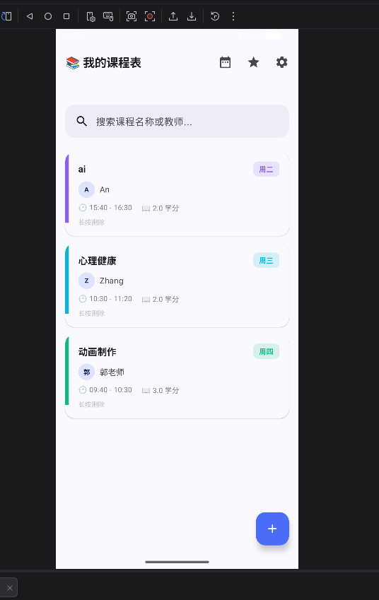
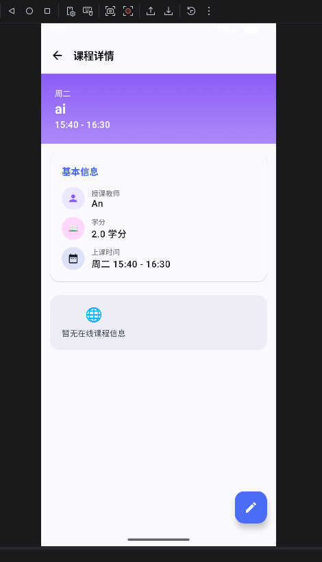
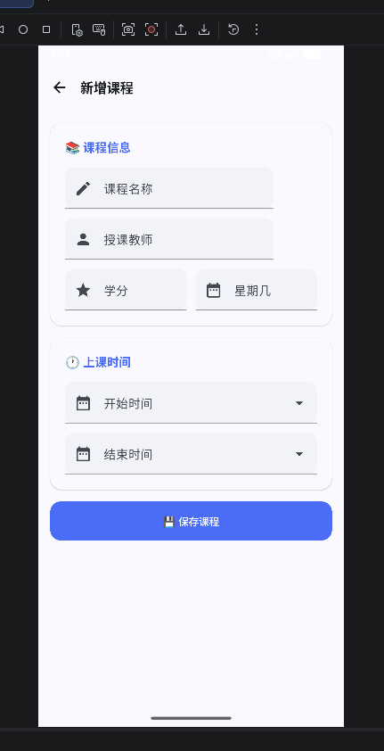
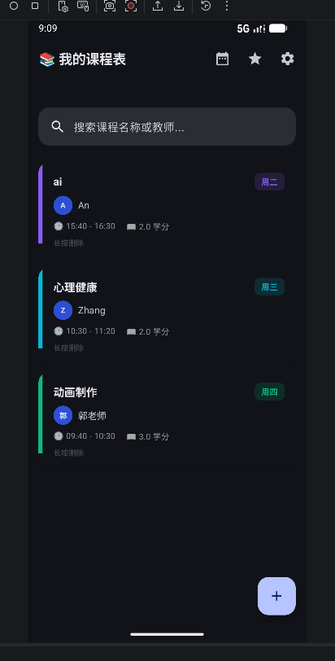

# 课程表管理 App（Qimo）

GitHub 仓库地址：https://github.com/An-ruijia1/2025003021-FinalProject

## 1. 项目简介

- 应用名称：Qimo 课程表
- 目标用户：在校大学生
- 核心功能：课程管理（新增、删除、搜索、查看详情）、学期管理、深色模式支持、网络热门课程浏览

## 2. 技术栈

- UI：Jetpack Compose + Material 3
- 数据库：Room（KSP 注解处理）
- 网络：Retrofit + OkHttp + Gson（接口来源：MockAPI）
- 状态管理：ViewModel + StateFlow
- 持久化偏好：DataStore Preferences
- 导航：Navigation Compose
- 异步处理：Kotlin Coroutines
- 图片加载：Coil
- 其他依赖：lifecycle-viewmodel-compose、lifecycle-runtime-compose

## 3. 功能清单

### 必做项完成情况

**UI 层**
- [x] Jetpack Compose 构建全部 UI
- [x] 至少 2 个主要页面（课程列表、课程详情、新增课程、设置页）
- [x] Compose Navigation 导航
- [x] LazyColumn 列表
- [x] Material 3 组件和主题
- [x] 浅色 / 深色模式支持（通过 DataStore 保存用户偏好）

**数据层**
- [x] Room 数据库，至少 2 张表（courses、semesters）
- [x] 完整 CRUD 操作（insertCourse、updateCourse、deleteCourse、getCourseById）
- [x] DAO 查询方法返回 Flow 类型（getCoursesBySemester、searchCourses、getAllSemesters）
- [x] 至少一种查询功能（按课程名/教师名模糊搜索）
- [x] DataStore 保存用户偏好（深色模式、当前学期ID）

**网络层**
- [x] 声明并使用 Internet 权限
- [x] 使用网络请求获取真实 API 或 Mock API 数据（MockAPI：courseInfo 接口）
- [x] 网络数据在核心页面中展示或参与主要功能流程（课程详情页展示网络课程信息）
- [x] 处理 Loading / Success / Error 等网络状态（UiState sealed interface）
- [x] Composable 不直接发起网络请求（通过 ViewModel → Repository → NetworkDataSource）

**架构层**
- [x] ViewModel 状态管理
- [x] Repository 模式
- [x] StateFlow / Flow 数据流
- [x] Kotlin 协程异步处理
- [x] UiState 描述界面状态（CourseListUiState、CourseDetailUiState、HotCourseUiState）
- [x] Composable 不直接访问数据库或网络

**功能完整性**
- [x] 新增 / 删除 / 搜索等核心操作
- [x] 输入验证和错误提示（课程名称、学分、时间等校验）
- [x] 状态展示（Loading / Empty / Error / Success）
- [x] 屏幕旋转后状态保持（ViewModel + StateFlow 自动保持）

### 选做项完成情况

- [x] 搜索功能（支持按课程名称和教师名模糊搜索）
- [x] 学期关联查询（课程按学期分组）
- [x] 深色模式偏好持久化
- [x] Coil AsyncImage 加载网络图片（课程详情页展示封面图）
- [x] 网络数据本地缓存（course_info_cache 表缓存网络课程信息，离线时从 Room 读取）
- [x] Room 数据库迁移（v1→v2，新增缓存表，使用 Migration 对象安全升级）
- [x] 下拉刷新（PullToRefreshBox，课程列表页支持下拉刷新本地数据）
- [x] 页面切换动画（fadeIn + slideInHorizontally，导航过渡更流畅）
- [x] 图表统计（Canvas 绘制饼图 + 柱状图，StatisticsScreen 统计学分分布和每周课时）
- [x] 课程冲突检测（新增课程时自动检测同一时间段是否已有课程，有冲突时弹出提示）

## 3.1 页面结构说明

本应用共包含 **6 个页面**，通过 Navigation Compose 统一管理导航：

| 页面 | 路由 | 功能说明 |
|------|------|----------|
| 课程列表页 | `course_list` | 展示当前学期所有课程（LazyColumn），支持搜索、下拉刷新、删除课程、跳转详情页 |
| 课程详情页 | `course_detail/{id}` | 展示课程基本信息 + 网络课程信息（描述、评分、封面图），支持编辑和删除 |
| 新增/编辑课程页 | `add_course?courseId={id}` | 表单填写课程信息，含输入验证和课程冲突检测，可选参数 jump 到编辑模式 |
| 设置页 | `settings` | 深色模式开关、当前学期选择、关于信息 |
| 统计页 | `statistics` | Canvas 饼图展示学分分布、柱状图展示每周课时分布 |
| 周视图页 | `week_view` | 按星期展示当前学期的课程时间表 |

**导航关系：**
- 课程列表页 → 点击课程卡片 → 课程详情页
- 课程列表页 → 点击 FAB（+）→ 新增课程页
- 课程详情页 → 点击编辑 → 编辑课程页
- 底部导航栏 → 课程列表 / 统计 / 周视图 / 设置（四个 Tab 之间自由切换）
- 所有子页面均可通过返回键/箭头返回上一级

## 4. 数据库设计

### 表 1：courses（课程表）

| 字段名 | 类型 | 说明 |
|---|---|---|
| id | Int | 主键，自增 |
| courseName | String | 课程名称 |
| teacher | String | 授课教师 |
| credit | Float | 学分数 |
| dayOfWeek | Int | 星期几（1-7） |
| startTime | String | 上课开始时间 |
| endTime | String | 下课结束时间 |
| semesterId | Int | 关联学期表的外键 |
| createdTime | Long | 创建时间戳 |

### 表 2：semesters（学期表）

| 字段名 | 类型 | 说明 |
|---|---|---|
| id | Int | 主键，自增 |
| semesterName | String | 学期名称，如 "2024-2025学年第一学期" |
| isCurrent | Boolean | 是否当前学期 |
| startDate | Long | 学期开始日期时间戳 |
| endDate | Long | 学期结束日期时间戳 |

**表关系：** courses.semesterId → semesters.id（多对一关系）

### 表 3：course_info_cache（网络缓存表）

| 字段名 | 类型 | 说明 |
|---|---|---|
| id | Int | 主键，与网络课程ID对应 |
| courseName | String | 课程名称 |
| teacher | String | 授课教师 |
| description | String | 课程描述 |
| credit | Float | 学分数 |
| rating | Float | 评分 |
| coverUrl | String | 封面图URL |
| hotCount | Int | 热度 |
| cachedTime | Long | 缓存时间戳 |

此表用于缓存网络课程信息，网络请求成功后将数据写入本表；网络失败时从本表读取缓存数据，实现离线降级。

**主要 DAO 查询方法：**
- `CourseDao.getCoursesBySemester(semesterId)`：按学期查询课程，返回 `Flow<List<CourseEntity>>`
- `CourseDao.searchCourses(keyword)`：按课程名/教师名模糊搜索，返回 `Flow<List<CourseEntity>>`
- `SemesterDao.getCurrentSemester()`：获取当前学期
- `SemesterDao.getAllSemesters()`：获取所有学期列表

## 5. 网络功能设计

- API 来源：MockAPI（https://mockapi.io/）
- 接口地址：`https://660f2f69b625bf088c094038.mockapi.io/api/v1/`
- 请求方式：GET
- 接口列表：
  - `GET /courseInfo/{courseId}` — 获取课程详情
  - `GET /courseInfo` — 获取热门课程列表
- 主要返回字段（CourseInfoDto）：id、courseName、teacher、description、credit、rating、coverUrl
- App 中使用这些网络数据的页面或功能：课程详情页（CourseDetailScreen）展示网络课程信息（描述、评分、封面图）
- 网络失败时的处理方式：展示 ErrorView 错误界面，提供重试按钮

## 6. 架构设计

本项目采用 **MVVM + Repository 分层架构**：

```
┌─────────────────────────────────────────────────┐
│  UI Layer (Compose Screens)                      │
│  CourseListScreen / CourseDetailScreen /          │
│  AddCourseScreen / SettingsScreen                │
│  - 通过 collectAsStateWithLifecycle 收集状态     │
│  - 用户操作调用 ViewModel 方法                   │
└────────────────────┬────────────────────────────┘
                     │
┌────────────────────▼────────────────────────────┐
│  ViewModel Layer                                 │
│  CourseViewModel                                 │
│  - 持有 StateFlow<UiState>                       │
│  - 通过 viewModelScope.launch 管理协程           │
│  - 封装业务逻辑                                   │
└────────────────────┬────────────────────────────┘
                     │
┌────────────────────▼────────────────────────────┐
│  Repository Layer                                │
│  CourseRepository                                │
│  - 整合本地数据源（Room DAO）和网络数据源         │
│  - 统一对外提供数据                               │
└──────┬──────────────────────┬───────────────────┘
       │                      │
┌──────▼──────┐    ┌─────────▼─────────┐
│  Data Layer │    │  Network Layer     │
│  Room DB    │    │  Retrofit + OkHttp │
│  CourseDao  │    │  ApiService        │
│  SemesterDao│    │  MockAPI           │
│  DataStore  │    │                    │
└─────────────┘    └───────────────────┘
```

**数据流：**
1. UI 通过 `collectAsStateWithLifecycle()` 订阅 ViewModel 的 StateFlow
2. ViewModel 通过 Repository 获取数据
3. Repository 整合 Room 本地数据和 Retrofit 网络数据
4. 数据库查询返回 Flow，数据变化自动通知 UI 更新

## 7. 核心功能截图

### 首页 — 课程列表

说明：展示当前学期的课程列表，支持搜索、查看详情、删除课程。底部浮动按钮可新增课程。

### 课程详情页

说明：展示课程基本信息（名称、教师、学分、时间），同时从网络加载课程描述、评分和封面图。

### 新增课程页

说明：提供表单填写课程信息，包含输入验证（必填校验、学分格式、时间逻辑等），下拉选择上课时间段。

### 深色模式

说明：支持浅色/深色模式切换，用户偏好通过 DataStore 持久化保存。

## 8. 技术难点与解决方案

### 难点 1：应用启动黑屏 / Compose 内容不渲染

- 问题描述：应用安装后打开只显示系统默认背景，Compose UI 完全不显示
- 原因分析：
  1. `build.gradle.kts` 中只配置了 `kotlin.compose` 插件，但 `libs.versions.toml` 中 Kotlin 版本写成了不存在的 `2.2.10`，导致编译失败
  2. `MainActivity` 中 `setContent` 没有包裹 `MaterialTheme`，Material3 组件无法渲染
- 解决方案：
  1. 将 Kotlin 版本修正为 `2.0.21`，KSP 版本修正为 `2.0.21-1.0.27`
  2. 使用 `QimoTheme` 包裹所有 Compose 内容，提供 MaterialTheme 上下文
- 参考资料：Jetpack Compose 官方文档、Kotlin 版本发布说明

### 难点 2：应用闪退 — 缺少 INTERNET 权限

- 问题描述：恢复完整代码后，应用启动即闪退，Logcat 显示 `SecurityException: Permission denied (missing INTERNET permission?)`
- 原因分析：`CourseViewModel` 初始化时会调用 `loadHotCourses()` 发起网络请求，但 `AndroidManifest.xml` 中没有声明 `android.permission.INTERNET` 权限，OkHttp 发起 DNS 解析时被系统拒绝
- 解决方案：在 `AndroidManifest.xml` 中添加 `<uses-permission android:name="android.permission.INTERNET" />` 和 `ACCESS_NETWORK_STATE` 权限

### 难点 3：DataStore 导致主线程阻塞

- 问题描述：应用启动时出现卡顿黑屏
- 原因分析：`UserPreferencesRepository` 中的 Flow 属性作为类成员变量在构造时立即初始化，触发了同步的 DataStore I/O 操作，阻塞了主线程
- 解决方案：将 Flow 属性改为函数方法（`getDarkModeEnabled()`、`getCurrentSemesterId()`），延迟到实际调用时才读取

### 难点 4：ViewModel 初始化时机问题

- 问题描述：`CourseViewModel` 在 `init {}` 中启动协程加载数据，可能导致 Compose 渲染前就完成数据加载，UI 状态更新丢失
- 解决方案：移除 `init {}` 块，改为 `initialize()` 方法，在 Compose 的 `LaunchedEffect(Unit)` 中调用，确保在 Composable 进入组合后再触发数据加载

## 9. AI 使用说明

请在以下选项中勾选，可多选：

- [ ] 未使用 AI
- [x] 网页版 AI（如 ChatGPT、Claude、Kimi、豆包等）
- [x] AI Agent / 编程代理（如 Claude Code、Codex、OpenCode、Cursor Agent 等）
- [ ] 国产大模型服务（如 DeepSeek、GLM、通义千问、文心一言等）
- [x] IDE 插件或代码补全工具（如 GitHub Copilot、Cursor、CodeGeeX 等）
- [ ] 其他：

具体工具名称：CodeBuddy（Auto）

AI 主要用于哪些环节：
- 代码生成（MVVM 架构搭建、Room 数据库配置、Retrofit 网络层、Compose UI 组件）
- 调试（黑屏问题排查、崩溃原因分析、Logcat 日志诊断）
- 报告整理（实验报告填写、架构图描述）

说明：是否使用 AI 以及使用了什么 AI 工具不会影响分值，请如实填写。

## 10. 运行说明

- 最低 Android 版本：API 24（Android 7.0）
- 推荐 Android 版本：API 36（Android 14）
- 特殊权限：
  - `android.permission.INTERNET` — 网络请求
  - `android.permission.ACCESS_NETWORK_STATE` — 网络状态检测
- 运行步骤：
  1. 克隆仓库：`git clone https://github.com/An-ruijia1/Qimo`
  2. 使用 Android Studio（Hedgehog 或更新版本）打开项目
  3. 等待 Gradle 同步完成（首次需下载依赖）
  4. 连接模拟器或真机，点击 Run ▶

## 11. 项目亮点（可选）

1. **完整的分层架构**：严格遵循 MVVM + Repository 模式，UI 层不直接接触数据层
2. **UiState 密封接口**：使用 Kotlin sealed interface 定义 Loading / Success / Error / Empty 四种状态，确保状态处理完备
3. **深色模式支持**：通过 DataStore 持久化用户偏好，支持动态主题切换
4. **输入验证**：新增课程时包含完整的字段校验（必填、数值范围、时间逻辑等）
5. **搜索功能**：支持按课程名和教师名模糊搜索，使用 Room 的 LIKE 查询
6. **网络降级处理**：网络请求失败时仍可展示本地数据，提供重试机制

## 12. 未来改进方向（可选）

1. 添加课程提醒通知功能（上课前推送通知）
2. 优化搜索体验（防抖处理、搜索历史）
3. 支持课程导入/导出（iCal 格式）
4. 添加桌面小组件（Widget）显示今日课程
5. 支持课程颜色自定义标签
6. 接入真实 API 替换 MockAPI
