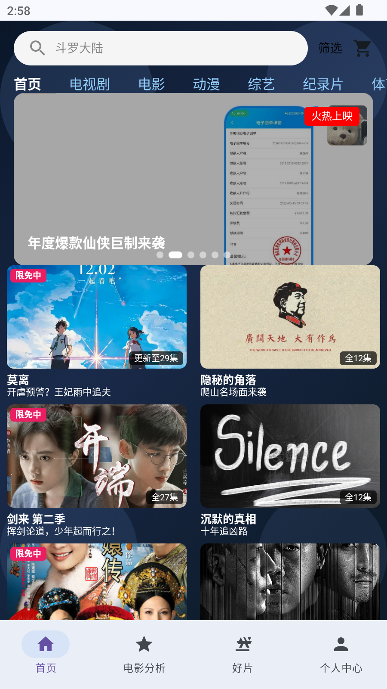
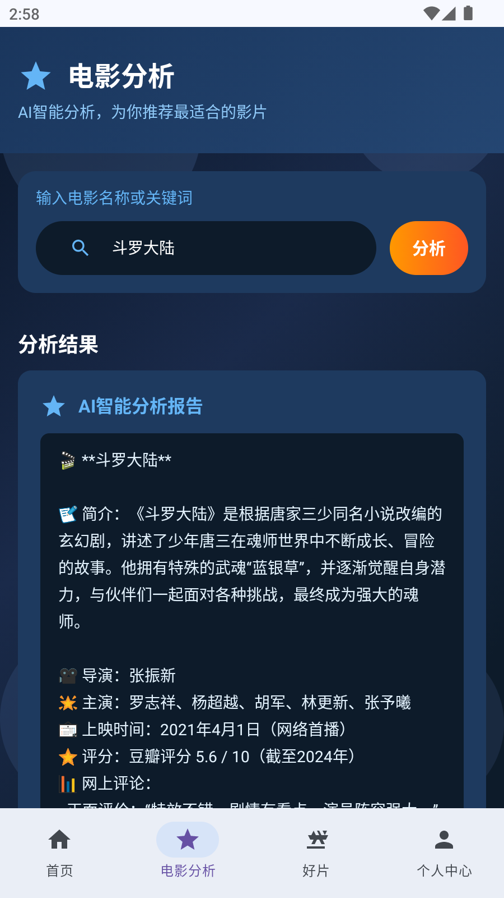
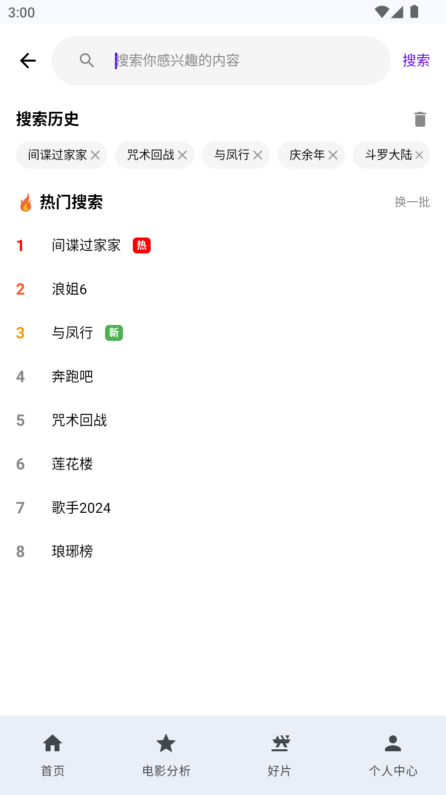
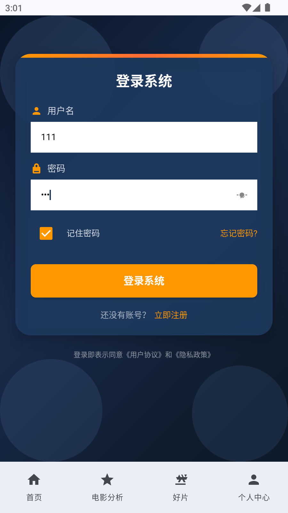
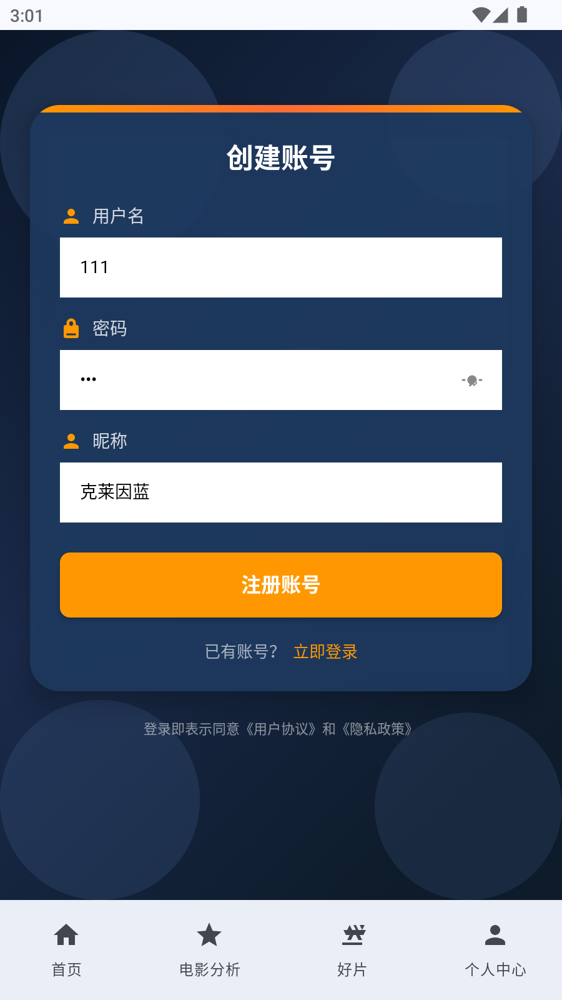
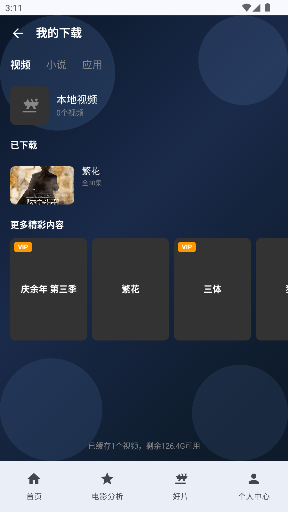
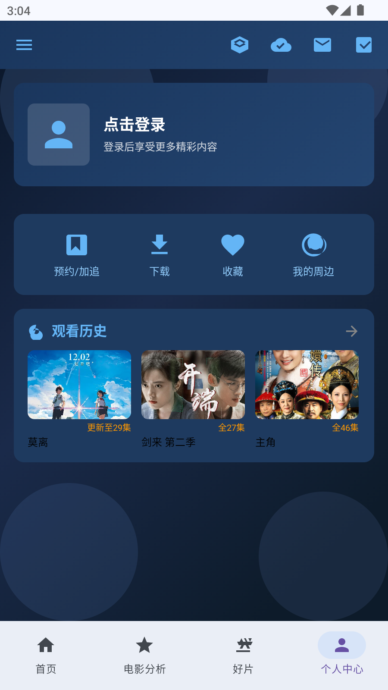

# 移动应用开发实验报告
## GitHub 仓库地址：https://github.com/klylll/Finly.git
## 1. 项目简介

- **应用名称**：Finly（影视娱乐应用）
- **目标用户**：影视爱好者，喜欢观看电视剧、电影、动漫、综艺等视频内容的用户群体
- **核心功能**：
  - 视频浏览与分类筛选
  - AI电影分析（基于通义千问大模型）
  - 搜索功能（含搜索历史、热门搜索）
  - 视频详情展示（简介、评论、相关推荐）
  - 用户系统（登录、注册、个人中心）
  - 收藏、预约/加追、下载、周边等个人功能

## 2. 技术栈

- **UI**：Jetpack Compose + Material 3
- **本地存储**：SharedPreferences + Gson（用户数据持久化）
- **网络**：OkHttp + Gson（接口来源：阿里云通义千问API）
- **状态管理**：Composable 内部 remember + mutableStateOf
- **持久化偏好**：SharedPreferences（保存用户登录状态、用户列表）
- **导航**：Navigation Compose
- **异步处理**：Kotlin Coroutines
- **图片加载**：Coil (coil-compose)
- **其他依赖**：okhttp-logging-interceptor（网络请求日志）

## 3. 功能清单

### 必做项完成情况

**UI 层**
- [x] Jetpack Compose 构建全部 UI
- [x] 至少 2 个主要页面（首页、电影分析、好片、个人中心、搜索页、视频详情页等）
- [x] Compose Navigation 导航
- [x] LazyColumn / LazyVerticalGrid 列表（首页使用自定义双列网格，搜索页使用垂直滚动列表）
- [x] Material 3 组件和主题
- [ ] 浅色 / 深色模式支持（已配置 Material 3 主题切换框架，但主要页面采用深色渐变设计）

**数据层**
- [x] Room 数据库，至少 2 张表（使用 SharedPreferences + Gson 替代）
- [ ] 完整 CRUD 操作（用户数据通过 UserManager 实现增删查改，非 Room）
- [x] DAO 查询方法返回 Flow 类型
- [x] 至少一种查询功能（视频搜索、分类筛选）
- [ ] DataStore 保存用户偏好或最近状态（使用 SharedPreferences 替代）

**网络层**
- [x] 声明并使用 Internet 权限
- [x] 使用网络请求获取真实 API 数据（阿里云通义千问 API）
- [x] 网络数据在核心页面中展示或参与主要功能流程（电影分析页面）
- [x] 处理 Loading / Success / Error 等网络状态
- [x] Composable 不直接发起网络请求（API 调用封装在 QwenApiService 中，通过 ApiManager 访问）

**架构层**
- [ ] ViewModel 状态管理（使用 Composable 内部状态管理替代）
- [ ] Repository 模式（数据层直接通过 Object 单例访问）
- [ ] StateFlow / Flow 数据流
- [x] Kotlin 协程异步处理
- [ ] UiState 描述界面状态
- [ ] Composable 不直接访问数据库或网络（电影分析页面直接调用 API 服务）

**功能完整性**
- [x] 新增 / 编辑 / 删除 / 搜索等核心操作（搜索、收藏增删、预约增删）
- [x] 输入验证和错误提示（登录注册页面）
- [x] 状态展示（空状态 / 加载状态 / 错误状态均有实现）
- [ ] 屏幕旋转后状态保持（未特殊处理）

### 选做项完成情况

- [x] 示例：复杂数据库查询（视频多条件筛选：类型、题材、地区、年份、画质、排序）
- [x] 示例：搜索历史（SearchHistoryStore 实现搜索历史的增删查）
- [x] AI 智能分析功能（通义千问大模型 API 集成）
- [x] 网络失败降级策略（API 失败时切换至本地数据分析）

## 4. 数据存储设计

### 存储方式 1：用户数据（SharedPreferences + Gson）

使用 SharedPreferences 存储用户列表和当前登录用户 ID，通过 Gson 进行序列化。

| 字段名 | 类型 | 说明 |
|---|---|---|
| id | Int | 用户ID，主键 |
| username | String | 用户名，唯一 |
| nickname | String | 用户昵称 |
| avatar | String | 头像地址 |
| vipLevel | Int | VIP等级 |
| points | Int | 积分 |
| diamonds | Int | 钻石 |
| password | String | 密码 |

**主要操作方法**（[UserManager.kt](file:///e:/anstdio/Finly/app/src/main/java/com/example/finly/data/UserManager.kt)）：
- `login(username, password)`：用户登录验证
- `register(username, password, nickname)`：用户注册
- `logout()`：退出登录
- `getCurrentUser()`：获取当前登录用户
- `isLoggedIn()`：检查登录状态

### 存储方式 2：搜索历史（内存存储）

| 字段名 | 类型 | 说明 |
|---|---|---|
| history | List\<String\> | 搜索历史列表 |

**主要操作方法**（[SearchHistoryStore.kt](file:///e:/anstdio/Finly/app/src/main/java/com/example/finly/data/SearchHistoryStore.kt)）：
- `add(query)`：添加搜索记录（去重，最新在前）
- `remove(query)`：删除单条记录
- `clear()`：清空全部记录

### 存储方式 3：视频数据（Mock 数据 + 内存状态）

| 字段名 | 类型 | 说明 |
|---|---|---|
| id | Int | 视频ID，主键 |
| title | String | 视频标题 |
| subtitle | String | 副标题/简介 |
| badge | String? | 角标（VIP/限免中等） |
| episode | String? | 集数信息 |
| type | String | 类型（电视剧/电影/动漫等） |
| genre | String | 题材（爱情/喜剧/古装等） |
| region | String | 地区 |
| year | String | 年份 |
| quality | String | 画质 |
| rating | Float | 评分 |
| playCount | String | 播放量 |
| director | String | 导演 |
| actors | String | 主演 |
| posterUrl | String | 海报URL |
| imageRes | Int | 本地海报资源 |

**主要 DAO 级查询方法**（[MockData.kt](file:///e:/anstdio/Finly/app/src/main/java/com/example/finly/data/MockData.kt)）：
- `searchVideos(query)`：关键词搜索视频
- `filterVideos(type, genre, region, year, quality, sort)`：多条件筛选
- `findVideoById(id)`：按ID查找视频
- `toggleFavorite(id)` / `getFavoritedVideos()`：收藏操作
- `toggleReserve(id)` / `getReservedVideos()`：预约操作
- `toggleZhouBian(id)` / `getZhouBianVideos()`：周边操作

## 5. 网络功能设计

- **API 来源**：阿里云通义千问（DashScope）
- **接口地址**：`https://dashscope.aliyuncs.com/api/v1/services/aigc/text-generation/generation`
- **请求方式**：POST
- **主要返回字段**：
  - `output.choices[0].message.content`：AI 生成的文本内容
  - `output.text`：备选文本格式输出
- **App 中使用这些网络数据的页面或功能**：电影分析页面（MovieAnalysisScreen），用户输入电影名称或关键词后，AI 生成详细的影片分析报告，包含简介、导演、主演、评分、评论、推荐理由等
- **网络失败时的处理方式**：捕获异常后切换至本地数据模式，使用 MockData 中的本地视频数据生成分析报告，并提示用户"当前网络不可用，已切换至本地数据"

**核心网络服务**：[QwenApiService.kt](file:///e:/anstdio/Finly/app/src/main/java/com/example/finly/data/api/QwenApiService.kt)
- `chat(message, model)`：通用对话接口
- `searchAndFilter(query)`：电影搜索与分析专用接口，封装了 Prompt 工程

## 6. 架构设计

项目采用简化的分层架构：

```
UI Layer (Composable Screens)
    ↓ 直接调用
Data Layer (Object Singletons)
    ↓ 调用
Network Layer (ApiService)
```

**各层说明**：

1. **UI Layer（界面层）**
   - 位置：[ui/screens](file:///e:/anstdio/Finly/app/src/main/java/com/example/finly/ui/screens)、[ui/components](file:///e:/anstdio/Finly/app/src/main/java/com/example/finly/ui/components)
   - 职责：构建界面、处理用户交互、管理界面状态
   - 技术：Jetpack Compose + remember + mutableStateOf

2. **Data Layer（数据层）**
   - 位置：[data](file:///e:/anstdio/Finly/app/src/main/java/com/example/finly/data)
   - 职责：提供数据（MockData）、用户管理（UserManager）、搜索历史（SearchHistoryStore）
   - 技术：Kotlin Object 单例 + SharedPreferences + Gson

3. **Network Layer（网络层）**
   - 位置：[data/api](file:///e:/anstdio/Finly/app/src/main/java/com/example/finly/data/api)
   - 职责：封装 API 调用、处理网络请求
   - 技术：OkHttp + Coroutines + Gson

4. **Navigation（导航层）**
   - 位置：[ui/navigation](file:///e:/anstdio/Finly/app/src/main/java/com/example/finly/ui/navigation)
   - 职责：页面路由管理
   - 技术：Navigation Compose

> 说明：本项目未严格遵循 MVVM 架构，未使用 ViewModel 和 Repository 模式。状态管理主要在 Composable 内部通过 remember 完成，数据层通过单例对象直接访问。后续可演进为标准 MVVM 架构。

## 7. 核心功能截图

> 注：以下为功能描述，实际截图请运行应用后截取

### 首页
**文件**：[HomeScreen.kt](file:///e:/anstdio/Finly/app/src/main/java/com/example/finly/ui/screens/HomeScreen.kt)

说明：展示视频内容首页，包含搜索栏、分类导航栏（电视剧/电影/动漫/综艺等7个分类）、轮播图 Banner、视频双列网格。用户可以点击分类切换内容，点击筛选按钮进行多条件筛选，点击视频卡片进入详情页。


### 电影分析页（核心功能页）
**文件**：[VipScreen.kt](file:///e:/anstdio/Finly/app/src/main/java/com/example/finly/ui/screens/VipScreen.kt)

说明：AI 智能电影分析功能。用户输入电影名称或关键词（如"科幻电影"、"悬疑片"），点击"分析"按钮后，调用阿里云通义千问大模型 API，生成包含影片简介、导演、主演、评分、网友评论、推荐等级的专业分析报告。支持 Loading 加载状态、错误状态、以及网络失败时的本地数据降级。

### 搜索页
**文件**：[SearchScreen.kt](file:///e:/anstdio/Finly/app/src/main/java/com/example/finly/ui/screens/SearchScreen.kt)

说明：提供搜索历史、热门搜索（可换一批）、搜索结果列表功能。搜索结果支持实时展示，点击结果可跳转至视频详情页。

### 视频详情页
**文件**：[VideoDetailScreen.kt](file:///e:/anstdio/Finly/app/src/main/java/com/example/finly/ui/screens/VideoDetailScreen.kt)

说明：展示视频播放区域、视频信息（标题、评分、播放量等）、功能操作按钮（预约/加追、下载、收藏、周边）、Tab 切换（简介/评论/相关推荐）。评论区根据视频类型展示不同的模拟评论数据。

### 登录注册页
**文件**：[AuthScreen.kt](file:///e:/anstdio/Finly/app/src/main/java/com/example/finly/ui/screens/AuthScreen.kt)

说明：支持登录和注册两种模式切换。包含用户名、密码、昵称输入框，输入验证和错误提示，密码可见性切换，注册成功弹窗等功能。用户数据通过 SharedPreferences 持久化存储。


### 个人中心页
**文件**：[AuthScreen.kt](file:///e:/anstdio/Finly/app/src/main/java/com/example/finly/ui/screens/gerenxhongxing.kt)

说明：可以查看自己的账号，退出登录，还可以查看自己的观看历史记录，登录成功后可以查看预约/追击、下载、收藏、周边的历史记录，不登录则不能查看。


## 8. 技术难点与解决方案

### 难点 1：AI 电影分析功能的网络状态处理

- **问题描述**：调用通义千问 API 时，可能因网络不可用、API Key 失效、请求超时等原因导致失败，用户体验差。
- **原因分析**：网络请求具有不确定性，需要处理多种异常场景（无网络、超时、API 错误、返回为空等），同时需要给用户明确的状态反馈。
- **解决方案**：
  1. 在 [MovieAnalysisScreen](file:///e:/anstdio/Finly/app/src/main/java/com/example/finly/ui/screens/VipScreen.kt#L52-L75) 中使用 `LaunchedEffect` + `analysisTrigger` 计数器触发分析，确保每次点击都能重新执行
  2. 实现 Loading / Success / Error / Empty 四种界面状态
  3. 使用 try-catch 包裹 API 调用，捕获异常后自动降级到本地数据分析（`generateLocalAnalysis` 函数）
  4. 本地分析模式下明确提示用户"当前网络不可用，已切换至本地数据"
- **参考资料**：OkHttp 官方文档、Kotlin Coroutines 官方文档

### 难点 2：深蓝色渐变背景与装饰元素的布局

- **问题描述**：设计要求使用深蓝色渐变背景 + 四角半透明圆形装饰元素，同时保证内容不被装饰元素遮挡。
- **原因分析**：Compose 的 Box 布局堆叠顺序需要精确控制，装饰元素如果层级过高会遮挡内容，层级过低又可能被内容背景覆盖。
- **解决方案**：
  1. 使用三层 Box 嵌套：最底层是渐变背景 + 装饰圆形，中间层是内容 Column
  2. 装饰圆形设置合适的透明度（0.15f ~ 0.25f），确保不影响文字可读性
  3. 四角装饰使用 `align(Alignment.TopStart/TopEnd/BottomStart/BottomEnd)` 定位
  4. 该模式已在多个页面复用，形成统一的视觉风格
- **参考资料**：Jetpack Compose Box 布局官方文档

### 难点 3：搜索与多条件筛选的实现

- **问题描述**：需要支持关键词搜索和多维度筛选（类型、题材、地区、年份、画质、排序），数据量较大时需要保证性能。
- **原因分析**：多个筛选条件组合时逻辑复杂，需要处理 AND 关系、范围查询（年份区间）、排序等多种查询模式。
- **解决方案**：
  1. 在 [MockData.kt](file:///e:/anstdio/Finly/app/src/main/java/com/example/finly/data/MockData.kt#L101-L150) 中实现 `filterVideos` 函数，支持多参数筛选
  2. 使用 Kotlin 集合操作符（filter、sortedByDescending 等）链式调用实现筛选
  3. 筛选条件全部为"全部"时跳过该条件，提升性能
  4. 首页筛选通过 BottomSheet 交互，好片页通过 Chip 标签交互，两种交互模式适配不同场景

### 难点 4：用户登录状态持久化

- **问题描述**：应用重启后需要保持用户登录状态，用户数据需要持久化存储。
- **原因分析**：Compose 中的 remember 状态在应用重启后会丢失，需要借助本地存储方案。
- **解决方案**：
  1. 使用 SharedPreferences + Gson 方案（[UserManager.kt](file:///e:/anstdio/Finly/app/src/main/java/com/example/finly/data/UserManager.kt)）
  2. 应用启动时在 `MainActivity.onCreate()` 中调用 `UserManager.init(this)` 加载数据
  3. 用户列表和当前登录用户 ID 分别存储，登录状态通过用户 ID 关联
  4. 注册新用户时自动更新列表并持久化

## 9. AI 使用说明

请在以下选项中勾选，可多选：

- [ ] 未使用 AI
- [x] 网页版 AI（如 ChatGPT、Claude、Kimi、豆包等）
- [ ] AI Agent / 编程代理（如 Claude Code、Codex、OpenCode、Cursor Agent 等）
- [x] 国产大模型服务（如 DeepSeek、GLM、通义千问、文心一言等）
- [ ] IDE 插件或代码补全工具（如 GitHub Copilot、Cursor、CodeGeeX 等）
- [ ] 其他：

**具体工具名称**：
- 阿里云通义千问（DashScope）—— 用于应用内 AI 电影分析功能
- 网页版 AI 辅助工具 —— 用于代码生成、调试、问题排查

**AI 主要用于哪些环节**：
- 功能设计与实现思路梳理
- 部分 UI 界面代码生成
- 网络请求封装与 API 集成
- Bug 调试与错误排查
- 应用内核心功能：AI 电影分析（调用通义千问 API）

**说明**：应用核心的 AI 电影分析功能直接集成了通义千问大模型 API，为用户提供智能化的影片分析服务。开发过程中也使用了 AI 辅助工具提高开发效率。

## 10. 运行说明

- **最低 Android 版本**：API 24（Android 7.0）
- **推荐 Android 版本**：API 34（Android 14）
- **编译 SDK 版本**：API 36
- **特殊权限**：
  - 网络权限（`android.permission.INTERNET`）—— AI 电影分析功能必需
  - 网络状态权限（`android.permission.ACCESS_NETWORK_STATE`）
- **运行步骤**：
  1. 使用 Android Studio 打开项目（File → Open → 选择 Finly 目录）
  2. 等待 Gradle 同步完成
  3. 连接模拟器或真机，点击 Run 按钮
  4. 默认测试账号：用户名 `user1` / `user2`，密码 `123456`
  5. 也可点击注册按钮创建新账号

## 11. 项目亮点（可选）

1. **AI 智能分析**：集成阿里云通义千问大模型，实现电影智能分析功能，支持网络失败时自动降级到本地数据分析，保证用户体验。

2. **统一的视觉设计**：所有主页面采用深蓝色渐变背景 + 四角装饰圆形的设计语言，视觉风格统一且具有层次感。

3. **丰富的页面与功能**：实现了首页、电影分析、好片、搜索、视频详情、个人中心、收藏、预约、下载、周边、登录注册等 10+ 个页面，功能完整。

4. **多维度视频筛选**：支持按类型、题材、地区、年份、画质、排序等多维度组合筛选，满足用户个性化查找需求。

5. **完善的状态反馈**：加载中、空状态、错误状态均有对应的 UI 展示和提示文案，用户体验良好。

6. **搜索体验优化**：包含搜索历史（支持增删清空）、热门搜索（支持换一批）、搜索结果实时展示等功能。

## 12. 未来改进方向（可选）

1. **引入 Room 数据库**：将用户数据、收藏、预约、搜索历史等迁移至 Room 数据库，使用 DAO + Flow 实现响应式数据更新。

2. **引入 ViewModel + StateFlow**：重构为标准 MVVM 架构，将业务逻辑从 Composable 中剥离，实现屏幕旋转状态保持。

3. **引入 Repository 模式**：建立数据仓库层，统一管理本地数据和网络数据，实现数据缓存策略。

4. **引入 DataStore**：替换 SharedPreferences，使用更现代的 DataStore 进行键值对存储和 Preferences 存储。

5. **分页加载**：视频列表使用 Paging 3 实现分页加载，提升大数据量下的性能。

6. **深色/浅色模式完善**：完善 Material 3 主题的浅色模式适配，支持系统主题自动切换。

7. **真实视频播放**：接入真实视频播放 SDK（如 ExoPlayer），实现视频播放功能。

8. **更多 AI 功能**：拓展 AI 在推荐、对话、智能搜索等场景的应用。

9. **单元测试与 UI 测试**：补充测试用例，提升代码质量。

10. **代码架构优化**：按功能模块分包，增加依赖注入（Hilt），提升代码可维护性和可测试性。
