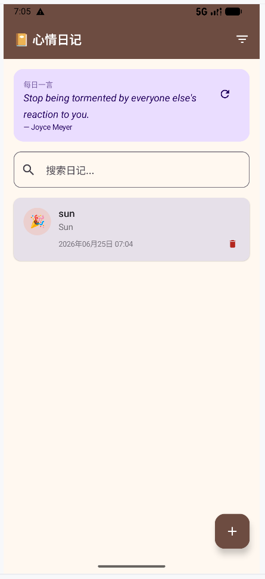
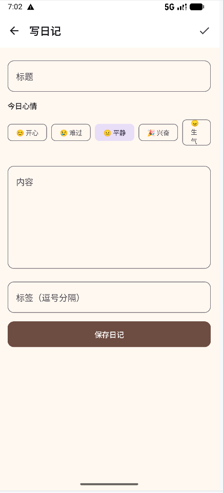
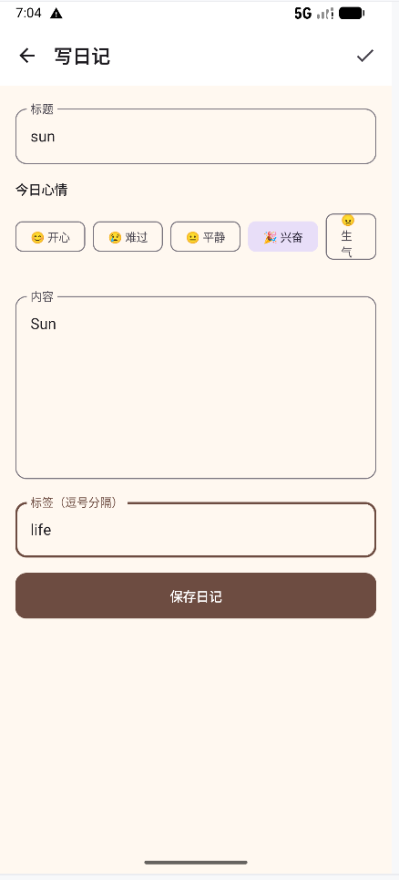
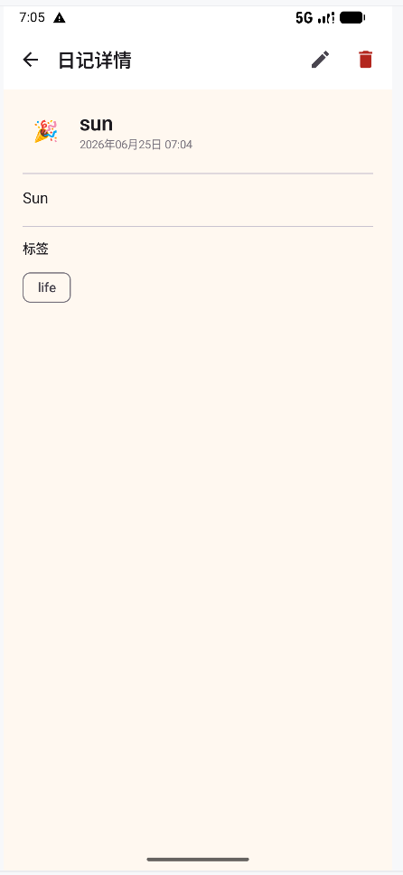

# 心情日记 (Diary App)

GitHub 仓库地址：https://github.com/wangxi-033/2025003033-FinalProject

## 1. 项目简介

- 应用名称：心情日记 (Diary App)
- 目标用户：希望记录每日心情和生活点滴的普通用户
- 核心功能：
  - 日记的新增、编辑、查看、删除（完整 CRUD）
  - 6 种心情选择：开心、难过、平静、兴奋、生气、放松
  - 日记搜索（按标题/内容/标签模糊匹配）和心情筛选
  - 每日一言（ZenQuotes API 随机名言展示）
  - 标签分类管理
  - 浅色 / 深色主题支持

## 2. 技术栈

- UI：Jetpack Compose + Material 3
- 数据库：Room
- 网络：Retrofit / OkHttp / Gson（接口来源：ZenQuotes API）
- 状态管理：ViewModel + StateFlow
- 持久化偏好：DataStore Preferences
- 导航：Navigation Compose
- 异步处理：Kotlin Coroutines
- 图片加载：Coil
- 其他依赖：Material Icons Extended、HttpLoggingInterceptor

## 3. 功能清单

### 必做项完成情况

**UI 层**
- [x] Jetpack Compose 构建全部 UI
- [x] 至少 2 个主要页面（首页、编辑页、详情页共 3 个）
- [x] Compose Navigation 导航
- [x] LazyColumn 列表展示日记
- [x] Material 3 组件和主题（TopAppBar、Card、Chip、FAB 等）
- [x] 浅色 / 深色模式支持（跟随系统自动切换）

**数据层**
- [x] Room 数据库，至少 2 张表（`diary_entries`、`tags`）
- [x] 完整 CRUD 操作（新增、查询、编辑、删除）
- [x] DAO 查询方法返回 Flow 类型（`getAllEntries()`、`getEntryCount()` 等）
- [x] 至少一种查询功能（标题/内容/标签模糊搜索 + 心情筛选 + 心情统计）
- [x] DataStore 保存用户偏好（排序方式、默认心情）

**网络层**
- [x] 声明并使用 Internet 权限
- [x] 使用网络请求获取真实 API 数据（ZenQuotes 随机名言）
- [x] 网络数据在核心页面中展示（首页每日一言卡片）
- [x] 处理 Loading / Success / Error 等网络状态
- [x] Composable 不直接发起网络请求（通过 QuoteRepository 封装）

**架构层**
- [x] ViewModel 状态管理
- [x] Repository 模式（DiaryRepository + QuoteRepository）
- [x] StateFlow / Flow 数据流
- [x] Kotlin 协程异步处理
- [x] UiState 描述界面状态（DiaryListState、QuoteState、DiaryFormState）
- [x] Composable 不直接访问数据库或网络

**功能完整性**
- [x] 新增 / 编辑 / 删除 / 搜索等核心操作（全部实现）
- [x] 输入验证和错误提示（标题为空时提示错误）
- [x] 状态展示（加载状态、空态、错误状态全覆盖）
- [x] 屏幕旋转后状态保持（ViewModel 生命周期管理）

### 选做项完成情况

- [x] 复杂数据库查询：`combine` + `flatMapLatest` 实现搜索词与心情筛选的联合查询
- [x] 心情统计查询：`getMoodStats()` 按心情分组统计日记数量
- [x] 标签系统：标签表设计 + 使用计数 + REPLACE 策略防重复
- [x] 用户偏好持久化：DataStore 保存排序方式、默认心情等设置
- [x] 每日一言功能：Retrofit 请求 ZenQuotes API，带刷新和错误重试

## 4. 数据库设计

### 表 1：diary_entries（日记表）

| 字段名 | 类型 | 说明 |
|---|---|---|
| id | Int | 主键，自增 |
| title | String | 日记标题 |
| content | String | 日记正文内容 |
| mood | String | 心情，默认 "neutral"（happy/sad/neutral/excited/angry/calm） |
| tags | String | 标签，逗号分隔存储（如 "工作,学习,生活"） |
| createdAt | Long | 创建时间戳 |
| updatedAt | Long | 最后更新时间戳 |

### 表 2：tags（标签表）

| 字段名 | 类型 | 说明 |
|---|---|---|
| name | String | 主键，标签名称 |
| useCount | Int | 使用次数，默认 0 |

**表关系说明**：`diary_entries` 与 `tags` 之间通过日记中的 `tags` 字段（字符串）间接关联，标签表独立维护标签及使用计数。`DiaryDao` 负责日记 CRUD 与统计查询，`TagDao` 负责标签管理（含 `incrementUseCount` 计数更新）。

**主要 DAO 查询方法**：

| 方法 | 返回类型 | 说明 |
|---|---|---|
| `getAllEntries()` | `Flow<List<DiaryEntry>>` | 按创建时间降序返回全部日记 |
| `searchEntries(query)` | `Flow<List<DiaryEntry>>` | 模糊搜索 title/content/tags |
| `getEntriesByMood(mood)` | `Flow<List<DiaryEntry>>` | 按心情筛选日记 |
| `getMoodStats()` | `Flow<List<MoodStat>>` | 按心情分组统计日记数量 |
| `getEntryById(id)` | `DiaryEntry?` | 按 ID 查询单条 |
| `insertEntry(entry)` | `Long` | 插入或替换（REPLACE 策略） |
| `updateEntry(entry)` | `Unit` | 更新日记 |
| `deleteEntry(entry)` | `Unit` | 删除日记 |

## 5. 网络功能设计

- API 来源：ZenQuotes API（免费名言 API）
- 接口地址：`https://zenquotes.io/api/random`
- 请求方式：GET
- 主要返回字段：
  - `q`：名言内容
  - `a`：作者
  - `h`：HTML 格式
- App 中使用这些网络数据的页面或功能：首页"每日一言"卡片展示，用户可手动刷新获取新名言
- 网络失败时的处理方式：
  - `QuoteState` 使用 sealed interface 管理三种状态：Loading / Success / Error
  - 加载中显示圆形进度指示器
  - 失败时显示错误信息和重试按钮
  - Retrofit 客户端配置 15 秒超时，防止长时间挂起

## 6. 架构设计

项目采用 **MVVM + Repository** 分层架构，数据流单向传递：

```
┌─────────────────────────────────────────────┐
│                  UI Layer                     │
│  HomeScreen / EditDiaryScreen / ViewDiaryScreen │
│         ↕ collectAsState() / 事件回调          │
├─────────────────────────────────────────────┤
│              ViewModel Layer                   │
│  DiaryViewModel (AndroidViewModel)             │
│  - diaryListState: StateFlow<DiaryListState>   │
│  - quoteState: MutableStateFlow<QuoteState>    │
│  - diaryFormState: MutableStateFlow<DiaryForm> │
│  - filteredEntries: StateFlow 联合筛选         │
│         ↕ Repository 调用                       │
├─────────────────────────────────────────────┤
│            Repository Layer                     │
│  DiaryRepository      QuoteRepository          │
│  (Room CRUD 封装)     (Retrofit API 封装)       │
│         ↕                    ↕                  │
├─────────────────────────────────────────────┤
│               Data Layer                        │
│  Room Database        Retrofit + OkHttp         │
│  (diary_database)     (ZenQuotes API)           │
│  DataStore Preferences                          │
└─────────────────────────────────────────────┘
```

**核心设计要点**：

1. **Data Layer（数据层）**：Room 数据库提供本地持久化，Retrofit 提供远程 API 调用，DataStore 保存用户偏好。

2. **Repository（仓库层）**：`DiaryRepository` 封装所有 DAO 操作，对 ViewModel 暴露干净的挂起函数和 Flow；`QuoteRepository` 封装网络请求，使用 `Result<T>` 包裹结果以统一处理成功和失败。

3. **ViewModel（视图模型层）**：`DiaryViewModel` 是核心，持有所有 UI 状态。`diaryListState` 将数据库 Flow 映射为 `DiaryListState` 密封接口；`filteredEntries` 使用 `combine` + `flatMapLatest` 实现搜索关键词和心情筛选的响应式联动；`quoteState` 管理网络名言状态。表单数据单独放在 `diaryFormState` 中。

4. **UiState（界面状态）**：使用 sealed interface 定义类型安全的状态类：
   - `DiaryListState.Loading / Success / Error`：日记列表的三种状态
   - `QuoteState.Loading / Success / Error`：每日一言的三种状态
   - `DiaryFormState`：编辑表单的数据类，含字段验证逻辑

5. **UI Layer（界面层）**：Composable 函数通过 `collectAsState()` 收集 ViewModel 的 StateFlow，根据状态渲染不同 UI（加载指示器、内容、空态、错误提示）。Composable 不直接访问数据库或网络，所有数据操作通过 ViewModel 的事件处理函数完成。

## 7. 核心功能截图

### 首页

说明：展示搜索栏、心情筛选栏（6 种心情可切换筛选）、每日一言卡片（可刷新）、日记列表（LazyColumn 展示日记标题、心情、内容摘要和日期）。底部 FAB 按钮用于新增日记。

### 编辑页


说明：支持新建和编辑两种模式。包含标题输入（带空值校验）、6 种心情选择（FilterChip 单选）、正文多行输入、标签输入（逗号分隔提示）。顶部和底部均有保存按钮，保存成功后自动返回上一页。

### 详情页

说明：展示日记完整信息，包括心情 emoji、标题、创建时间、正文内容和标签。TopAppBar 提供返回、编辑和删除操作，删除前弹出确认对话框。

## 8. 技术难点与解决方案

### 难点 1：搜索与心情筛选的联合过滤

- 问题描述：需要同时支持关键词搜索和心情筛选两个维度的过滤，两者可以独立或组合使用，需要保证数据流响应的正确性。
- 原因分析：单一筛选条件可以直接切换 DAO 查询，但两个筛选条件组合时存在竞态问题，简单的 if-else 嵌套无法优雅处理。
- 解决方案：使用 `combine(searchQuery, moodFilter)` 将两个 Flow 合并，再通过 `flatMapLatest` 动态切换到对应的 DAO 查询方法。当搜索词变化或心情筛选变化时，自动重新查询并输出合并结果。
- 参考资料：Kotlin Flow 官方文档 - combine 与 flatMapLatest 操作符

### 难点 2：网络状态的类型安全管理

- 问题描述：每日一言功能涉及网络请求，需要处理加载、成功、失败三种状态，如果直接使用 nullable 字段容易遗漏状态处理导致崩溃。
- 原因分析：传统做法用多个 Boolean 或 nullable 变量表示状态，类型不安全且扩展性差。
- 解决方案：定义 `QuoteState` sealed interface，包含 `Loading`、`Success(content, author)`、`Error(message)` 三个子类。Composable 中使用 `when` 表达式对每种状态做彻底匹配，编译器会检查分支完整性，杜绝遗漏。

### 难点 3：DataStore 与 ViewModel 的偏好管理

- 问题描述：用户偏好（如默认心情）需要在设置后立即生效，同时需要在应用重启后保持。
- 原因分析：SharedPreferences 是同步操作，不符合现代 Android 开发的异步和响应式原则。
- 解决方案：使用 DataStore Preferences，暴露 `Flow<Preferences>` 供 ViewModel 收集，变化自动传递到 UI。写入使用 `suspend` 函数在协程中执行，不阻塞主线程。

## 9. AI 使用说明

请在以下选项中勾选，可多选：

- [ ] 未使用 AI
- [ ] 网页版 AI（如 ChatGPT、Claude、Kimi、豆包等）
- [ ] AI Agent / 编程代理（如 Claude Code、Codex、OpenCode、Cursor Agent 等）
- [ ] 国产大模型服务（如 DeepSeek、GLM、通义千问、文心一言等）
- [ ] IDE 插件或代码补全工具（如 GitHub Copilot、Cursor、CodeGeeX 等）
- [ ] 其他：

具体工具名称：

AI 主要用于哪些环节：（如选题分析、代码生成、调试、报告整理等）

说明：是否使用 AI 以及使用了什么 AI 工具不会影响分值，请如实填写。

## 10. 运行说明

- 最低 Android 版本：API 24（Android 7.0）
- 推荐 Android 版本：API 35（Android 14）
- 特殊权限：网络权限（用于获取 ZenQuotes API 名言数据）
- 运行步骤：
  1. 克隆仓库：`git clone https://github.com/wangxi-033/MobileSoftwareDevelopment.git`
  2. 使用 Android Studio（Hedgehog 及以上）打开项目
  3. 等待 Gradle 同步完成（首次同步需下载依赖）
  4. 连接模拟器或真机（需网络连接），点击 Run

## 11. 项目亮点（可选）

1. **完善的 UI 状态管理**：使用 sealed interface 分别定义日记列表、名言卡片、编辑表单三种 UI 状态，配合 Compose 的 `when` 全覆盖匹配，确保每种状态都有对应的 UI 展示，不会出现空指针或状态遗漏。

2. **响应式联合筛选**：搜索栏和心情筛选栏通过 `combine` + `flatMapLatest` 组合，实现了输入即搜索的即时过滤体验，代码结构清晰，易于扩展新的筛选维度。

3. **温暖的视觉设计**：自定义色彩体系模拟纸质日记的温暖感，浅色模式采用米白纸张底色配棕色系，深色模式采用琥珀主色调配深棕黑背景，6 种心情各有专属颜色和 emoji，视觉识别度高。

4. **完整的网络异常处理**：使用 `Result<T>` 包裹网络请求结果，配合 `QuoteState` sealed interface 提供加载指示器、错误提示和重试机制，用户体验友好。

5. **单例模式资源管理**：Room 数据库和 Retrofit 客户端均采用线程安全的单例模式（`@Volatile` + `synchronized`），避免多线程下的重复实例化问题。

## 12. 未来改进方向（可选）

1. **标签系统完善**：当前标签仅以逗号分隔字符串存储，未来可利用已定义好的 `TagDao` 实现标签的增删管理、智能推荐和云同步。

2. **图片附件功能**：支持在日记中添加图片，利用 Coil 加载和 Room 存储路径，丰富日记表达形式。

3. **数据备份与导出**：支持将日记导出为 Markdown 或 PDF 文件，或通过 DataStore + 云存储实现跨设备同步。

4. **提醒功能**：添加日记提醒通知，帮助用户养成每日记录习惯。

5. **统计数据可视化**：利用已有的 `getMoodStats()` 和 `getEntryCount()` 查询，添加心情趋势图表、写作频率统计等数据可视化页面。

6. **手动切换深色模式**：当前深色模式仅跟随系统设置，可利用 `UserPreferences` 中已预留的 `KEY_DARK_MODE` 实现应用内手动切换。
