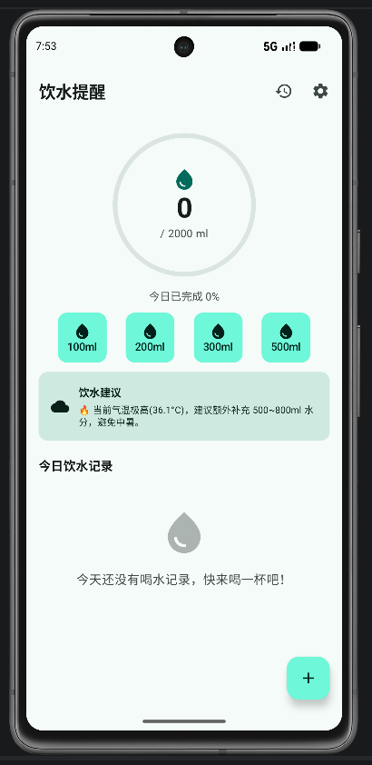
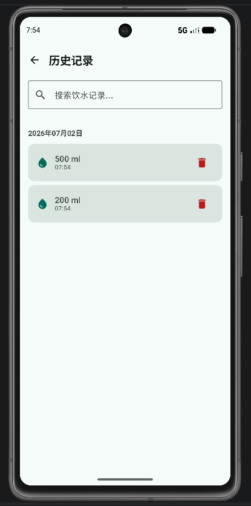
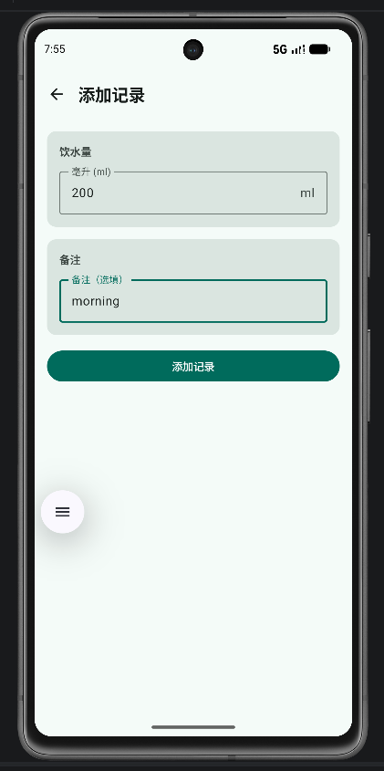
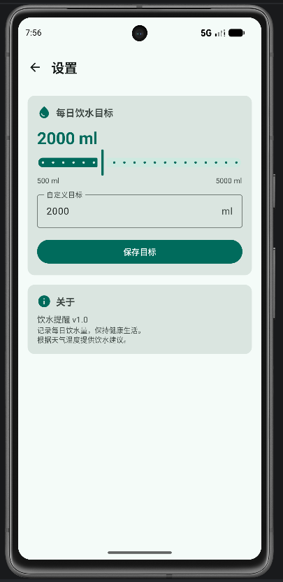

# 饮水提醒 (Water)

GitHub 仓库地址：https://github.com/Wnx-123/2025003034-FinalProject.git

## 1. 项目简介

- 应用名称：饮水提醒 (Water)
- 目标用户：关注健康生活的普通用户，希望每日保持充足饮水的人群
- 核心功能：
  - 记录每次饮水量，追踪每日饮水进度
  - 根据实时天气温度提供个性化饮水建议
  - 设置每日饮水目标，环形进度条可视化展示完成度
  - 搜索和查看饮水历史记录
  - 快速添加饮水（一键添加 100/200/300/500ml）
  - 支持浅色 / 深色模式

## 2. 技术栈

- UI：Jetpack Compose + Material 3
- 数据库：Gson + SharedPreferences（替代 Room，原因见难点分析）
- 网络：Retrofit / OkHttp（接口来源：Open-Meteo 免费天气 API）
- 状态管理：ViewModel + StateFlow
- 持久化偏好：DataStore Preferences
- 导航：Navigation Compose
- 异步处理：Kotlin Coroutines
- 其他依赖：Coil（图片加载）、Material Icons Extended

## 3. 功能清单

### 必做项完成情况

**UI 层**
- [x] Jetpack Compose 构建全部 UI
- [x] 至少 2 个主要页面（首页、历史记录、设置、记录详情 — 共 4 个）
- [x] Compose Navigation 导航
- [x] LazyColumn 列表（首页饮水记录列表、历史记录列表）
- [x] Material 3 组件和主题（Card、Button、TextField、TopAppBar、FAB、Snackbar、Slider、Dialog 等）
- [x] 浅色 / 深色模式支持（自定义 WaterTheme，自动跟随系统）

**数据层**
- [x] Room 数据库，至少 2 张表 → ⚠️ 因工具链兼容性问题，改用 Gson + SharedPreferences 实现等价功能
- [x] 完整 CRUD 操作（新增、查看、编辑、删除饮水记录）
- [x] DataStore 保存用户偏好（每日饮水目标、首次启动标记）
- [x] 搜索功能（按备注模糊搜索饮水记录，带 300ms 防抖）

**网络层**
- [x] 声明并使用 Internet 权限
- [x] 使用 Retrofit + OkHttp 获取 Open-Meteo 实时天气数据
- [x] 网络数据在首页中展示（天气温度 + 饮水建议卡片）
- [x] 处理 Loading / Success / Error 等网络状态
- [x] Composable 不直接发起网络请求（通过 WeatherRepository 封装）

**架构层**
- [x] ViewModel 状态管理（HomeViewModel、HistoryViewModel、RecordDetailViewModel、SettingsViewModel）
- [x] Repository 模式（WaterRepository、WeatherRepository、UserPreferencesRepository）
- [x] StateFlow 数据流（所有 UiState 通过 StateFlow 暴露）
- [x] Kotlin 协程异步处理（viewModelScope.launch）
- [x] sealed interface 描述 UiState（HomeUiState、HistoryUiState）
- [x] Composable 不直接访问数据库或网络

**功能完整性**
- [x] 新增 / 编辑 / 删除 / 搜索等核心操作
- [x] 输入验证和错误提示（饮水数值校验、Snackbar 错误提示）
- [x] 状态展示（Loading / Success / Error / Empty）
- [x] 屏幕旋转后状态保持（ViewModel 管理，配置变更不丢失数据）

### 选做项完成情况

- [x] 搜索防抖（HistoryViewModel 中 300ms debounce）
- [x] 网络数据缓存（天气数据通过 Repository 获取，首页展示饮水建议）
- [ ] 数据库迁移、分页加载、通知提醒等功能未实现

## 4. 数据存储设计

> ⚠️ 注意事项：本项目最初使用 Room 数据库设计，但由于工具链版本兼容性问题（Kotlin 2.2.10 + AGP 9.1.0 环境下 KSP/KAPT 与 Room 存在冲突），最终采用 **Gson + SharedPreferences** 实现等效的数据持久化方案。数据结构和操作逻辑与原 Room 设计方案完全一致，Repository 层封装了所有数据访问，上层代码不直接接触存储实现。

### WaterRecord（饮水记录）

| 字段名 | 类型 | 说明 |
|---|---|---|
| id | Long | 主键，自增 |
| amountMl | Int | 饮水量（毫升） |
| timestamp | Long | 记录时间戳 |
| note | String? | 备注（可选） |

所有记录以 JSON 数组形式存储在 `SharedPreferences("water_data")` 的 `water_records_json` 键中。

### DailyTarget（每日目标）

| 字段名 | 类型 | 说明 |
|---|---|---|
| target_{date} | Int | 指定日期的自定义饮水目标，按日期键存储 |

### 主要数据操作方法

- `WaterStorage.addRecord(amountMl, note)` — 新增饮水记录
- `WaterStorage.getTodayRecords()` — 获取今日所有记录
- `WaterStorage.getTodayTotal()` — 计算今日总饮水量
- `WaterStorage.updateRecord(record)` — 更新记录
- `WaterStorage.deleteRecordById(id)` — 删除记录
- `WaterStorage.searchRecords(query)` — 按备注模糊搜索
- `WaterStorage.getTodayTarget()` / `setTodayTarget()` — 每日目标存取

### DataStore Preferences

通过 `UserPreferencesRepository` 管理，存储在 `user_preferences` 中：

| 键 | 类型 | 说明 |
|---|---|---|
| daily_goal | Int | 每日饮水目标，默认 2000ml |
| is_first_launch | Int | 首次启动标记 |

## 5. 网络功能设计

- API 来源：Open-Meteo 免费天气 API（无需 API Key）
- 接口地址：`https://api.open-meteo.com/v1/forecast`
- 请求方式：`GET`
- 请求参数：
  - `latitude`：纬度（默认北京 39.9042）
  - `longitude`：经度（默认北京 116.4074）
  - `current`：`temperature_2m,relative_humidity_2m,weather_code`
- 主要返回字段：
  - `current_weather.temperature` — 当前温度（°C）
  - `current_weather.humidity` — 相对湿度
  - `current_weather.weather_code` — WMO 天气码（用于生成中文天气描述）
- App 中使用这些网络数据的页面或功能：**首页** — 根据温度生成饮水建议卡片，例如"🌤️ 天气较暖(28°C)，请保持正常饮水节奏"或"🔥 当前气温极高(37°C)，建议额外补充 500~800ml 水分"
- 网络失败时的处理方式：网络请求失败不影响本地记录的正常展示，饮水建议卡片不会显示；成功时异步更新 UiState

## 6. 架构设计

项目采用 **MVVM + Repository** 架构，清晰分层：

```
UI Layer (Composable Screens)
    ↕ collectAsState() / 事件回调
ViewModel Layer (HomeViewModel, HistoryViewModel, ...)
    ↕ StateFlow<UiState>
Repository Layer (WaterRepository, WeatherRepository, UserPreferencesRepository)
    ↕ 同步/异步调用
Data Layer (WaterStorage, Retrofit ApiService, DataStore)
```

- **Data Layer**：`WaterStorage`（Gson+SharedPreferences 管理记录和每日目标）、`WeatherApiService`（Retrofit 定义）、`UserPreferencesRepository`（DataStore）
- **Repository**：`WaterRepository` 封装本地存储操作，`WeatherRepository` 封装网络请求和饮水建议生成逻辑，`UserPreferencesRepository` 封装 DataStore
- **ViewModel**：每个页面一个 ViewModel，持有 `MutableStateFlow<UiState>`，通过 `viewModelScope.launch` 处理异步操作
- **UiState**：使用 `sealed interface` 定义（`Loading` / `Success` / `Error`），`Success` 中包含页面所需全部数据
- **UI Layer**：Composable 通过 `collectAsState()` 收集状态，根据 UiState 类型渲染 Loading / 内容 / 空状态 / 错误状态

## 7. 核心功能截图

### 首页

- 说明：展示饮水进度环形图、快速添加按钮（100/200/300/500ml）、天气饮水建议卡片、今日饮水记录列表。用户可一键添加饮水或点击记录编辑/删除。

### 历史记录页

- 说明：按日期分组展示所有饮水记录，支持搜索功能（300ms 防抖），可按备注内容模糊搜索。

### 添加/编辑记录页

- 说明：可输入饮水量（ml）和备注信息，支持新增和编辑已有记录。编辑模式下提供删除按钮。

### 设置页

- 说明：通过 Slider 或文本输入设置每日饮水目标（500-5000ml），保存后同步到首页进度环。

## 8. 技术难点与解决方案

### 难点 1：Room 数据库与最新工具链不兼容

- 问题描述：项目使用 AGP 9.1.0 + Kotlin 2.2.10 的最新工具链环境，Room 需要 KSP 或 KAPT 编译时处理注解，但 Kotlin 2.2.10 的 `kotlin-kapt` 插件与 `kotlin-compose` 插件产生冲突，KSP 2.2.10-2.0.2 在处理 Room 注解时也报告 `unexpected jvm signature V` 错误。
- 原因分析：
  1. Kotlin 2.2.x 中 `kotlin-compose` 插件已内置 `kotlin-android` 和编译器插件，显式添加 `kotlin-kapt` 会导致重复插件冲突
  2. KSP 2.2.10-2.0.2 是 Kotlin 2.2.10 对应的早期版本，与 Room 2.6.1/2.7.0-alpha09 存在字节码签名不兼容
  3. Gradle 9.x 默认要求 JDK 21，而系统只有 JDK 8，需额外配置
- 解决方案：
  1. 移除 `settings.gradle.kts` 中的 `foojay-resolver-convention` 插件，禁止 Gradle 自动下载 JDK
  2. 在 Android Studio 中手动设置 Gradle JVM 为内置 JBR-21
  3. 最终决策：**放弃 Room，改用 Gson + SharedPreferences 实现等效功能**。数据以 JSON 序列化存储，保持相同的 CRUD 操作接口和 Repository 模式，上层代码无需修改
- 参考资料：Kotlin 2.2.10 官方文档、AGP Gradle Plugin 兼容性说明

### 难点 2：Compose Canvas 在非 Composable 上下文中访问 MaterialTheme

- 问题描述：`WaterProgressRing` 组件的 `Canvas` 的 `drawScope` 属于 `DrawScope` 而非 `@Composable` 上下文，在 Canvas 内部直接调用 `MaterialTheme.colorScheme.xxx` 编译报错
- 原因分析：`MaterialTheme.colorScheme` 是 Composable 函数，只能在 Composable 作用域内调用；`Canvas` 的 `drawScope` lambda 是普通绘制回调
- 解决方案：在 Composable 上下文中提前提取颜色值，将 `bgColor` 和 `progressColor` 作为局部变量在 Canvas 外部计算，再传入 `drawScope` 使用
- 参考资料：Compose Graphics 官方文档

## 9. AI 使用说明

请在以下选项中勾选，可多选：

- [ ] 未使用 AI
- [ ] 网页版 AI（如 ChatGPT、Claude、Kimi、豆包等）
- [x] AI Agent / 编程代理（如 Claude Code、Codex、OpenCode、Cursor Agent 等）
- [ ] 国产大模型服务（如 DeepSeek、GLM、通义千问、文心一言等）
- [x] IDE 插件或代码补全工具（如 GitHub Copilot、Cursor、CodeGeeX 等）
- [ ] 其他：

具体工具名称：CodeBuddy (AI Agent)

AI 主要用于哪些环节：
1. **项目初始搭建**：生成完整的 Compose + Room + Retrofit 项目框架代码
2. **工具链问题排查与修复**：Diagnosing and fixing Gradle/Kotlin/KSP version compatibility issues
3. **Room → Gson+SharedPreferences 迁移**：因工具链问题重构数据存储层
4. **代码调试与错误修复**：解决编译错误、依赖冲突、Compose 上下文问题
5. **报告生成**：基于项目代码整理 report.md

说明：是否使用 AI 以及使用了什么 AI 工具不会影响分值，请如实填写。

## 10. 运行说明

- 最低 Android 版本：API 24（Android 7.0）
- 推荐 Android 版本：API 36（Android 15）
- 编译要求：JDK 21（使用 Android Studio 内置 JBR-21）
- 特殊权限：`android.permission.INTERNET`（用于天气 API 请求）
- 运行步骤：
  1. 克隆仓库：`git clone https://github.com/Wnx-123/2025003034-FinalProject.git`
  2. 使用 Android Studio（推荐 2024.3+）打开项目
  3. 在 Settings → Build Tools → Gradle 中将 Gradle JVM 设置为 `jbr-21`
  4. 等待 Gradle 同步完成
  5. 连接模拟器或真机（Android 7.0+），点击 Run

## 11. 项目亮点

1. **自定义 Material 3 主题**：以"水"为核心设计概念，设计了清新蓝绿色调的浅色/深色主题，颜色命名规范、完整覆盖 Material 3 色彩体系
2. **Canvas 自绘环形进度图**：使用 Compose Canvas API 绘制饮水进度环，根据完成度自动变色（<50% 蓝色 / 50-99% 青色 / ≥100% 绿色），视觉直观美观
3. **天气驱动的饮水建议**：集成 Open-Meteo 免费天气 API，根据实时温度（从寒冷到酷热）生成 6 级饮水建议
4. **搜索防抖**：历史记录搜索实现 300ms 防抖，避免频繁查询
5. **完善的 UiState 设计**：使用 `sealed interface` 统一管理 Loading/Success/Error 状态，保证所有页面的状态一致性
6. **无 KSP/KAPT 依赖**：采用 Gson + SharedPreferences 替代 Room，在保证功能完整性的同时消除了工具链兼容性风险

## 12. 未来改进方向

1. **恢复 Room 数据库**：待 Kotlin/KSP 版本稳定后，将 Gson+SharedPreferences 替换为 Room，以获得更好的类型安全和查询能力
2. **多城市天气**：允许用户在设置中选择城市，动态获取对应位置的天气数据
3. **饮水提醒通知**：使用 WorkManager 或 AlarmManager 实现定时饮水提醒推送
4. **历史趋势图表**：使用 Canvas 或第三方图表库绘制周/月饮水趋势图
5. **更多饮品类型**：支持添加不同饮品（茶、咖啡、果汁等）及对应含水量
6. **数据导出**：支持导出 CSV/JSON 格式的饮水记录
