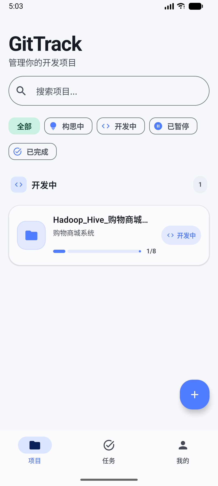
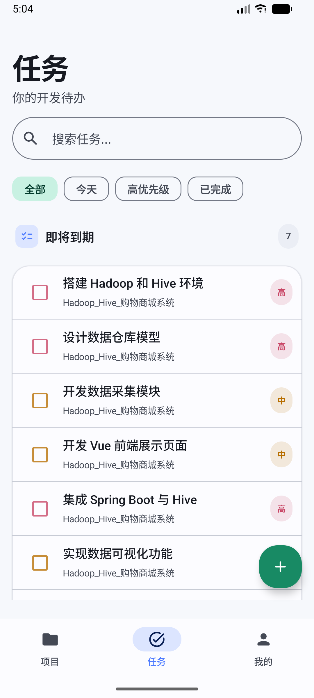
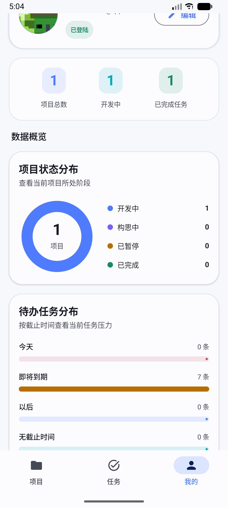
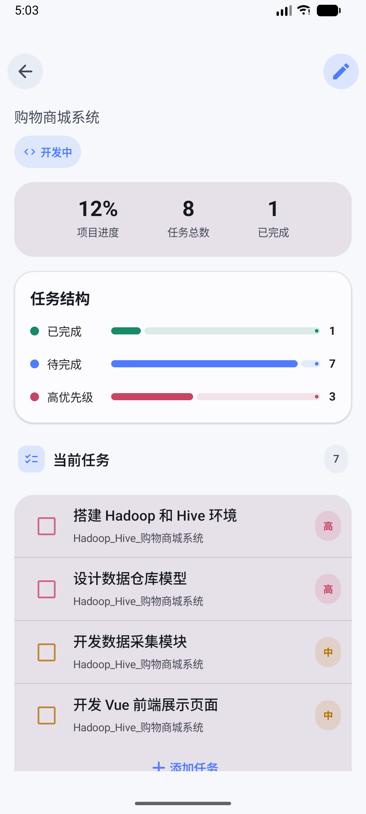
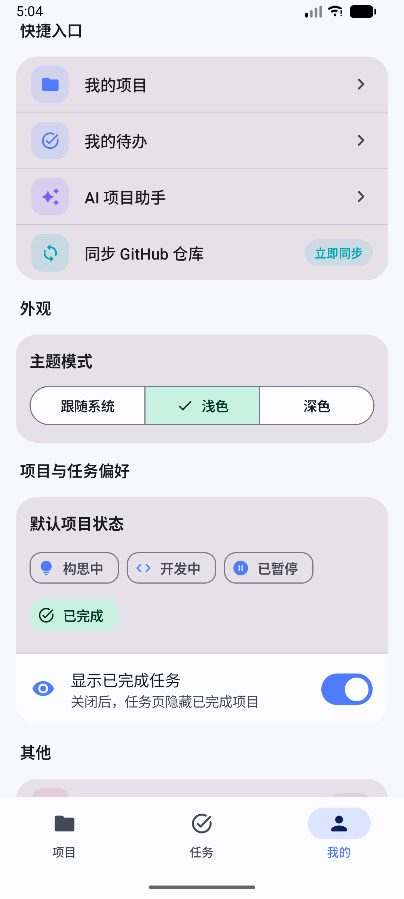

# GitTrack——个人开发项目与任务管理应用

GitHub 仓库地址：https://github.com/hhhSyyyShhh/GitTrack.git

## 1. 项目简介

- **应用名称：** GitTrack
- **目标用户：** 需要管理个人软件项目的计算机专业学生、独立开发者和编程爱好者
- **选题背景：** 在学习和开发过程中，个人通常同时维护多个课程项目、练习项目和 GitHub 仓库。普通待办软件缺少项目构思、开发进度和仓库信息之间的关联，因此设计了 GitTrack。
- **核心功能：** 项目管理、开发任务管理、项目进度统计、GitHub 仓库信息同步、AI 项目规划、AI 任务拆分和个人偏好设置。

GitTrack 的主要使用流程为：

```text
记录项目构思
→ 创建项目
→ 添加或使用 AI 生成开发任务
→ 完成任务
→ 自动统计项目进度
→ 关联并同步 GitHub 仓库信息
```

## 2. 页面结构

应用底部导航包含三个主要页面：

1. **项目页**：展示项目列表，支持搜索、状态筛选、新建项目和查看详情。
2. **任务页**：展示全部项目的开发任务，按照今天、即将到期、以后、无截止时间和已完成进行分组。
3. **我的页**：展示个人资料、项目统计、快捷入口、主题模式、默认项目状态、完成任务显示偏好和缓存管理。

二级页面包括：

- 项目详情页
- 新建/编辑项目页
- 新增任务页
- AI 项目规划 Bottom Sheet
- AI 任务拆分 Bottom Sheet
- 个人资料编辑 Bottom Sheet

## 3. 技术栈

- **开发语言：** Kotlin
- **UI：** Jetpack Compose + Material 3
- **主题：** Material 3 Dynamic Color + 自定义备用色板
- **数据库：** Room
- **网络：** Retrofit + OkHttp + Gson
- **状态管理：** ViewModel + StateFlow / Flow
- **持久化偏好：** DataStore Preferences
- **导航：** Navigation Compose
- **异步处理：** Kotlin Coroutines
- **依赖注入：** 手动 AppContainer
- **AI 服务：** 阿里云百炼 Qwen OpenAI 兼容接口
- **公开仓库数据：** GitHub REST API

## 4. 功能清单

### 必做项完成情况

**UI 层**

- [x] Jetpack Compose 构建全部 UI
- [x] 至少 2 个主要页面
- [x] Compose Navigation 导航
- [x] LazyColumn 列表
- [x] Material 3 组件和主题
- [x] 浅色 / 深色 / 跟随系统模式
- [x] Android 12 以上 Dynamic Color

**数据层**

- [x] Room 数据库，包含 3 张表
- [x] 项目和任务完整 CRUD
- [x] DAO 查询返回 Flow
- [x] 项目与任务统计联合查询
- [x] DataStore 保存用户偏好和个人资料

**网络层**

- [x] 声明并使用 Internet 权限
- [x] 使用 GitHub 真实 API 获取公开仓库信息
- [x] 使用 Qwen API 完善项目规划和生成任务
- [x] 网络数据在项目详情和核心工作流中使用
- [x] 处理加载、成功、错误和缓存状态
- [x] Composable 不直接发起网络请求

**架构层**

- [x] ViewModel 状态管理
- [x] Repository 模式
- [x] StateFlow / Flow 数据流
- [x] Kotlin 协程异步处理
- [x] UiState 描述页面状态
- [x] 使用 collectAsStateWithLifecycle 收集状态
- [x] Composable 不直接访问数据库或网络

**功能完整性**

- [x] 新增、编辑、删除和搜索项目
- [x] 新增任务、完成任务和筛选任务
- [x] 输入验证和错误提示
- [x] 空状态、加载状态和错误状态
- [x] 屏幕旋转后数据库数据和 ViewModel 状态保持
- [x] 顶层导航与系统返回逻辑正确

### 选做项完成情况

- [x] Room 联合统计查询
- [x] GitHub 网络数据保存到 Room，支持离线缓存
- [x] Material 3 Dynamic Color
- [x] AI 生成结构化任务并批量写入 Room
- [x] 手动 AppContainer 依赖注入
- [ ] 数据导入/导出
- [ ] WorkManager 后台同步
- [ ] 大屏双栏布局

## 5. 数据库设计

### 表 1：ProjectEntity（projects）

| 字段名 | 类型 | 说明 |
|---|---|---|
| id | Long | 主键，自增 |
| name | String | 项目名称 |
| summary | String | 一句话简介 |
| idea | String | 项目构思 |
| status | ProjectStatus | 构思中、开发中、暂停或完成 |
| techStack | String | 技术栈 |
| githubOwner | String? | GitHub 用户名或组织名 |
| githubRepo | String? | GitHub 仓库名 |
| icon | String | 项目图标类型 |
| tone | String | 项目图标色调 |
| createdAt | Long | 创建时间 |
| updatedAt | Long | 更新时间 |

### 表 2：TaskEntity（tasks）

| 字段名 | 类型 | 说明 |
|---|---|---|
| id | Long | 主键，自增 |
| projectId | Long | 所属项目外键 |
| title | String | 任务标题 |
| description | String | 任务说明 |
| priority | TaskPriority | LOW、MEDIUM、HIGH |
| dateGroup | TaskDateGroup | TODAY、UPCOMING、LATER、NONE |
| isCompleted | Boolean | 是否完成 |
| createdAt | Long | 创建时间 |
| updatedAt | Long | 更新时间 |

`TaskEntity.projectId` 与 `ProjectEntity.id` 建立一对多关系，删除项目时通过 `ForeignKey.CASCADE` 级联删除项目任务。

### 表 3：GitHubCacheEntity（github_cache）

| 字段名 | 类型 | 说明 |
|---|---|---|
| projectId | Long | 主键，同时关联项目 |
| fullName | String | owner/repo |
| description | String? | 仓库介绍 |
| language | String? | 主要语言 |
| stars | Int | Star 数量 |
| forks | Int | Fork 数量 |
| openIssues | Int | Open Issues 数量 |
| htmlUrl | String | 仓库网页地址 |
| remoteUpdatedAt | String? | GitHub 更新时间 |
| syncedAt | Long | 本地同步时间 |

### 主要 DAO 查询

`ProjectDao.observeProjectsWithProgress()` 使用 `LEFT JOIN` 和分组统计，直接返回每个项目的任务总数和完成数量：

```sql
SELECT p.*,
       COUNT(t.id) AS taskCount,
       COALESCE(SUM(CASE WHEN t.isCompleted = 1 THEN 1 ELSE 0 END), 0) AS completedCount
FROM projects p
LEFT JOIN tasks t ON p.id = t.projectId
GROUP BY p.id
ORDER BY p.updatedAt DESC
```

其他查询包括：

- 根据项目 ID 观察项目；
- 查询某项目全部任务；
- 查询全部任务；
- 统计项目总数；
- 统计开发中项目数；
- 统计已完成任务数；
- 根据项目 ID 读取 GitHub 缓存。

## 6. DataStore 设计

DataStore 保存以下数据：

| 数据 | 用途 |
|---|---|
| themeMode | 跟随系统、浅色或深色主题 |
| defaultProjectStatus | 新建项目时的默认状态 |
| showCompletedTasks | 是否在任务页显示已完成任务 |
| lastOpenedProjectId | 记录最近查看的项目，供 AI 快捷入口使用 |
| profileName | “我的”页面昵称 |
| profileEmail | “我的”页面邮箱 |

用户在“我的”页面修改设置或个人资料后，ViewModel 调用 `UserPreferencesRepository` 写入 DataStore；应用启动后通过 Flow 自动读取并更新 UI。

## 7. 网络功能设计

### 7.1 GitHub REST API

- **API 来源：** GitHub REST API
- **Base URL：** `https://api.github.com/`
- **接口：** `GET /repos/{owner}/{repo}`
- **主要返回字段：** `full_name`、`description`、`language`、`stargazers_count`、`forks_count`、`open_issues_count`、`html_url`、`updated_at`
- **App 中用途：** 在项目详情页展示关联仓库的名称、描述、主要语言、Star、Fork、Issue 和更新时间。
- **缓存：** 请求成功后写入 `GitHubCacheEntity`。请求失败时保留并继续展示上一次同步结果。
- **错误处理：** 404 提示仓库不存在；403 提示请求受限；其他异常提示网络连接失败。

### 7.2 阿里云百炼 Qwen

- **API 来源：** 阿里云百炼 OpenAI 兼容模式
- **Base URL：** `https://dashscope.aliyuncs.com/compatible-mode/v1/`
- **接口：** `POST /chat/completions`
- **模型：** 默认 `qwen-plus`
- **主要用途：**
  - 根据项目构思生成项目名称、简介、目标用户、核心功能和推荐技术栈；
  - 根据项目名称、构思、技术栈和已有任务生成 6～10 条开发任务。
- **数据安全：** API Key 通过 `local.properties` 注入 BuildConfig，没有直接写在 Kotlin 源码中。
- **错误处理：** 未配置 API Key 时基础功能正常运行，AI 页面显示“未配置 DASHSCOPE_API_KEY”；空响应或 JSON 格式异常时给出错误提示，不写入 Room。

## 8. 架构设计

项目采用以下单向数据流：

```text
Compose UI
   ↓ 用户事件
ViewModel
   ↓
Repository
   ├── Room DAO
   ├── Retrofit GitHub API
   ├── Retrofit Qwen API
   └── DataStore Repository
   ↓ Flow / StateFlow
Compose UI 自动刷新
```

- **Data Layer：** Entity、DAO、Database、Retrofit API 和 DataStore。
- **Repository：** 隔离 UI 与本地/网络数据源，统一处理 GitHub 缓存和数据库事务。
- **ViewModel：** 负责搜索、筛选、项目选择、网络同步、AI 请求、表单验证和一次性提示事件。
- **UiState：** `ProjectsUiState`、`TasksUiState`、`ProjectDetailUiState` 和 `AiUiState` 描述页面数据及加载/错误状态。
- **UI Layer：** Composable 只负责渲染状态和发送事件，不直接调用 DAO 或 Retrofit。

## 9. 核心功能截图

<p align="center">





</p>

### 从左到右分别是：

项目首页，任务列表，我的页面，项目点进去的详细列表

说明：展示项目搜索、状态筛选、按状态分组的项目列表，以及任务完成进度。

说明：展示项目进度、当前任务、项目构思、GitHub 网络数据和 AI 任务拆分入口。

说明：展示可编辑个人资料、项目统计、快捷入口、主题选择和项目任务偏好。

## 10. 技术难点与解决方案

### 难点 1：从“我的”快捷入口切换顶层页面后无法正常返回

- **问题描述：** 点击“我的项目”后，导航栈出现重复页面，之后切换回“我的”可能卡在错误页面。
- **原因分析：** 顶层页面使用普通 `navigate()`，每次点击都会向返回栈压入一个新页面。
- **解决方案：** 创建统一 `navigateTopLevel()`，设置 `popUpTo`、`saveState`、`launchSingleTop` 和 `restoreState`。底部导航与快捷入口统一调用该方法。
- **结果：** 项目、任务和我的三个顶层页面可稳定切换，页面状态也可以恢复。

### 难点 2：AI 返回 JSON 可能包含 Markdown 或非法值

- **问题描述：** Qwen 偶尔在 JSON 外层添加代码块，或者返回不合法的优先级。
- **原因分析：** 大语言模型输出并不保证始终完全符合格式。
- **解决方案：**
  - 从返回文本中截取第一个 `{` 到最后一个 `}`；
  - 使用 Gson DTO 解析；
  - 过滤空标题和重复任务；
  - 限制任务数量与字符串长度；
  - 非法优先级降级为 `MEDIUM`；
  - 解析失败时不写数据库。

### 难点 4：网络数据与本地缓存一致性

- **问题描述：** GitHub 请求失败时不能让整个项目详情页失效。
- **解决方案：** Repository 请求成功后更新 Room 缓存；详情页持续观察缓存 Flow。网络失败只更新错误状态，旧缓存仍可展示。

## 11. Bug 修复与 UI 优化记录

本次最终调整包含：

- 删除项目页重复的右上角三点菜单；
- 删除风格不统一的独立设置页面；
- 将主题、默认状态、任务显示和缓存管理整合到“我的”页面；
- 实现昵称与邮箱编辑，并保存到 DataStore；
- 修复“我的项目/我的待办”顶层导航返回异常；
- 开启 Android 12 Dynamic Color；
- 为低版本设计 Google Material 3 风格的蓝、绿、琥珀备用色板；
- 项目状态、优先级和图标颜色统一使用 `MaterialTheme.colorScheme`。

详细说明见：`docs/BUG_FIX_AND_UI_UPDATE.md`。

## 12. AI 使用说明

- [ ] 未使用 AI
- [x] 网页版 AI（ChatGPT）
- [x] AI Agent / 编程代理（Codex）
- [x] 国产大模型服务（阿里云百炼 Qwen）
- [ ] IDE 插件或代码补全工具
- [ ] 其他

**具体工具名称：** ChatGPT、Codex、阿里云百炼 Qwen

**AI 主要用于：**

- 项目选题和功能规划；
- Material 3 UI 原型设计；
- Compose 代码生成和重构；
- 编译报错分析；
- 导航 Bug 定位；
- Qwen API 接入；
- 项目报告整理。

应用内的 Qwen 功能用于项目规划和开发任务拆分，所有生成结果均需要用户确认后才写入数据库。

## 13. 运行说明

- **最低 Android 版本：** API 24（Android 7.0）
- **目标 Android 版本：** API 35
- **Gradle JDK：** JDK 17
- **特殊权限：** `android.permission.INTERNET`

运行步骤：

1. 克隆仓库：

```bash
https://github.com/hhhSyyyShhh/GitTrack.git
```

2. 使用 Android Studio 打开 GitTrack 项目目录。
3. 在 Gradle 设置中选择 JDK 17。
4. 在根目录 `local.properties` 添加：

```properties
sdk.dir=/你的/Android/Sdk
DASHSCOPE_API_KEY=你的阿里云百炼API_KEY
QWEN_MODEL=qwen-plus
DASHSCOPE_BASE_URL=https://dashscope.aliyuncs.com/compatible-mode/v1/
```

5. 等待 Gradle 同步完成。
6. 执行 `./gradlew clean assembleDebug`，确认构建成功。
7. 连接模拟器或真机，点击 Run。
8. 不配置 Qwen Key 时，项目、任务、GitHub 和“我的”偏好功能仍然可以使用。

## 14. 项目亮点

1. 项目、任务、GitHub 仓库和 AI 规划形成完整工作流。
2. 项目进度由 Room 任务统计自动计算，避免手动填写造成数据不一致。
3. GitHub 网络数据与 Room 缓存结合，网络失败时仍能展示旧数据。
4. Qwen 返回结构化 JSON，用户确认后批量写入任务表。
5. 使用 Material 3 Dynamic Color，与 Android 系统配色保持一致。
6. 设置功能集中在“我的”页面，减少重复入口和无效页面。

## 15. 未来改进方向

- 增加任务编辑、删除撤销和真实截止日期；
- 增加 GitHub OAuth 登录和用户仓库选择；
- 使用 WorkManager 定期同步仓库；
- 增加项目数据 JSON 导入和导出；
- 增加平板端列表-详情双栏布局；
- 为 Repository 和 ViewModel 增加更完整的单元测试；
- 正式发布时通过自建后端代理 Qwen 请求，避免 API Key 存在 APK 中。

## 16. 数据可视化与色彩优化

为增强应用的数据表达能力，同时保持 Material 3 的简洁风格，本次在“我的”页面与项目详情页增加了轻量级可视化组件。所有图表均使用 Jetpack Compose `Canvas` 和 `LinearProgressIndicator` 自定义绘制，没有引入额外大型图表库。

### 16.1 项目状态环形图

“我的”页面新增项目状态环形图，统计构思中、开发中、已暂停和已完成项目数量。图表数据直接来自 Room 的项目 `Flow`，不会使用写死数据，也不会受到项目页搜索和筛选条件影响。

### 16.2 待办任务分布图

“我的”页面新增待办任务分布图，按照今天、即将到期、以后和无截止时间四个分组展示未完成任务数量，帮助用户快速判断近期开发压力。

### 16.3 项目任务结构图

项目详情页新增任务结构统计，展示已完成、待完成和高优先级任务数量。统计值根据当前项目任务实时计算，完成或取消完成任务后图表自动刷新。

### 16.4 Material 3 语义化配色

本次将按钮颜色按照操作语义进行区分：

- 创建项目等核心操作使用主色蓝色；
- 新增任务与完成状态使用辅助绿色；
- AI 项目规划和 AI 任务拆分统一使用紫色；
- GitHub 刷新操作使用中性的 Surface Variant；
- 高优先级与删除操作使用错误红色；
- 中优先级和提醒信息使用强调色容器。

Android 12 及以上继续支持 Material You Dynamic Color；不支持动态颜色的设备使用项目内置的蓝色、绿色和紫色备用色板。


## UI 视觉升级补充

最终版本在 Material 3 基础上采用 Clean Geek 视觉语言。界面以低饱和冷灰和深蓝黑为背景，以电光蓝、青色、翡翠绿、紫色、琥珀色和玫红色作为语义强调色。不同功能按钮和图标按照业务语义配色，例如 AI 使用紫色、GitHub 同步使用青色、完成状态使用绿色、高优先级使用玫红色。该方案避免大面积渐变和霓虹效果，同时提升按钮辨识度、页面层次和开发者工具属性。


## 17. 本地登录注册与个人资料权限控制

为使“我的”页面交互更符合真实应用逻辑，最终版本加入了本地登录和注册流程。未登录时，个人资料卡片不再直接显示编辑按钮，而是显示“登录 / 注册”入口。用户完成注册或登录后，页面才显示昵称、邮箱、登录状态和“编辑”按钮。

登录与注册状态由 DataStore 保存，主要字段包括本地账户昵称、账户邮箱、密码摘要和登录状态。密码不会以明文形式保存，而是保存 SHA-256 摘要。注册成功后自动登录，退出登录只清除当前登录状态，不删除本地账户。用户登录后修改昵称或邮箱时，个人资料与本地账户邮箱会同步更新。

该功能定位为课程项目中的本地交互演示，因此不包含远程服务器、短信验证码、Token 刷新和多设备同步。正式产品应使用后端认证服务、HTTPS、服务端密码哈希、访问令牌和安全会话管理。

### 17.1 登录注册流程

```text
未登录进入“我的”页面
→ 点击“登录 / 注册”
→ 选择登录或注册
→ 表单校验
→ DataStore 验证或保存账户
→ 登录成功
→ 显示个人资料和编辑入口
```

### 17.2 表单校验

- 昵称不能为空；
- 邮箱必须符合常见邮箱格式；
- 密码至少 6 位；
- 注册时两次密码必须一致；
- 本机没有账户时登录会提示先注册；
- 邮箱或密码错误时显示明确提示；
- 请求处理中禁用提交按钮，避免重复操作。


## 示例数据与账户状态隔离修复

项目早期版本会在数据库为空时自动插入 GitTrack、WordOrbit 和 SpaceLog 等演示数据，但注册或登录后仍会继续显示这些数据。问题原因是示例数据初始化与账户状态没有建立联系。

修复后，应用在注册或登录成功时清除内置示例项目，并在 DataStore 中保存 `demo_data_dismissed` 标记。ViewModel 初始化时先读取登录状态和该标记，仅在用户尚未登录且从未移除演示数据时执行初始化。示例项目的关联任务和 GitHub 缓存通过 Room 外键级联删除。

该修复保证了：

- 未登录用户第一次启动时仍可查看完整功能演示；
- 登录用户看到的是自己的真实项目数据；
- 登录后重启 App 不会再次插入演示数据；
- 用户自己创建的项目不会被清理。


## 未登录个人统计数据隔离

在测试中发现，未登录用户进入“我的”页面时仍会看到由初始化演示项目产生的项目数量和图表。这不符合个人中心的数据语义，因为演示项目不属于当前账户。

本次修复在 ViewModel 层将 Room 统计流与 DataStore 登录状态进行组合。未登录时，`profileStats` 返回全零状态，`analyticsUiState` 返回空项目和空任务列表。同时，在 Compose 界面层只允许已登录用户查看统计卡片和可视化图表；未登录用户会看到登录提示卡片。

该方案形成两层保护：

1. 状态层阻止演示数据进入个人统计状态；
2. UI 层阻止未登录状态渲染个人数据组件。

修复后，项目页仍可在首次未登录时展示演示项目，用于功能体验；“我的”页面则保持账户数据隔离。登录成功后，系统会清除演示数据，并根据用户真实创建的项目和任务展示统计结果。


## 退出登录后的项目与任务数据隔离

在进一步测试中发现，退出登录后，“我的”页面已经隐藏统计数据，但“项目”和“任务”页面仍然显示上一个登录状态下创建的数据。原因是项目列表与任务列表直接监听 Room 数据流，未与 DataStore 中的登录状态组合。

本次修复在 `projectsUiState` 和 `tasksUiState` 中加入登录态判断。应用允许首次未登录且没有本地账户时查看演示数据，但在用户注册或登录后，退出登录状态下会隐藏项目和任务列表，只显示登录提示。Room 数据不会被删除，因此用户重新登录后可以继续查看自己的项目和任务。

同时，退出登录时会清空已选中项目、搜索词和筛选条件，项目详情页也会因登录态变化返回空状态，避免未登录状态继续停留在退出前的详情页。

该修复实现了“数据保留但界面隔离”的效果，兼顾了本地项目数据持久化和退出登录后的隐私保护。


## GitHub 提交版数据安全处理

为避免课程项目上传 GitHub 时携带个人项目、任务、登录状态或 API Key，本项目最终提交版采用空数据库策略。Room 数据库属于 Android 运行时数据，保存在设备内部存储中，不在源码目录内，正常情况下不会被 Git 上传。

本版本同时关闭自动示例数据插入逻辑：

```kotlin
suspend fun seedIfEmpty() = Unit
```

因此其他用户从 GitHub 拉取项目后，首次运行会创建空的 `gittrack.db` 数据库。用户需要自行注册、登录并创建自己的项目和任务。

项目 `.gitignore` 已加入数据库和本地配置过滤规则，包括：

```text
local.properties
*.db
*.db-shm
*.db-wal
.env
build/
app/build/
```

这样可以避免本地数据库、API Key 和编译缓存被误提交。

## 头像选择功能

为了提升“我的”页面的个性化效果，项目新增了头像选择功能。用户登录后可以点击个人资料卡片中的头像，打开头像选择弹窗，从开发者、探索者、开源、学生、极客和专注等内置头像中选择一个作为个人头像。

头像信息通过 DataStore 保存，字段为 `profile_avatar`。系统只保存头像标识字符串，不保存图片文件，因此不需要相册权限，也不会将用户个人照片上传到 GitHub。该设计适合课程项目演示，兼顾界面完整性和隐私安全。
