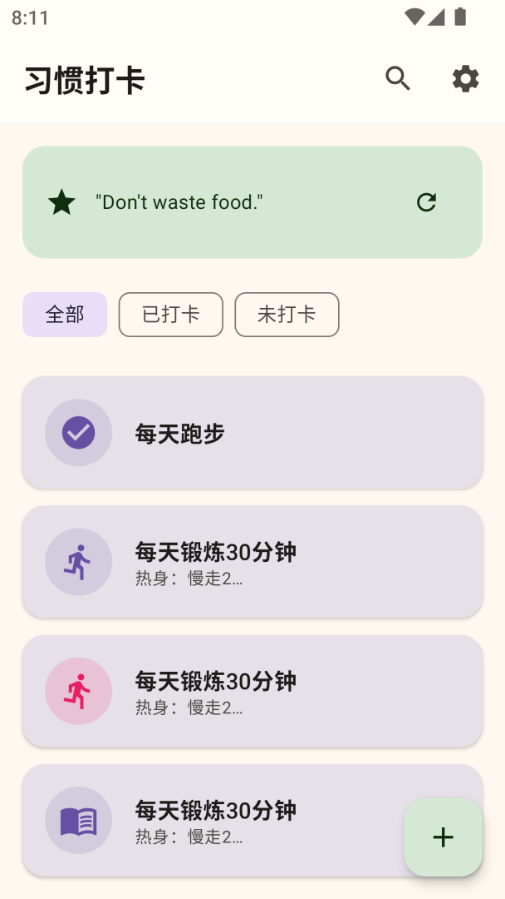
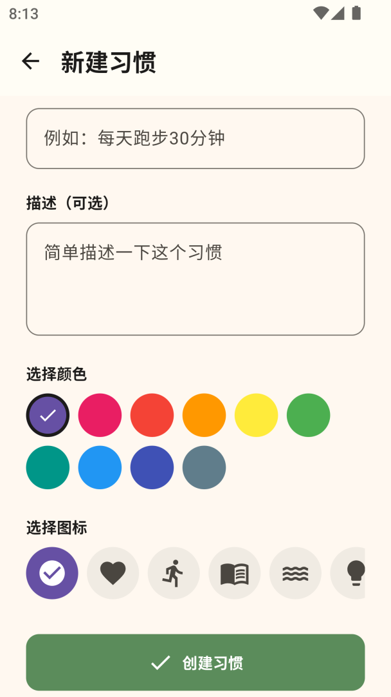
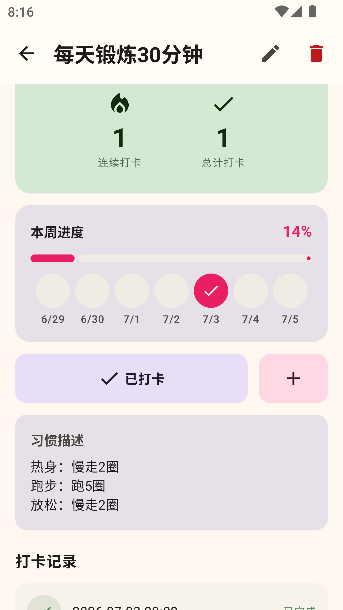
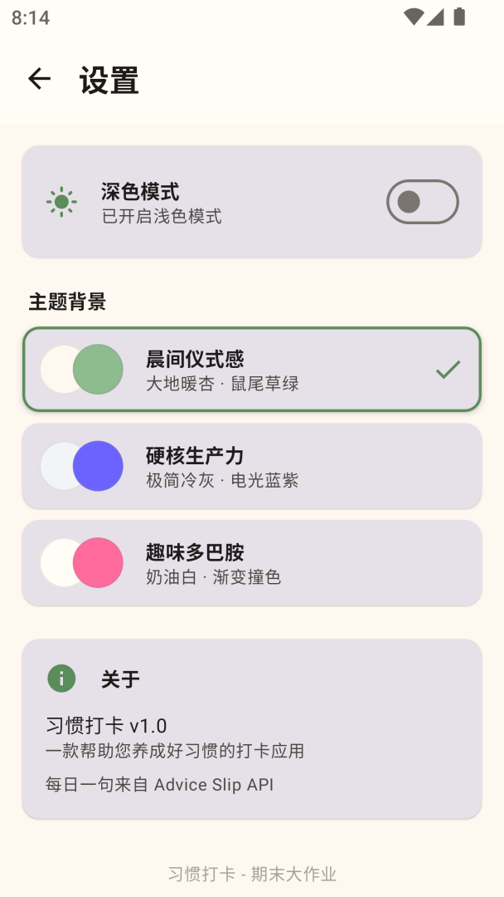

# 习惯打卡 - Habit Tracker

GitHub 仓库地址：https://github.com/user123214/2025003036-FinalProject.git

## 1. 项目简介

- **应用名称：** 习惯打卡
- **目标用户：** 希望养成良好生活习惯、需要每日打卡记录的大学生及职场人士
- **选题背景：** 日常生活中，许多人想培养新习惯（如早起、运动、阅读）但缺乏有效的记录和激励工具。本应用通过每日打卡、连续天数统计和可视化进度反馈，帮助用户坚持习惯养成。
- **核心功能：** 新增/编辑/删除习惯、每日打卡（支持备注）、查看打卡日历和周进度、连续打卡天数统计、搜索和筛选习惯、深色模式/三套主题切换

## 2. 技术栈

- **UI：** Jetpack Compose + Material 3
- **数据库：** Room（2 张表）
- **网络：** Retrofit + OkHttp（接口来源：Advice Slip API）
- **状态管理：** ViewModel + StateFlow
- **持久化偏好：** DataStore Preferences
- **导航：** Navigation Compose
- **异步处理：** Kotlin Coroutines
- **其他依赖：** Compose Material Icons Extended、OkHttp Logging Interceptor、Gson

## 3. 功能清单

### 必做项完成情况

**UI 层**
- [x] Jetpack Compose 构建全部 UI（无 XML 布局）
- [x] 至少 2 个主要页面（首页、新增/编辑、详情、设置，共 4 页）
- [x] Compose Navigation 导航（5 条路由）
- [x] LazyColumn 列表（首页习惯列表、详情页打卡记录）
- [x] Material 3 组件和主题（Card、Button、TopAppBar、FAB、Switch、FilterChip、Snackbar、AlertDialog、LinearProgressIndicator）
- [x] 自定义 Material 主题（3 套预设 × 深浅色 = 6 套配色方案）
- [x] 浅色 / 深色模式支持（跟随 DataStore 设置）

**数据层**
- [x] Room 数据库，2 张表（`habits` + `habit_records`，含外键）
- [x] 完整 CRUD 操作（新增、查询、更新、删除）
- [x] DAO 查询方法返回 Flow 类型
- [x] 至少一种查询功能（LIKE 模糊搜索、连续打卡天数统计、周进度计算）
- [x] DataStore 保存用户偏好（深色模式、主题预设、搜索历史）

**网络层**
- [x] 声明并使用 Internet 权限
- [x] 使用 Retrofit 请求真实 API（Advice Slip API）
- [x] 网络数据在核心页面展示（首页每日格言）
- [x] 处理 Loading / Success / Error 等网络状态
- [x] Composable 不直接发起网络请求（通过 Repository 封装）

**架构层**
- [x] ViewModel 状态管理（4 个 ViewModel）
- [x] Repository 模式（HabitRepository 隔离本地和网络数据源）
- [x] StateFlow / Flow 数据流
- [x] Kotlin 协程异步处理
- [x] UiState 描述界面状态（data class 组织）
- [x] Composable 不直接访问数据库或网络

**功能完整性**
- [x] 新增 / 编辑 / 删除 / 搜索 / 筛选 / 查看详情（6 项交互）
- [x] 输入验证（习惯名称不能为空）和错误提示（Snackbar + 错误文本）
- [x] 状态展示（空状态、加载中、错误提示）
- [x] 屏幕旋转后状态保持（ViewModel + StateFlow）

### 选做项完成情况

- [x] **复杂数据库查询：** 连续打卡天数计算（跨多表关联查询）
- [x] **搜索防抖/搜索历史：** DataStore 存储最近 5 条搜索记录，支持一键回搜
- [x] **图表统计：** 周完成率进度条 + 7 天打卡日历圆点视图
- [x] **滑动删除：** 首页习惯列表支持左滑快速删除
- [x] **多主题切换：** 3 套预设主题（晨间仪式感、硬核生产力、趣味多巴胺），每套含完整深浅色配色
- [ ] 数据导入/导出
- [ ] Coil 图片加载
- [ ] 单元测试

## 4. 数据库设计

### 表 1：habits（习惯表）

| 字段名 | 类型 | 说明 |
|---|---|---|
| id | Long (PK, autoGenerate) | 主键，自增 |
| name | String | 习惯名称 |
| description | String | 习惯描述 |
| icon | String | 图标名称 |
| color_hex | String | 颜色十六进制值 |
| created_at | Long | 创建时间戳 |

### 表 2：habit_records（打卡记录表）

| 字段名 | 类型 | 说明 |
|---|---|---|
| id | Long (PK, autoGenerate) | 主键，自增 |
| habit_id | Long (FK → habits.id) | 外键，关联习惯 |
| date | Long | 打卡日期时间戳 |
| completed | Boolean | 是否完成 |
| note | String | 打卡备注 |

**表关系：** 一个习惯（habits）对应多条打卡记录（habit_records），通过 `habit_id` 外键关联。删除习惯时级联删除所有记录（`ForeignKey.CASCADE`）。两张表分别在 `habit_id` 和 `date` 字段建有索引以加速查询。

**主要 DAO 查询方法：**
- `HabitDao.getAllHabits()` — 返回 `Flow<List<HabitEntity>>`，按创建时间降序
- `HabitDao.searchHabits(query)` — `LIKE` 模糊搜索名称和描述
- `HabitDao.getAllHabitsDirect()` / `searchHabitsDirect()` — 同步查询版本
- `HabitRecordDao.getRecordsByHabitId()` — 返回指定习惯的打卡记录 Flow
- `HabitRecordDao.getRecordByHabitIdAndDate()` — 查询某天是否已打卡
- `getCompletedCount()` / `getLatestCompletedRecord()` / `getRecordsSince()` — 用于连续天数统计

## 4.5 DataStore 使用说明

DataStore Preferences 用于持久化用户偏好设置，读写时机如下：

| 存储数据 | 读取场景 | 写入场景 |
|---|---|---|
| **深色模式**（`dark_mode`） | 应用启动时加载，设置页切换深色/浅色时 | 用户在设置页操作深色模式开关 |
| **主题预设**（`theme_preset`） | 应用启动时加载，设置页切换主题背景时 | 用户在设置页选择主题（晨间仪式感 / 硬核生产力 / 趣味多巴胺） |
| **搜索历史**（`search_history`） | 首页搜索框获取焦点且为空时展示搜索建议 | 用户每次提交搜索时追加，最多保留 5 条 |

DataStore 通过 `UserPreferencesRepository` 封装，ViewModel 通过 `preferencesRepository.data`（Flow）监听变化并更新 UI。

## 5. 网络功能设计

- **API 来源：** Advice Slip API（免费公开 API，无需 API Key）
- **接口地址：** `GET https://api.adviceslip.com/advice`
- **请求方式：** HTTP GET，无参数
- **主要返回字段：** `slip.id`（Int）、`slip.advice`（String，格言文本）
- **App 中使用这些网络数据的页面或功能：** 首页顶部每日格言卡片，每次进入首页或手动刷新时请求新格言
- **网络失败时的处理方式：** 显示兜底文字"💡 每日小提示：坚持就是胜利！"，用户可点击刷新按钮重试
- **封装方式：** `ApiService` 接口定义 Retrofit 请求 → `HabitRepository` 封装为 `suspend fun getDailyAdvice(): Result<String>` → `HomeViewModel` 在协程中调用并更新 UiState

## 6. 架构设计

采用分层架构，遵循单一职责原则，共分四层：

```
┌──────────────────────────────────────────────────┐
│  UI Layer (Composable)                           │
│  - 仅负责界面渲染和事件触发                       │
│  - 通过 collectAsState() 收集 ViewModel 的状态    │
└──────────────────────┬───────────────────────────┘
                       │ 调用 ViewModel 的方法
┌──────────────────────▼───────────────────────────┐
│  ViewModel Layer                                 │
│  - 管理 UiState（StateFlow）                      │
│  - 在 viewModelScope 中启动协程                  │
│  - 通过 Repository 访问数据，不直接调 DAO 或 API │
└──────────────────────┬───────────────────────────┘
                       │ 调用 Repository
┌──────────────────────▼───────────────────────────┐
│  Repository Layer                                │
│  - 封装数据来源，隔离本地和网络                   │
│  - 组合 DAO 和 API Service 提供统一接口           │
└───────────────────┬──────────┬───────────────────┘
                    │          │
┌───────────────────▼──┐  ┌───▼───────────────────┐
│  Local Data (Room)   │  │  Remote Data (Retrofit)│
│  - HabitDao          │  │  - ApiService          │
│  - HabitRecordDao    │  │  - Advice Slip API     │
│  - DataStore         │  │                        │
└──────────────────────┘  └────────────────────────┘
```

**UiState 设计：** 每个页面对应一个 data class（`HomeUiState`、`AddEditHabitUiState`、`HabitDetailUiState`、`SettingsUiState`），包含页面所需的全部状态字段。`HomeViewModel` 通过直接查询数据库 + `refresh()` 确保数据最新。

## 7. 核心功能截图

### 首页

说明：展示习惯列表、每日格言和筛选芯片。用户可点击圆圈打卡，左滑删除，点击卡片进入详情。右下角 FAB 新增习惯。

### 新建习惯

说明：填写习惯名称和描述，选择颜色和图标。顶部圆形预览实时显示所选颜色和图标组合。


说明：颜色选择器和图标选择器支持个性化搭配，每个习惯都有独立视觉标识。


### 详情页

说明：展示连续天数、总打卡次数、本周进度条和 7 天日历圆点，以及打卡记录列表。提供快速打卡和带备注打卡两种方式。

### 设置页

说明：深色模式开关和三套主题背景选择（晨间仪式感、硬核生产力、趣味多巴胺），选中主题即时全局生效。

## 8. 技术难点与解决方案

### 难点 1：Room Flow 不自动刷新

- **问题描述：** 创建新习惯后返回首页，列表不立即显示新创建的习惯，需要重启应用才能看到。同样地，打卡后首页状态也不更新。
- **原因分析：** Room 的 `@Query` 返回的 `Flow<List<T>>` 依赖内部的 `InvalidationTracker` 监听数据库表变化。在 Kotlin 2.2.10 + Room 2.7.0 的环境下，失效通知机制未能正确触发，导致 Flow 不重新发射。即便 Flow 正常发射，嵌套的 `suspend` 函数调用（`getRecordByHabitIdAndDate`、`calculateStreak`）在主线程执行时也可能导致收集异常中断。
- **解决方案：** 放弃依赖 Room Flow 的自动发射机制，改为主动查询模式。在 `HabitDao` 中新增 `suspend fun getAllHabitsDirect()` 等同步查询方法，`HomeViewModel` 使用 `withContext(Dispatchers.IO)` 在 IO 线程执行所有数据库操作，配合 `lifecycle.repeatOnLifecycle(RESUMED)` 在页面可见时自动触发 `refresh()` 重新加载数据。
- **参考资料：** Room 官方文档 - DAO 返回 Flow；Android Lifecycle - repeatOnLifecycle

### 难点 2：搜索结果与筛选结果不一致

- **问题描述：** 搜索习惯后切换筛选标签（全部/已打卡/未打卡），筛选结果与搜索条件叠加导致列表显示异常，且筛选后筛选芯片自身消失。
- **原因分析：** 筛选功能直接基于 `uiState.habits` 进行过滤，但搜索也是通过修改 `uiState.habits` 实现，筛选与搜索的过滤逻辑存在冲突。同时，filter chip 的显示条件为 `uiState.habits.isNotEmpty()`，当筛选结果为空时，filter chip 自身也隐藏了，导致 UI 状态混乱。
- **解决方案：** 将搜索和筛选分离处理。搜索时直接替换 habits 列表（仅搜索模式），筛选时重新从数据库查询全部数据再应用过滤条件。新增 `totalHabitCount` 字段记录数据库中总习惯数，filter chip 始终根据 `totalHabitCount > 0` 判断是否显示，不受当前过滤结果影响。

### 难点 3：KSP 插件版本不匹配

- **问题描述：** 添加 Room 依赖后 Gradle 同步失败，提示 `com.google.devtools.ksp:2.2.10-1.0.31` 不存在。
- **原因分析：** KSP 版本号格式为 `kotlinVersion-kspPluginVersion`，`1.0.31` 是与早期 Kotlin 版本匹配的 KSP 版本，与 Kotlin 2.2.10 不兼容。
- **解决方案：** 查阅 KSP GitHub Releases 页面，使用正确的版本 `2.2.10-2.0.2`。

## 9. AI 使用说明

请在以下选项中勾选，可多选：

- [ ] 未使用 AI
- [ ] 网页版 AI（如 ChatGPT、Claude、Kimi、豆包等）
- [x] AI Agent / 编程代理（如 Claude Code、Codex、OpenCode、Cursor Agent 等）
- [x] 国产大模型服务（如 DeepSeek、GLM、通义千问、文心一言等）
- [ ] IDE 插件或代码补全工具（如 GitHub Copilot、Cursor、CodeGeeX 等）
- [ ] 其他：

**具体工具名称：** CodeBuddy（基于 DeepSeek V4 Flash）

**AI 主要用于哪些环节：**
- 项目框架搭建和代码生成（Compose UI、ViewModel、Room 数据库、Retrofit 网络请求等全部代码）
- Bug 排查与修复（Room Flow 不刷新、KSP 版本不兼容、collect 泄漏等问题）
- 功能增强（主题切换、搜索历史、周统计图表、滑动删除等）
- 报告文档整理

**说明：** 是否使用 AI 以及使用了什么 AI 工具不会影响分值，请如实填写。本项目全程使用 AI Agent 辅助完成，从初始项目模板搭建到逐步完善所有功能均由 AI 协助实现。

## 10. 运行说明

- **最低 Android 版本：** API 24（Android 7.0）
- **推荐 Android 版本：** API 34+（Android 14+）
- **特殊权限：** 网络权限（`android.permission.INTERNET`）
- **开发环境要求：** JDK 17+、Android Studio Hedgehog 或更新版本
- **运行步骤：**
  1. 克隆仓库：`git clone https://github.com/user123214/2025003036-FinalProject.git`
  2. 使用 Android Studio 打开项目
  3. 等待 Gradle 同步完成（如遇 KSP 版本错误，检查 `gradle/libs.versions.toml` 中 `ksp` 版本与 Kotlin 版本匹配）
  4. 连接模拟器（API 24+）或真机，点击 Run 按钮
  5. 首次启动后，点击右下角 `+` 按钮创建第一个习惯开始使用

## 11. 项目亮点

- **三套完整主题预设：** 晨间仪式感（暖杏×鼠尾草绿）、硬核生产力（冷灰×电光蓝紫）、趣味多巴胺（奶油白×渐变撞色），每套包含 14 个颜色属性的 Light/Dark 完整配色方案
- **周进度可视化：** 7 天日历圆点 + 线性进度条直观展示本周打卡完成率
- **搜索历史：** 通过 DataStore 持久化最近 5 条搜索，方便快速复用
- **滑动删除：** 首页列表支持左滑删除，配合 Snackbar 提示确认
- **带备注打卡：** 打卡时可附加文字备注，记录当天感受
- **颜色+图标个性化：** 每种习惯可独立选择颜色和图标组合，列表卡片区分度高
- **代码结构清晰：** 严格分层（data / datastore / navigation / viewmodel / ui），命名规范

## 12. 未来改进方向

- **数据导出：** 支持将打卡数据导出为 JSON/CSV 文件
- **通知提醒：** 使用 WorkManager 实现每日定时打卡提醒
- **云端同步：** 接入后端服务实现多设备数据同步
- **图表增强：** 添加月/季度统计图表和完成趋势分析
- **小组件：** 添加 Android 桌面小组件，首页直接查看今日打卡状态
- **单元测试：** 为 ViewModel 和 Repository 编写完整单元测试
