# Sudoku（数独）—— 纯净 Android 数独游戏

GitHub 仓库地址：https://github.com/gzzrrg/Sudoku

## 1. 项目简介

- **应用名称：** Sudoku（数独）
- **目标用户：** 数独爱好者、希望无广告无付费享受纯粹解谜体验的 Android 用户
- **选题背景：** 应用商店中大多数数独 App 存在广告频繁打断或需付费去广告的问题。作为数独爱好者，希望打造一款干净、无广告、完全免费且功能完整的数独游戏。
- **核心功能：** 三级难度谜题、在线获取与离线自动降级、笔记模式、撤销/重做、提示系统、冲突检测、错误限制、自动存档、实时计时和数据统计。

Sudoku 的主要使用流程为：

```text
启动应用 → 选择难度 → 在线/本地生成谜题
→ 填入数字 / 笔记标记 / 使用提示
→ 撤销重做修正错误 → 通关或失败
→ 自动保存记录 → 查看统计数据
```

应用共有 5 个主要页面：启动页、主页、游戏页、我的页面和设置页；二级页面包括难度选择弹窗、通关庆祝弹窗、游戏失败页面、主题选择 Bottom Sheet 和颜色调试预览页。

## 2. 技术栈

| 类别 | 技术 |
|------|------|
| 开发语言 | Kotlin 2.2.10 |
| UI | Jetpack Compose + Material 3（BOM 2026.02.01） |
| 数据库 | Room 2.7.1（游戏存档 + 历史记录） |
| 网络 | Retrofit 2.9.0 + Gson（接口来源：dosuku API） |
| 状态管理 | ViewModel + StateFlow |
| 持久化偏好 | Jetpack DataStore Preferences 1.1.4 |
| 导航 | Compose Navigation 2.8.0 |
| 异步处理 | Kotlin Coroutines 1.7.3 |
| 依赖注入 | 手动 AppContainer |
| 构建系统 | Gradle 9.4.1 + AGP 9.2.1 + KSP |
| 最低/目标 SDK | API 36（Android 16） |

## 3. 功能清单

### 必做项完成情况

**UI 层**

- [x] Jetpack Compose 构建全部 UI
- [x] 至少 2 个主要页面（主页、游戏页、我的页、设置页共 5 个）
- [x] Compose Navigation 导航
- [x] LazyColumn 列表（颜色调试预览页）
- [x] Material 3 组件和主题
- [x] 浅色 / 深色 / 白色 / 跟随系统四种主题模式

<p align="center">
  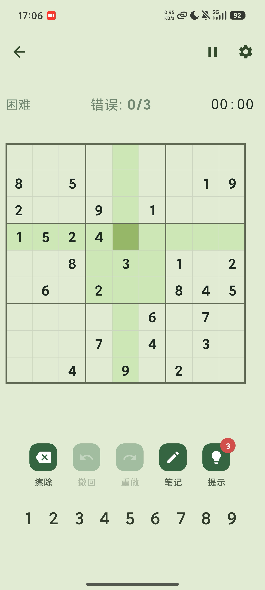
  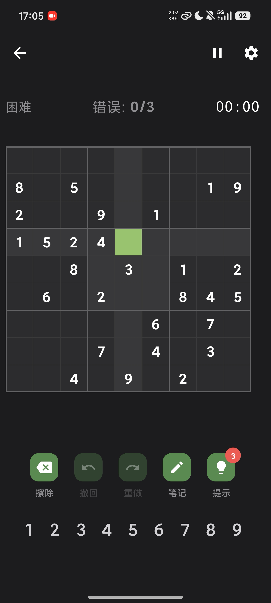
  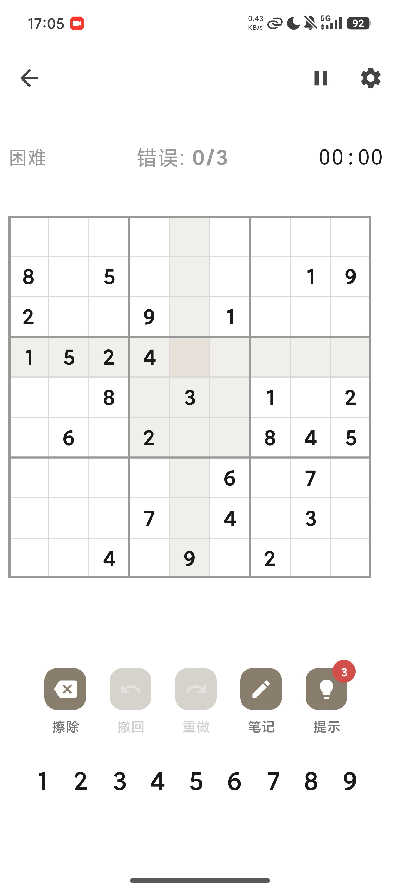
</p>

**数据层**

- [x] Room 数据库，包含 2 张表（game_session + game_record）
- [x] 项目和任务完整 CRUD（GameSession 增删改、GameRecord 增删查）
- [x] DAO 查询方法返回 Flow 类型
- [x] 联合统计查询（按难度统计最佳/平均用时、零错误获胜数、总游戏数）
- [x] DataStore 保存用户偏好设置和游戏统计数据

**网络层**

- [x] 声明并使用 Internet 权限
- [x] 使用网络请求获取 dosuku API 真实数独谜题数据
- [x] 网络数据在核心游戏流程中使用（谜题生成 → 填入数字 → 通关判定）
- [x] 处理 Loading / Success / Error 状态（GameUiState 六种状态完整覆盖）
- [x] Composable 不直接发起网络请求（通过 ViewModel → Repository → Retrofit）

**架构层**

- [x] ViewModel 状态管理
- [x] Repository 模式
- [x] StateFlow / Flow 数据流
- [x] Kotlin 协程异步处理
- [x] UiState 描述界面状态（HomeUiState / GameUiState / SettingsUiState / ProfileUiState）
- [x] 使用 `collectAsStateWithLifecycle` 收集状态
- [x] Composable 不直接访问数据库或网络

**功能完整性**

- [x] 填入数字、擦除、笔记切换、提示、撤销、重做等核心操作
- [x] 输入验证和错误提示（冲突检测实时红色高亮、填错橙色标记、3 次错误限制）

<p align="center">
  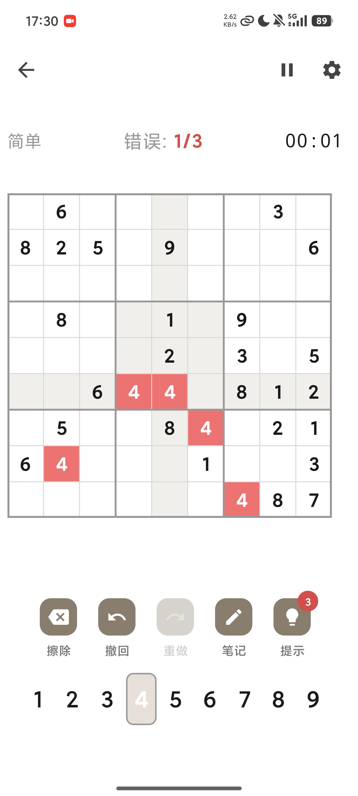
  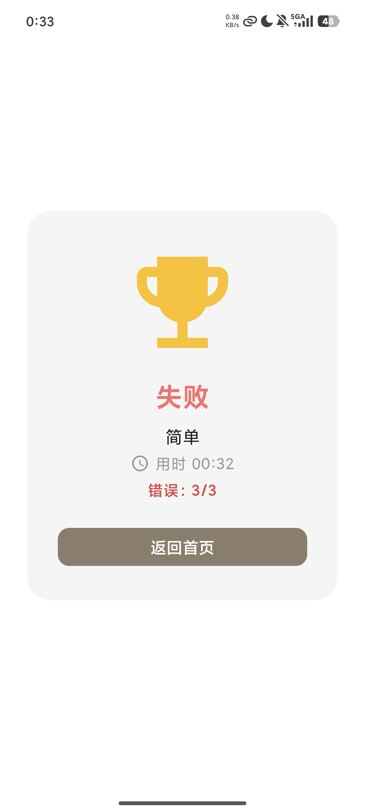
</p>

- [x] 空状态、加载状态和错误状态（GameUiState 六种状态 + HomeUiState 三种状态）
- [x] 屏幕旋转后数据库数据和 ViewModel 状态保持
- [x] 顶层导航与系统返回逻辑正确

### 选做项完成情况

- [x] Room 联合统计查询（`MIN`/`AVG`/`COUNT` 按难度聚合）
- [x] 网络数据保存到 Room，API 不可用时展示本地生成数据
- [x] Material 3 三套自定义主题 + 系统动态主题支持
- [x] 回溯法本地谜题生成（含唯一解验证）
- [x] 手动 AppContainer 依赖注入
- [x] 响应式布局（竖屏单栏 / 横屏平板双栏）
- [x] 统计数据可视化（Canvas 绘制胜负柱状图）
- [ ] 数据导入/导出
- [ ] WorkManager 后台同步
- [ ] 大屏双栏布局

## 4. 数据库设计

### 表 1：GameSession（game_session）

| 字段名 | 类型 | 说明 |
|---|---|---|
| id | Int (PK) | 主键，固定为 1（单存档模型） |
| puzzle_json | String | 初始谜题 9×9 JSON 数组 |
| solution_json | String | 完整解答 9×9 JSON 数组 |
| current_board_json | String | 用户当前填入状态 9×9 JSON 数组 |
| notes_json | String | 所有格子笔记三维 JSON 数组 |
| difficulty | String | 难度（简单/中等/困难） |
| elapsed_seconds | Int | 已用时间（秒） |
| hint_count | Int | 剩余提示次数（默认 3） |
| operation_history_json | String | 撤销操作栈 JSON |
| redo_stack_json | String | 重做操作栈 JSON |
| is_paused | Boolean | 是否处于暂停状态 |
| created_at | Long | 创建时间戳 |

该表使用单主键固定为 1 的单存档模型，同一时间只存在一个活跃游戏。棋盘数据、操作历史均以 JSON 序列化存储。`upsertSession()` 使用 REPLACE 策略实现插入或更新。

### 表 2：GameRecord（game_record）

| 字段名 | 类型 | 说明 |
|---|---|---|
| id | Long (PK) | 主键，自增 |
| difficulty | String | 难度 |
| time_seconds | Int | 用时（秒） |
| error_count | Int | 错误次数 |
| completed_at | Long | 完成时间戳 |

`GameSession` 和 `GameRecord` 为独立表，不设外键关联。游戏通关时 ViewModel 中写入 `GameRecord` 并删除 `GameSession`，游戏失败时同样删除 `GameSession`。

### 主要 DAO 查询

`GameSessionDao` 提供 `upsertSession()`（REPLACE 策略）、`getActiveSession()`（Flow）、`getActiveSessionOnce()`（一次性读取）、`deleteActiveSession()`。

`GameRecordDao` 提供按难度筛选、按时间排序和聚合统计，包括：

```sql
-- 最佳用时
SELECT MIN(time_seconds) FROM game_record WHERE difficulty = :difficulty

-- 平均用时
SELECT AVG(time_seconds) FROM game_record WHERE difficulty = :difficulty

-- 零错误获胜数
SELECT COUNT(*) FROM game_record WHERE difficulty = :difficulty AND error_count = 0
```

所有聚合查询返回 Flow，支持 Compose 响应式收集。

## 5. 网络功能设计

- **API 来源：** dosuku 开源数独 API
- **接口地址：** `https://sudoku-api.vercel.app/api/dosuku`
- **请求方式：** `GET`
- **主要返回字段：** `newboard.grids[].value`（9×9 谜题盘面）、`newboard.grids[].solution`（9×9 完整解答）、`newboard.grids[].difficulty`（难度标签）
- **App 中使用这些网络数据的页面或功能：** `SudokuRepository.fetchPuzzle()` 方法在游戏开始时调用，获取的谜题和解答存入 ViewModel 的 `puzzle` 和 `solution` 数组，驱动整个游戏流程。
- **网络失败时的处理方式：** Repository 层使用 try-catch 包裹 API 调用，任何异常（超时、空数据、网络错误）自动切换至本地 `SudokuGenerator.generatePuzzle()` 回溯法生成器。API 成功时不额外消耗本地计算资源，失败时保证 100% 可玩性。

## 6. 架构设计

项目采用 MVVM + Repository 三层架构，手动依赖注入：

```text
Compose UI
   ↓ 用户事件
ViewModel（StateFlow 管理 UiState）
   ↓ 调用
Repository（统一数据访问）
   ├── Room DAO（游戏存档 + 历史记录）
   ├── Retrofit API（dosuku 谜题获取）
   ├── DataStore（偏好设置 + 统计数据）
   └── SudokuGenerator（离线谜题生成）
   ↓ Flow / StateFlow
Compose UI 自动刷新
```

**各层职责：**

- **Domain Layer：** `BoardState`、`Cell`、`Difficulty`、`Operation` 纯数据模型；`SudokuGenerator`、`SudokuValidator` 纯逻辑引擎，与 Android 框架无关。
- **Data Layer：** Room Entity/DAO/Database、Retrofit API Service、DataStore。`SudokuRepository` 封装所有数据源，提供统一的挂起函数和 Flow 接口。
- **ViewModel Layer：** `GameViewModel`（游戏核心逻辑，约 630 行）、`HomeViewModel`、`SettingsViewModel`、`ProfileViewModel`。管理 UiState，处理用户交互，调用 Repository。
- **UI Layer：** Compose Composable 函数，仅负责渲染状态和发送事件。通过 `collectAsStateWithLifecycle()` 收集 StateFlow。
- **DI Layer：** `AppContainer` 手动创建并持有全部依赖单例。

**UiState 设计：**

- `HomeUiState`：sealed interface（Loading / Ready / Error）
- `GameUiState`：sealed interface（Loading / Active / Paused / Completed / Failed / Error）
- `SettingsUiState`：data class，包含全部设置项
- `ProfileUiState`：data class，包含选中的难度和统计 Map

**DataStore 设计：** `SettingsDataStore` 通过 `Context.dataStore` 顶层扩展属性确保全局单例。存储用户偏好 7 项（theme_mode / highlight_conflicts / sound_enabled / vibration_enabled / score_animation_enabled / error_limit_enabled / default_difficulty）和按难度的游戏统计 3 项（games_started / current_streak / max_streak）。所有读取暴露为 Flow，写入为挂起函数。

## 7. 核心功能截图

### 首页

<p align="center">
  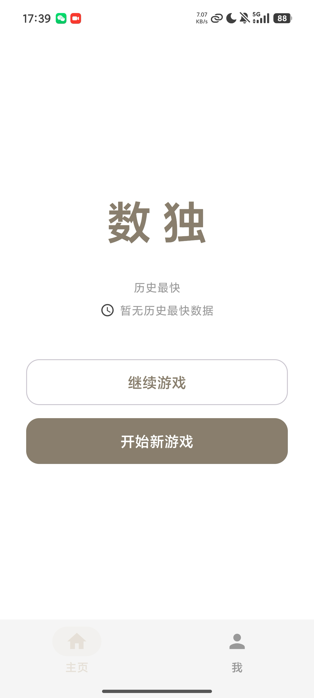
</p>

说明：展示应用 Logo、历史最快用时卡片、继续游戏和开始新游戏按钮。底部导航栏包含"主页"和"我"两个标签页。点击"开始新游戏"弹出难度选择弹窗。

### 游戏页

<p align="center">
  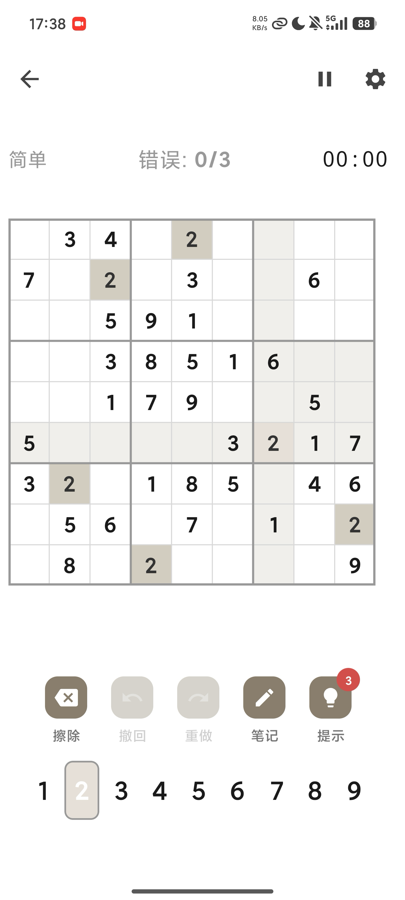
</p>

说明：核心游戏界面，包含 9×9 数独棋盘（粗线分隔 3×3 宫格）、状态栏（难度/错误计数/计时器）、功能工具栏（擦除/撤回/重做/笔记/提示）和数字键盘。选中格以绿色高亮，同行/列/宫关联格以浅色背景标识。

### 笔记与横屏

<p align="center">
  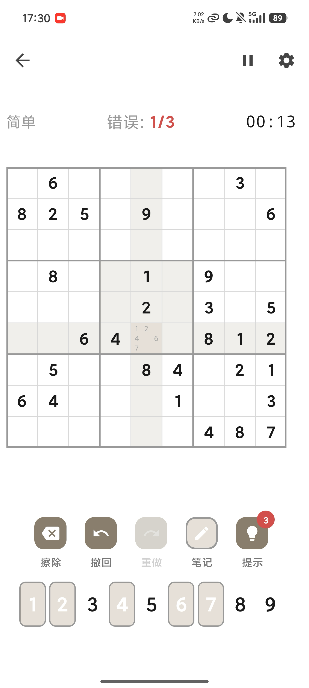
  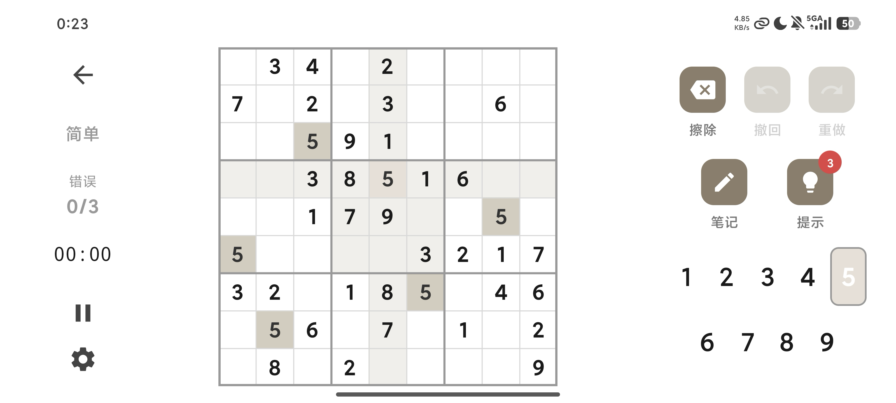
</p>

说明：左图为笔记模式，空格以 3×3 子网格显示候选数字。右图为横屏/平板双栏布局，左侧状态栏 + 居中棋盘 + 右侧控制面板，充分利用屏幕空间。竖屏单栏与横屏双栏通过 `BoxWithConstraints` 以 600dp 为阈值自动切换。

### 数据统计与设置

<p align="center">
  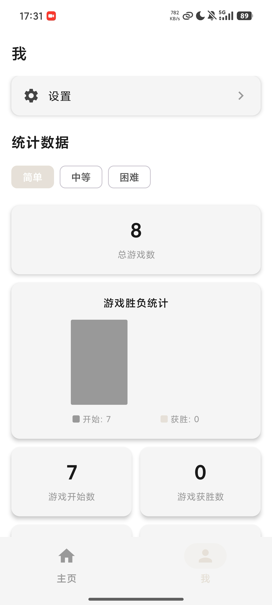
  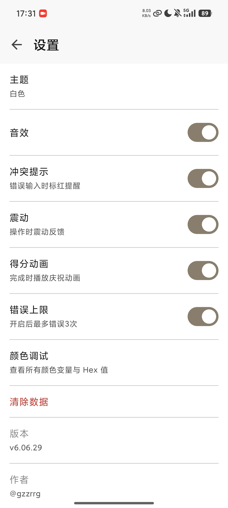
</p>

说明：左图为"我的"页面，按难度筛选展示游戏数、获胜数、胜率、零错误获胜、连胜、最佳用时和平均用时，包含 Canvas 自定义绘制的胜负柱状图。右图为设置页，支持主题切换、音效、冲突提示、震动、得分动画、错误上限等偏好设置。

## 8. 技术难点与解决方案

### 难点 1：在线 API 不可用时的无缝降级

- **问题描述：** dosuku API 是外部服务，可能因网络问题、服务宕机或请求超时而不可用。不能因为 API 失败就让用户无法游戏。
- **原因分析：** 外部 API 的可用性不在应用控制范围内，必须有可靠的本地备选方案。
- **解决方案：** Repository 层实现 `try API → catch → local generator` 的降级链。`fetchPuzzle()` 方法使用 try-catch 包裹 API 调用，任何异常都自动切换到 `SudokuGenerator.generatePuzzle()`。API 成功时不额外消耗本地计算资源，失败时保证 100% 可玩性。

### 难点 2：棋盘状态的完整持久化与恢复

- **问题描述：** 游戏进度需要在 App 被杀、屏幕旋转、离开游戏等场景下完整保留。除棋面外还需保存操作历史、笔记、计时、提示次数等。
- **原因分析：** 游戏状态由多个数据结构组成（三个 9×9 数组、三维笔记数组、操作双栈、计时器状态），需全部原子化保存。
- **解决方案：** 棋盘数据通过 Gson 序列化为 JSON 存入 Room 单条记录；笔记三维数组自定义序列化为 `List<List<List<Int>>>` 格式；操作历史双栈序列化 `List<Operation>` 为 JSON；`autoSave()` 在每次操作后自动调用，全部数据原子写入；恢复时通过 `loadGame()` 反序列化并重建内存状态。

### 难点 3：回溯法唯一解验证的性能优化

- **问题描述：** 本地谜题生成器在挖空每一步后都需要验证唯一解，这是性能瓶颈。困难难度需挖除 55-59 格，每次验证都需回溯搜索。
- **原因分析：** 回溯法最坏复杂度 O(9ⁿ)，虽对 9×9 数独通常很快，但反复调用仍需优化。
- **解决方案：** `countSolutions()` 方法预提取所有空格坐标，避免每次迭代全盘扫描；传入 `limit=2` 参数，一旦找到 2 个解答立即终止搜索；挖空顺序随机打乱，避免集中在某些区域导致反复失败。

### 难点 4：多主题下棋盘自定义颜色的统一管理

- **问题描述：** 棋盘有 26 个专用颜色（网格线、格子背景、高亮、冲突等），需要三套主题 + 系统动态主题全部适配。
- **原因分析：** Material 3 标准 ColorScheme 不足以描述数独棋盘的全部颜色语义。
- **解决方案：** 定义 `SudokuColorPalette` 数据类包含 26 个颜色字段，提供 Light/Dark/White 三个静态预设实例，通过 `CompositionLocal` 传递，主题切换时自动更新。所有棋盘组件通过 `LocalSudokuPalette.current` 获取当前主题色。

### 难点 5：横竖屏切换的布局适配

- **问题描述：** 竖屏单栏和横屏双栏的 UI 结构差异大，需要无缝切换且保持 ViewModel 状态。
- **原因分析：** 游戏页组件结构因屏幕方向完全不同，但游戏逻辑应保持不变。
- **解决方案：** 使用 `BoxWithConstraints` 检测 `maxWidth`，以 600dp 为阈值分支渲染（竖屏单栏 / 横屏三栏）。`maxHeight < 500.dp` 触发紧凑模式缩小字号间距。ViewModel 通过 ViewModel 自动保持（屏幕旋转不重建），横竖切换无状态丢失。

### 难点 6：导航栈管理与 ViewModel 生命周期

- **问题描述：** 游戏页有多个导航目标，需正确处理返回栈。离开游戏页时需触发自动存档，但已完成/已失败的游戏不能再次存档。
- **原因分析：** `GameScreen` 的 `DisposableEffect` 在组件销毁时触发，但不区分是因为正常返回还是导航到新页面。
- **解决方案：** `saveAndExit()` 内部检查当前状态：`Completed` 和 `Failed` 跳过存档（游戏已结束，ViewModel 已删除 Room 存档）；`onNewGame` 使用 `popUpTo(Routes.HOME)` 清除回退栈；`onGoHome` 使用 `popBackStack(Routes.HOME, inclusive = false)`。

## 9. AI 使用说明

- [ ] 未使用 AI
- [x] 网页版 AI（ChatGPT、Claude）
- [x] AI Agent / 编程代理（Claude Code、Codex）
- [ ] 国产大模型服务
- [ ] IDE 插件或代码补全工具
- [x] 其他（GitHub Copilot）

**具体工具名称：** ChatGPT、Claude、Claude Code、GitHub Copilot

**AI 主要用于：**

- Material 3 UI 配色方案设计与多主题色板验证
- Compose 代码生成与重构（棋盘渲染、响应式布局）
- 回溯算法性能优化分析
- 编译报错分析与 Bug 定位
- 项目文档整理与报告生成

## 10. 运行说明

- **最低 Android 版本：** API 36（Android 16）
- **推荐 Android 版本：** API 36（Android 16）
- **Gradle JDK：** JDK 11+
- **特殊权限：** `android.permission.INTERNET`

运行步骤：

1. 克隆仓库：

```bash
git clone https://github.com/gzzrrg/Sudoku.git
```

2. 使用 Android Studio 打开 Sudoku 项目目录。
3. 等待 Gradle 同步完成。
4. Release 签名配置（可选）：在根目录创建 `signing.properties`，填写 `storeFile`、`storePassword`、`keyAlias`、`keyPassword`。
5. 执行 `./gradlew assembleDebug` 确认构建成功。
6. 连接模拟器或真机，点击 Run。

运行测试：

```bash
./gradlew test               # 单元测试
./gradlew lint               # 代码 Lint 检查
```

## 11. 项目亮点

1. **在线+离线双模式**：dosuku API 在线获取谜题，网络不可用时自动降级至本地回溯法生成，100% 可玩。
2. **完整游戏循环**：覆盖选难度、填数/笔记、撤销重做、提示辅助、冲突检测到通关/失败判定的完整玩法。
3. **可靠的持久化**：每次操作自动原子保存全部状态（棋面、笔记、操作历史、计时、提示），任意场景下进度不丢失。
4. **三套完整主题**：自定义 `SudokuColorPalette` 覆盖 26 个棋盘专用颜色，护眼绿、深灰和纯白三套主题完整适配，并支持跟随系统设置。
5. **响应式布局**：竖屏单栏、横屏/平板三栏自适应，通过 `BoxWithConstraints` 自动切换，充分利用屏幕空间。
6. **累积错误机制**：错误计数不会因撤销/擦除而减少，确保错误限制的严肃性。
7. **纯函数引擎**：`SudokuGenerator` 和 `SudokuValidator` 不依赖 Android 框架，可独立测试和复用。
8. **手动 DI**：不使用 Hilt/Koin，`AppContainer` 手动管理依赖，构建配置简洁。
9. **轻量数据可视化**：Canvas 自定义绘制胜负柱状图，无需引入大型图表库。

## 12. 未来改进方向

- 增加更完善的单元测试（覆盖 Generator、Validator、ViewModel 核心逻辑）
- 支持自定义难度（自由调节给定数范围）
- 增加每日挑战模式
- 使用 WorkManager 预取谜题缓存
- 增加数据导出（JSON/CSV 格式）
- 增加更多主题配色选项
- 为平板优化更多大屏交互细节

## 许可

MIT License © [@gzzrrg](https://github.com/gzzrrg)
